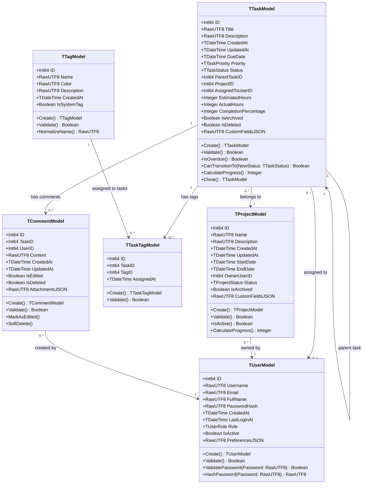
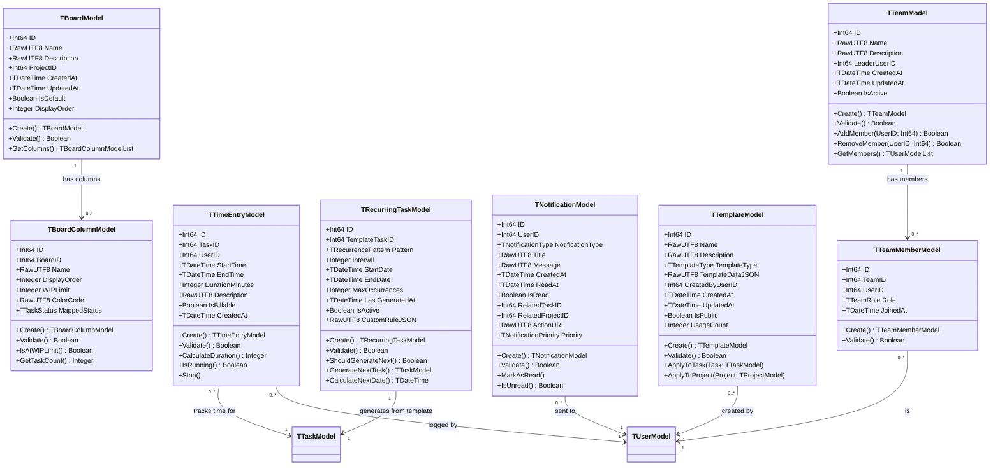
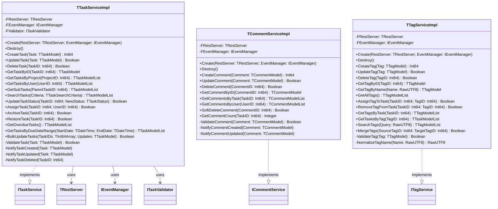
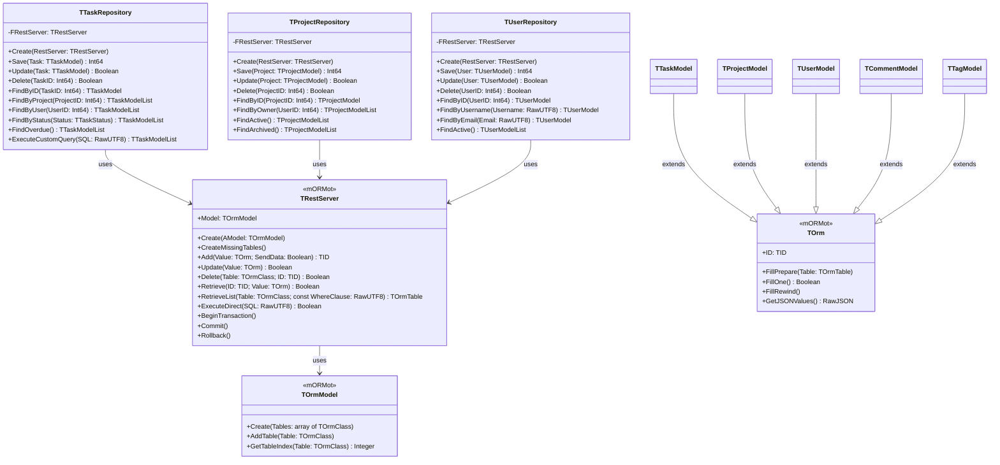

# Free Pascal Task Manager - Software Specification

## Document Information
- **Project Name:** Free Pascal Task Manager
- **Version:** 1.0
- **Last Updated:** 2024
- **Framework:** Free Pascal / Object Pascal with mORMot Framework
- **Status:** Architecture & Implementation Specification

---

## Table of Contents
1. [Overview](#1-overview)
2. [Software Architecture](#2-software-architecture)
3. [Detailed Module Descriptions](#3-detailed-module-descriptions)
4. [Data Models and Structures](#4-data-models-and-structures)
5. [API Endpoints and Usage](#5-api-endpoints-and-usage)
6. [User Interface Designs](#6-user-interface-designs)
7. [Third-Party Libraries and Services](#7-third-party-libraries-and-services)
8. [Deployment and Scaling Strategies](#8-deployment-and-scaling-strategies)
9. [Testing Strategies and Coverage](#9-testing-strategies-and-coverage)
10. [Class Diagrams and Methods](#10-class-diagrams-and-methods)
11. [Source Code Organization](#11-source-code-organization)
12. [Coding Task List](#12-coding-task-list)
13. [Development Workflows and Best Practices](#13-development-workflows-and-best-practices)

---

## 1. Overview

### 1.1 Project Purpose
The Free Pascal Task Manager is a comprehensive, modular task management system built with Free Pascal/Object Pascal and the mORMot framework. The system provides reusable components for task management, team collaboration, productivity tracking, and workflow automation without direct user interface dependencies (no ReadLn or console input).

### 1.2 Key Features
- **Core Task Management:** Create, update, delete, and organize tasks with priorities, deadlines, and statuses
- **Advanced Features:** Recurring tasks, templates, time tracking, resource allocation
- **Collaboration:** Team management, task assignments, comments, and notifications
- **Productivity:** Focus mode, gamification, smart suggestions, knowledge base integration
- **Organization:** Boards/Kanban, tags, search capabilities, meetings management
- **Wellness:** Well-being tracking and lifestyle management integration
- **Extensibility:** Modular architecture allowing feature extensions

### 1.3 Technology Stack
- **Language:** Free Pascal / Object Pascal (FPC 3.2+)
- **Framework:** mORMot 2.x (Model-View-Controller + ORM + REST)
- **Database:** SQLite3 (via mORMot ORM)
- **Architecture Pattern:** Service-Oriented Architecture with Clean Architecture principles
- **Design Patterns:** Repository, Service Layer, Dependency Injection, Observer

### 1.4 Target Platforms
- Linux (primary)
- Windows
- macOS
- FreeBSD

### 1.5 Design Principles
- **Modularity:** Each feature is a separate unit that can be included or excluded
- **Reusability:** Core components designed for integration into GUI, web, or console applications
- **No Direct I/O:** No ReadLn, WriteLn for user interaction (library approach)
- **Interface-Based:** Services defined through interfaces for testability and flexibility
- **Data-Driven:** Configuration and behavior controlled through data models
- **Type Safety:** Strong typing with Object Pascal's type system

---

## 2. Software Architecture

### 2.1 Architectural Overview

The system follows a **layered architecture** with clear separation of concerns:

```
┌─────────────────────────────────────────────────────────────┐
│                    Application Layer                        │
│  (Console Apps, GUI Apps, Web Services - Not Included)     │
└─────────────────────────────────────────────────────────────┘
                            ↓ ↑
┌─────────────────────────────────────────────────────────────┐
│                     Service Layer                           │
│  ┌──────────────┐  ┌──────────────┐  ┌──────────────┐     │
│  │ Task         │  │ Comment      │  │ Tag          │     │
│  │ Services     │  │ Services     │  │ Services     │     │
│  └──────────────┘  └──────────────┘  └──────────────┘     │
│                                                             │
│  ┌────────────────────────────────────────────────────┐   │
│  │  Feature Services (Advanced, Boards, Team, etc.)   │   │
│  └────────────────────────────────────────────────────┘   │
└─────────────────────────────────────────────────────────────┘
                            ↓ ↑
┌─────────────────────────────────────────────────────────────┐
│                     Domain Layer                            │
│  ┌──────────────┐  ┌──────────────┐  ┌──────────────┐     │
│  │ Task         │  │ Comment      │  │ Tag          │     │
│  │ Models       │  │ Models       │  │ Models       │     │
│  └──────────────┘  └──────────────┘  └──────────────┘     │
└─────────────────────────────────────────────────────────────┘
                            ↓ ↑
┌─────────────────────────────────────────────────────────────┐
│                  Data Access Layer (mORMot ORM)             │
│  ┌──────────────────────────────────────────────────────┐  │
│  │         mORMot REST/ORM Infrastructure               │  │
│  └──────────────────────────────────────────────────────┘  │
└─────────────────────────────────────────────────────────────┘
                            ↓ ↑
┌─────────────────────────────────────────────────────────────┐
│                   Persistence Layer                         │
│              SQLite3 Database (File-Based)                  │
└─────────────────────────────────────────────────────────────┘
```

### 2.2 Architectural Layers

#### 2.2.1 Domain Layer (Models)
- **Responsibility:** Define business entities and domain logic
- **Components:**
  - `task_models`: Core task entity definitions
  - `comment_models`: Comment entity definitions  
  - `tag_models`: Tag entity definitions
- **Pattern:** Rich Domain Models with mORMot TSQLRecord inheritance
- **Dependencies:** mORMot.orm.core, mORMot.core.base

#### 2.2.2 Service Layer (Business Logic)
- **Responsibility:** Implement business operations and orchestrate domain objects
- **Components:**
  - Interface Definitions: `task_services`, `comment_services`, `tag_services`
  - Implementations: `task_services_impl`, `comment_services_impl`, `tag_services_impl`
- **Pattern:** Service Interface + Implementation (Dependency Injection ready)
- **Dependencies:** Domain Models, mORMot.orm.rest

#### 2.2.3 Feature Modules Layer
- **Responsibility:** Extended functionality built on core services
- **Components:** 20 feature modules (detailed in Section 3)
- **Pattern:** Plugin/Module architecture
- **Dependencies:** Core services, domain models

#### 2.2.4 Data Access Layer
- **Responsibility:** Database operations, persistence, querying
- **Components:** mORMot ORM infrastructure
- **Pattern:** Repository pattern (via mORMot REST)
- **Dependencies:** mORMot.orm.sqlite3, mORMot.db.raw.sqlite3

#### 2.2.5 Infrastructure Layer
- **Responsibility:** Cross-cutting concerns (logging, security, networking)
- **Components:** mORMot framework services
- **Pattern:** Framework-provided infrastructure

### 2.3 Core Architectural Patterns

#### 2.3.1 Service-Oriented Architecture (SOA)
Each major functionality is exposed through service interfaces:

```pascal
type
  ITaskService = interface(IInvokable)
    function CreateTask(const ATask: TTaskModel): Int64;
    function GetTask(ATaskID: Int64): TTaskModel;
    function UpdateTask(const ATask: TTaskModel): Boolean;
    function DeleteTask(ATaskID: Int64): Boolean;
    function ListTasks(const AFilter: TTaskFilter): TTaskModelArray;
  end;
```

#### 2.3.2 Repository Pattern (via mORMot ORM)
Data access abstracted through mORMot's REST ORM:
- Automatic CRUD operations
- Query builder interface
- Transaction management
- Connection pooling

#### 2.3.3 Dependency Injection
Services depend on interfaces, not concrete implementations:
- Constructor injection for service dependencies
- Interface-based design for testability
- Factory pattern for service creation

#### 2.3.4 Observer Pattern
Event-driven notifications:
- Task status changes
- Comment additions
- Deadline alerts
- Team notifications

### 2.4 Module Dependency Graph

```
Core Modules (Foundation):
  task_models ──┐
  task_services ├──> All Feature Modules depend on these
  tag_models    │
  tag_services  │
  comment_models│
  comment_services ┘

Feature Modules (Can be independently enabled/disabled):
  taskmanager (Base) ──> taskmanagerenhanced ──> taskmanagerext
                    │
                    ├──> taskmanageradvanced ──> taskmanagersmart
                    ├──> taskmanagerboards
                    ├──> taskmanagerteam
                    ├──> taskmanagertemplates ──> taskmanagerrecurring
                    ├──> taskmanagertimetracking
                    ├──> taskmanagersearch
                    ├──> taskmanagernotifications
                    ├──> taskmanagerfocus
                    ├──> taskmanagergamify
                    ├──> taskmanagerknowledge
                    ├──> taskmanagerlifestyle
                    ├──> taskmanagermeetings
                    ├──> taskmanagerresource
                    └──> taskmanagerwellbeing
```

### 2.5 Data Flow Architecture


**Typical Task Creation Flow:**

```
User Request (External)
    ↓
[Service Layer: ITaskService.CreateTask()]
    ↓
1. Validate input data (title, description, priority, etc.)
2. Apply business rules (default values, calculated fields)
3. Check permissions (if team-based)
    ↓
[Domain Layer: TTaskModel instance creation]
    ↓
4. Set task properties
5. Generate unique ID (if not auto-increment)
6. Set creation timestamp
    ↓
[Data Access Layer: mORMot ORM]
    ↓
7. Begin transaction
8. Insert record into SQLite database
9. Commit transaction
    ↓
[Event System: Observer Pattern]
    ↓
10. Trigger OnTaskCreated event
11. Notify subscribers (notifications, logging, etc.)
    ↓
Return Task ID to caller
```

**Query Flow Example (List Tasks with Filters):**

```
User Request: Get all high-priority tasks due this week
    ↓
[Service Layer: ITaskService.ListTasks(filter)]
    ↓
1. Parse filter criteria
2. Build mORMot ORM query
    ↓
[Data Access Layer: mORMot ORM Query Builder]
    ↓
3. Generate SQL: 
   SELECT * FROM Task 
   WHERE Priority = 'High' 
   AND DueDate BETWEEN ? AND ?
    ↓
[SQLite3 Database]
    ↓
4. Execute query
5. Return result set
    ↓
[Domain Layer: Hydrate TTaskModel objects]
    ↓
6. Convert database rows to domain objects
7. Apply post-query business logic
    ↓
Return TTaskModelArray to caller
```

**Update Flow with Event Propagation:**

```
Update Task Status: "In Progress" → "Completed"
    ↓
[Service Layer: ITaskService.UpdateTask()]
    ↓
1. Load existing task from database
2. Validate state transition
3. Update fields (Status, CompletedDate, etc.)
    ↓
[Data Access Layer: mORMot ORM Update]
    ↓
4. Begin transaction
5. UPDATE Task SET Status=?, CompletedDate=? WHERE ID=?
6. Commit transaction
    ↓
[Event System: Multiple observers notified]
    ↓
7. OnTaskStatusChanged event
    ├──> Notification Service → Send completion notification
    ├──> Gamification Service → Award points
    ├──> Time Tracking Service → Stop timer
    └──> Statistics Service → Update metrics
    ↓
Return success status
```

**Cross-Module Data Flow (Task → Comment → Notification):**

```
Add Comment to Task
    ↓
[Comment Service Layer]
    ↓
1. Validate comment data
2. Check task exists
3. Create TCommentModel
    ↓
[Data Access: Insert Comment]
    ↓
4. Save comment to database
5. Link to parent task (foreign key)
    ↓
[Event: OnCommentAdded]
    ↓
6. Trigger notification system
    ↓
[Notification Service]
    ↓
7. Determine recipients (task assignees, watchers)
8. Create notification records
9. Queue for delivery
    ↓
[Delivery Mechanisms (External)]
    ├──> Email gateway (if configured)
    ├──> Push notification service
    └──> In-app notification store
```

**Dependency Injection Data Flow:**

```
Application Startup
    ↓
[Service Container/Registry Initialization]
    ↓
1. Register interface implementations:
   - ITaskService → TTaskServiceImpl
   - ICommentService → TCommentServiceImpl
   - ITagService → TTagServiceImpl
    ↓
2. Configure dependencies:
   - Services receive IRestOrm instance
   - Services receive configuration objects
    ↓
[Runtime Service Resolution]
    ↓
3. Request: "Give me ITaskService"
4. Container returns: TTaskServiceImpl instance
5. Instance already has dependencies injected
    ↓
Service ready for use
```

---

## 3. Detailed Module Descriptions

This section provides comprehensive descriptions of all modules in the Free Pascal Task Manager system. Modules are organized by layer and functionality.

### 3.1 Core Domain Models

#### 3.1.1 Task Models (`task_models.pas`)

**Purpose:** Define the core Task entity and related types.

**Key Components:**

- **`TTaskModel`**: Main task entity inheriting from `TSQLRecord`
  - Properties: ID, Title, Description, Status, Priority, DueDate, CreatedDate, CompletedDate, EstimatedHours, ActualHours
  - Methods: `Validate()`, `IsOverdue()`, `CalculateProgress()`
  
- **`TTaskStatus`**: Enumeration for task states
  ```pascal
  type
    TTaskStatus = (
      tsNotStarted,
      tsInProgress,
      tsBlocked,
      tsCompleted,
      tsCancelled
    );
  ```

- **`TTaskPriority`**: Enumeration for priority levels
  ```pascal
  type
    TTaskPriority = (
      tpLow,
      tpMedium,
      tpHigh,
      tpCritical
    );
  ```

- **`TTaskFilter`**: Record for filtering task queries
  ```pascal
  type
    TTaskFilter = record
      Status: TTaskStatus;
      Priority: TTaskPriority;
      StartDate: TDateTime;
      EndDate: TDateTime;
      TagIDs: TInt64DynArray;
      AssignedUserID: Int64;
      SearchText: RawUTF8;
    end;
  ```

**Dependencies:** 
- mORMot.orm.core
- mORMot.core.base
- mORMot.core.data

**File Location:** `src/models/task_models.pas`

---

#### 3.1.2 Comment Models (`comment_models.pas`)

**Purpose:** Define comment entities for task discussions.

**Key Components:**

- **`TCommentModel`**: Comment entity
  - Properties: ID, TaskID (foreign key), AuthorID, Content, CreatedDate, UpdatedDate, IsEdited
  - Methods: `Validate()`, `MarkAsEdited()`

- **`TCommentFilter`**: Record for filtering comments
  ```pascal
  type
    TCommentFilter = record
      TaskID: Int64;
      AuthorID: Int64;
      StartDate: TDateTime;
      EndDate: TDateTime;
      SearchText: RawUTF8;
    end;
  ```

**Dependencies:**
- task_models (for TaskID reference)
- mORMot.orm.core

**File Location:** `src/models/comment_models.pas`

---

#### 3.1.3 Tag Models (`tag_models.pas`)

**Purpose:** Define tagging system for task categorization.

**Key Components:**

- **`TTagModel`**: Tag entity
  - Properties: ID, Name, Color, Description, CreatedDate
  - Methods: `Validate()`, `GetDisplayName()`

- **`TTaskTagLink`**: Many-to-many relationship between tasks and tags
  - Properties: ID, TaskID, TagID, CreatedDate

**Dependencies:**
- task_models
- mORMot.orm.core

**File Location:** `src/models/tag_models.pas`

---

### 3.2 Core Service Interfaces

#### 3.2.1 Task Service Interface (`task_services.pas`)

**Purpose:** Define the contract for task management operations.

**Key Interface:**

```pascal
type
  ITaskService = interface(IInvokable)
    ['{A1B2C3D4-E5F6-7890-ABCD-EF1234567890}']
    
    // CRUD Operations
    function CreateTask(const ATask: TTaskModel): Int64;
    function GetTask(ATaskID: Int64): TTaskModel;
    function UpdateTask(const ATask: TTaskModel): Boolean;
    function DeleteTask(ATaskID: Int64): Boolean;
    
    // Query Operations
    function ListTasks(const AFilter: TTaskFilter): TTaskModelArray;
    function SearchTasks(const ASearchText: RawUTF8): TTaskModelArray;
    function GetTasksByStatus(AStatus: TTaskStatus): TTaskModelArray;
    function GetTasksByPriority(APriority: TTaskPriority): TTaskModelArray;
    function GetOverdueTasks: TTaskModelArray;
    
    // Status Management
    function ChangeTaskStatus(ATaskID: Int64; ANewStatus: TTaskStatus): Boolean;
    function CompleteTask(ATaskID: Int64): Boolean;
    function CancelTask(ATaskID: Int64; const AReason: RawUTF8): Boolean;
    
    // Validation
    function ValidateTask(const ATask: TTaskModel): TValidationResult;
  end;
```

**Design Notes:**
- Interface uses `IInvokable` for potential SOA/RPC exposure
- All methods return values (no var/out parameters for simplicity)
- Validation separated from creation for flexibility

**Dependencies:**
- task_models

**File Location:** `src/services/task_services.pas`

---

#### 3.2.2 Comment Service Interface (`comment_services.pas`)

**Purpose:** Define the contract for comment management operations.

**Key Interface:**

```pascal
type
  ICommentService = interface(IInvokable)
    ['{B2C3D4E5-F6A7-8901-BCDE-F12345678901}']
    
    // CRUD Operations
    function CreateComment(const AComment: TCommentModel): Int64;
    function GetComment(ACommentID: Int64): TCommentModel;
    function UpdateComment(const AComment: TCommentModel): Boolean;
    function DeleteComment(ACommentID: Int64): Boolean;
    
    // Query Operations
    function GetCommentsForTask(ATaskID: Int64): TCommentModelArray;
    function GetCommentsByAuthor(AAuthorID: Int64): TCommentModelArray;
    function SearchComments(const ASearchText: RawUTF8): TCommentModelArray;
    
    // Comment Management
    function EditComment(ACommentID: Int64; const ANewContent: RawUTF8): Boolean;
    function GetCommentCount(ATaskID: Int64): Integer;
  end;
```

**Dependencies:**
- comment_models
- task_models

**File Location:** `src/services/comment_services.pas`

---

#### 3.2.3 Tag Service Interface (`tag_services.pas`)

**Purpose:** Define the contract for tag management and task tagging.

**Key Interface:**

```pascal
type
  ITagService = interface(IInvokable)
    ['{C3D4E5F6-A7B8-9012-CDEF-123456789012}']
    
    // Tag CRUD
    function CreateTag(const ATag: TTagModel): Int64;
    function GetTag(ATagID: Int64): TTagModel;
    function UpdateTag(const ATag: TTagModel): Boolean;
    function DeleteTag(ATagID: Int64): Boolean;
    
    // Tag Queries
    function ListAllTags: TTagModelArray;
    function SearchTags(const ASearchText: RawUTF8): TTagModelArray;
    
    // Task-Tag Association
    function AddTagToTask(ATaskID, ATagID: Int64): Boolean;
    function RemoveTagFromTask(ATaskID, ATagID: Int64): Boolean;
    function GetTagsForTask(ATaskID: Int64): TTagModelArray;
    function GetTasksForTag(ATagID: Int64): TTaskModelArray;
    
    // Bulk Operations
    function AddMultipleTagsToTask(ATaskID: Int64; ATagIDs: TInt64DynArray): Boolean;
    function RemoveAllTagsFromTask(ATaskID: Int64): Boolean;
  end;
```

**Dependencies:**
- tag_models
- task_models

**File Location:** `src/services/tag_services.pas`

---

### 3.3 Core Service Implementations

#### 3.3.1 Task Service Implementation (`task_services_impl.pas`)

**Purpose:** Implement task management business logic.

**Key Class:**

```pascal
type
  TTaskServiceImpl = class(TInterfacedObject, ITaskService)
  private
    FOrm: IRestOrm;
    FEventDispatcher: IEventDispatcher;
    
    procedure ValidateTaskData(const ATask: TTaskModel);
    procedure TriggerTaskCreatedEvent(ATaskID: Int64);
    procedure TriggerTaskUpdatedEvent(ATaskID: Int64);
    procedure TriggerTaskDeletedEvent(ATaskID: Int64);
  public
    constructor Create(AOrm: IRestOrm; AEventDispatcher: IEventDispatcher);
    
    // ITaskService implementation
    function CreateTask(const ATask: TTaskModel): Int64;
    function GetTask(ATaskID: Int64): TTaskModel;
    function UpdateTask(const ATask: TTaskModel): Boolean;
    function DeleteTask(ATaskID: Int64): Boolean;
    function ListTasks(const AFilter: TTaskFilter): TTaskModelArray;
    // ... other methods
  end;
```

**Implementation Highlights:**

- **Transaction Management:** All write operations wrapped in transactions
- **Validation:** Input validation before database operations
- **Event Triggering:** Publishes events after successful operations
- **Error Handling:** Comprehensive exception handling with rollback
- **Logging:** Integration with logging infrastructure

**Example Implementation (CreateTask):**

```pascal
function TTaskServiceImpl.CreateTask(const ATask: TTaskModel): Int64;
var
  NewTask: TTaskModel;
begin
  ValidateTaskData(ATask);
  
  NewTask := TTaskModel.Create;
  try
    NewTask.Title := ATask.Title;
    NewTask.Description := ATask.Description;
    NewTask.Status := tsNotStarted;
    NewTask.Priority := ATask.Priority;
    NewTask.DueDate := ATask.DueDate;
    NewTask.CreatedDate := NowUTC;
    
    Result := FOrm.Add(NewTask, True);
    
    if Result > 0 then
      TriggerTaskCreatedEvent(Result);
  finally
    NewTask.Free;
  end;
end;
```

**Dependencies:**
- task_services (interface)
- task_models
- mORMot.orm.rest
- Event system (custom)

**File Location:** `src/services/impl/task_services_impl.pas`

---

#### 3.3.2 Comment Service Implementation (`comment_services_impl.pas`)

**Purpose:** Implement comment management business logic.

**Key Class:**

```pascal
type
  TCommentServiceImpl = class(TInterfacedObject, ICommentService)
  private
    FOrm: IRestOrm;
    FEventDispatcher: IEventDispatcher;
    FTaskService: ITaskService;
    
    procedure ValidateCommentData(const AComment: TCommentModel);
    function TaskExists(ATaskID: Int64): Boolean;
  public
    constructor Create(AOrm: IRestOrm; AEventDispatcher: IEventDispatcher;
                      ATaskService: ITaskService);
    
    // ICommentService implementation
    function CreateComment(const AComment: TCommentModel): Int64;
    // ... other methods
  end;
```

**Implementation Highlights:**

- **Reference Validation:** Ensures referenced tasks exist
- **Content Sanitization:** Basic XSS prevention for comment content
- **Cascade Operations:** Optionally delete comments when tasks are deleted
- **Edit Tracking:** Marks comments as edited and tracks edit timestamp

**Dependencies:**
- comment_services (interface)
- comment_models
- task_services (for validation)
- mORMot.orm.rest

**File Location:** `src/services/impl/comment_services_impl.pas`

---

#### 3.3.3 Tag Service Implementation (`tag_services_impl.pas`)

**Purpose:** Implement tag management and task-tag association logic.

**Key Class:**

```pascal
type
  TTagServiceImpl = class(TInterfacedObject, ITagService)
  private
    FOrm: IRestOrm;
    
    procedure ValidateTagData(const ATag: TTagModel);
    function TagNameExists(const AName: RawUTF8; AExcludeID: Int64): Boolean;
  public
    constructor Create(AOrm: IRestOrm);
    
    // ITagService implementation
    function CreateTag(const ATag: TTagModel): Int64;
    function AddTagToTask(ATaskID, ATagID: Int64): Boolean;
    // ... other methods
  end;
```

**Implementation Highlights:**

- **Unique Names:** Ensures tag names are unique (case-insensitive)
- **Color Validation:** Validates hex color codes
- **Duplicate Prevention:** Prevents duplicate task-tag associations
- **Cascade Deletion:** Removes task-tag links when tags are deleted

**Dependencies:**
- tag_services (interface)
- tag_models
- task_models
- mORMot.orm.rest

**File Location:** `src/services/impl/tag_services_impl.pas`

---

### 3.4 Feature Modules (Extended Functionality)

The system includes 17 feature modules that extend core functionality. Each module is designed to be independently enabled or disabled.

#### 3.4.1 Task Manager Base (`taskmanager.pas`)

**Purpose:** Foundational module that initializes core services and provides basic task management.

**Key Components:**

- **`TTaskManager`**: Main coordinator class
  ```pascal
  type
    TTaskManager = class
    private
      FTaskService: ITaskService;
      FCommentService: ICommentService;
      FTagService: ITagService;
      FOrm: IRestOrm;
    public
      constructor Create(const ADatabasePath: TFileName);
      destructor Destroy; override;
      
      property TaskService: ITaskService read FTaskService;
      property CommentService: ICommentService read FCommentService;
      property TagService: ITagService read FTagService;
    end;
  ```

**Responsibilities:**
- Initialize mORMot ORM
- Create service instances
- Manage database connection
- Provide service access points

**Dependencies:**
- All core services
- mORMot framework

**File Location:** `src/modules/taskmanager.pas`

---

#### 3.4.2 Enhanced Task Manager (`taskmanagerenhanced.pas`)

**Purpose:** Add enhanced filtering, sorting, and bulk operations.

**Key Features:**

- Advanced task filtering with multiple criteria
- Custom sorting options (by priority, due date, creation date)
- Bulk task operations (bulk update, bulk delete, bulk tag assignment)
- Task statistics (count by status, average completion time)

**Key Components:**

```pascal
type
  TTaskManagerEnhanced = class(TTaskManager)
  public
    function GetTasksWithAdvancedFilter(const AFilter: TAdvancedTaskFilter): TTaskModelArray;
    function BulkUpdateStatus(ATaskIDs: TInt64DynArray; ANewStatus: TTaskStatus): Boolean;
    function BulkAssignTags(ATaskIDs: TInt64DynArray; ATagIDs: TInt64DynArray): Boolean;
    function GetTaskStatistics: TTaskStatistics;
  end;
  
  TAdvancedTaskFilter = record
    BasicFilter: TTaskFilter;
    SortBy: TTaskSortField;
    SortOrder: TSortOrder;
    Limit: Integer;
    Offset: Integer;
  end;
```

**Dependencies:**
- taskmanager
- All core services

**File Location:** `src/modules/taskmanagerenhanced.pas`

---

#### 3.4.3 Task Manager Extended (`taskmanagerext.pas`)

**Purpose:** Provide import/export functionality and data interchange.

**Key Features:**

- Export tasks to JSON, CSV, XML
- Import tasks from JSON, CSV, XML
- Backup and restore functionality
- Data migration tools

**Key Components:**

```pascal
type
  TTaskManagerExt = class(TTaskManagerEnhanced)
  public
    function ExportTasksToJSON(const AFilter: TTaskFilter): RawJSON;
    function ExportTasksToCSV(const AFilter: TTaskFilter): RawUTF8;
    function ImportTasksFromJSON(const AJSONData: RawJSON): TImportResult;
    function CreateBackup(const ABackupPath: TFileName): Boolean;
    function RestoreBackup(const ABackupPath: TFileName): Boolean;
  end;
  
  TImportResult = record
    SuccessCount: Integer;
    FailureCount: Integer;
    ErrorMessages: TRawUTF8DynArray;
  end;
```

**Dependencies:**
- taskmanagerenhanced
- JSON/XML serialization libraries (mORMot)

**File Location:** `src/modules/taskmanagerext.pas`

---

#### 3.4.4 Advanced Task Manager (`taskmanageradvanced.pas`)

**Purpose:** Advanced features like dependencies, subtasks, and workflows.

**Key Features:**

- Task dependencies (prerequisite tasks)
- Subtask hierarchies
- Custom workflows
- Task checklists

**Key Components:**

```pascal
type
  TTaskDependency = record
    TaskID: Int64;
    DependsOnTaskID: Int64;
    DependencyType: TDependencyType; // FinishToStart, StartToStart, etc.
  end;
  
  TTaskManagerAdvanced = class(TTaskManagerExt)
  public
    function AddDependency(ATaskID, ADependsOnTaskID: Int64; 
                          AType: TDependencyType): Boolean;
    function GetDependencies(ATaskID: Int64): TTaskDependencyArray;
    function CreateSubtask(AParentTaskID: Int64; const ASubtask: TTaskModel): Int64;
    function GetSubtasks(AParentTaskID: Int64): TTaskModelArray;
    function CanCompleteTask(ATaskID: Int64): Boolean; // Checks dependencies
  end;
```

**Dependencies:**
- taskmanagerext
- Custom dependency models

**File Location:** `src/modules/taskmanageradvanced.pas`

---

#### 3.4.5 Boards/Kanban Module (`taskmanagerboards.pas`)

**Purpose:** Kanban board visualization and management.

**Key Features:**

- Create and manage boards
- Define custom columns/lanes
- Move tasks between columns
- Board templates

**Key Components:**

```pascal
type
  TBoardModel = class(TSQLRecord)
  private
    FName: RawUTF8;
    FDescription: RawUTF8;
    FCreatedDate: TDateTime;
  published
    property Name: RawUTF8 read FName write FName;
    property Description: RawUTF8 read FDescription write FDescription;
    property CreatedDate: TDateTime read FCreatedDate write FCreatedDate;
  end;
  
  TBoardColumn = class(TSQLRecord)
  private
    FBoardID: Int64;
    FName: RawUTF8;
    FPosition: Integer;
    FWIPLimit: Integer; // Work In Progress limit
  published
    property BoardID: Int64 read FBoardID write FBoardID;
    property Name: RawUTF8 read FName write FName;
    property Position: Integer read FPosition write FPosition;
    property WIPLimit: Integer read FWIPLimit write FWIPLimit;
  end;
```

**Dependencies:**
- taskmanager
- Board-specific models

**File Location:** `src/modules/taskmanagerboards.pas`

---

#### 3.4.6 Team Management Module (`taskmanagerteam.pas`)

**Purpose:** Team collaboration, user management, and permissions.

**Key Features:**

- User/team management
- Task assignment to users
- Role-based permissions
- Team statistics

**Key Components:**

```pascal
type
  TUserModel = class(TSQLRecord)
  private
    FUsername: RawUTF8;
    FEmail: RawUTF8;
    FFullName: RawUTF8;
    FRole: TUserRole;
  published
    property Username: RawUTF8 read FUsername write FUsername;
    property Email: RawUTF8 read FEmail write FEmail;
    property FullName: RawUTF8 read FFullName write FFullName;
    property Role: TUserRole read FRole write FRole;
  end;
  
  TUserRole = (urViewer, urContributor, urManager, urAdmin);
```

**Dependencies:**
- taskmanager
- User/permission models

**File Location:** `src/modules/taskmanagerteam.pas`

---

#### 3.4.7 Templates Module (`taskmanagertemplates.pas`)

**Purpose:** Task templates for repeatable workflows.

**Key Features:**

- Create task templates
- Apply templates to create new tasks
- Template categories
- Template variables

**Key Components:**

```pascal
type
  TTaskTemplate = class(TSQLRecord)
  private
    FName: RawUTF8;
    FDescription: RawUTF8;
    FTemplateData: RawJSON; // Serialized task structure
    FCategory: RawUTF8;
  published
    property Name: RawUTF8 read FName write FName;
    property Description: RawUTF8 read FDescription write FDescription;
    property TemplateData: RawJSON read FTemplateData write FTemplateData;
    property Category: RawUTF8 read FCategory write FCategory;
  end;
```

**Dependencies:**
- taskmanager
- Template models

**File Location:** `src/modules/taskmanagertemplates.pas`

---

#### 3.4.8 Recurring Tasks Module (`taskmanagerrecurring.pas`)

**Purpose:** Handle recurring/repeating tasks.

**Key Features:**

- Define recurrence patterns (daily, weekly, monthly, custom)
- Automatic task generation
- Recurrence management
- Skip/reschedule occurrences

**Key Components:**

```pascal
type
  TRecurrencePattern = record
    Frequency: TRecurrenceFrequency; // Daily, Weekly, Monthly, Yearly
    Interval: Integer; // Every N days/weeks/months
    DaysOfWeek: set of TDayOfWeek;
    DayOfMonth: Integer;
    EndDate: TDateTime;
    MaxOccurrences: Integer;
  end;
  
  TRecurrenceFrequency = (rfDaily, rfWeekly, rfMonthly, rfYearly, rfCustom);
```

**Dependencies:**
- taskmanagertemplates
- Recurrence models

**File Location:** `src/modules/taskmanagerrecurring.pas`

---

#### 3.4.9 Time Tracking Module (`taskmanagertimetracking.pas`)

**Purpose:** Track time spent on tasks.

**Key Features:**

- Start/stop timers for tasks
- Manual time entries
- Time reports
- Estimated vs. actual time tracking

**Key Components:**

```pascal
type
  TTimeEntry = class(TSQLRecord)
  private
    FTaskID: Int64;
    FUserID: Int64;
    FStartTime: TDateTime;
    FEndTime: TDateTime;
    FDuration: Integer; // In minutes
    FDescription: RawUTF8;
  published
    property TaskID: Int64 read FTaskID write FTaskID;
    property UserID: Int64 read FUserID write FUserID;
    property StartTime: TDateTime read FStartTime write FStartTime;
    property EndTime: TDateTime read FEndTime write FEndTime;
    property Duration: Integer read FDuration write FDuration;
    property Description: RawUTF8 read FDescription write FDescription;
  end;
```

**Dependencies:**
- taskmanager
- taskmanagerteam
- Time tracking models

**File Location:** `src/modules/taskmanagertimetracking.pas`

---

#### 3.4.10 Search Module (`taskmanagersearch.pas`)

**Purpose:** Advanced search and indexing capabilities.

**Key Features:**

- Full-text search across tasks and comments
- Search filters and facets
- Search result ranking
- Saved searches

**Key Components:**

```pascal
type
  TSearchQuery = record
    SearchText: RawUTF8;
    SearchFields: TSearchFields; // Title, Description, Comments
    Filters: TTaskFilter;
    MaxResults: Integer;
  end;
  
  TSearchFields = set of (sfTitle, sfDescription, sfComments, sfTags);
```

**Dependencies:**
- taskmanager
- Full-text indexing (mORMot FTS)

**File Location:** `src/modules/taskmanagersearch.pas`

---

#### 3.4.11 Notifications Module (`taskmanagernotifications.pas`)

**Purpose:** Notification system for task events.

**Key Features:**

- Event-based notifications
- Notification preferences
- Multiple delivery channels (extensible)
- Notification history

**Key Components:**

```pascal
type
  TNotification = class(TSQLRecord)
  private
    FRecipientID: Int64;
    FType: TNotificationType;
    FTitle: RawUTF8;
    FMessage: RawUTF8;
    FRelatedTaskID: Int64;
    FCreatedDate: TDateTime;
    FIsRead: Boolean;
  published
    property RecipientID: Int64 read FRecipientID write FRecipientID;
    property Type_: TNotificationType read FType write FType;
    property Title: RawUTF8 read FTitle write FTitle;
    property Message: RawUTF8 read FMessage write FMessage;
    property RelatedTaskID: Int64 read FRelatedTaskID write FRelatedTaskID;
    property CreatedDate: TDateTime read FCreatedDate write FCreatedDate;
    property IsRead: Boolean read FIsRead write FIsRead;
  end;
  
  TNotificationType = (
    ntTaskAssigned, ntTaskCompleted, ntTaskOverdue,
    ntCommentAdded, ntMentioned, ntDeadlineApproaching
  );
```

**Dependencies:**
- taskmanager
- taskmanagerteam
- Notification models

**File Location:** `src/modules/taskmanagernotifications.pas`

---

#### 3.4.12 Focus Mode Module (`taskmanagerfocus.pas`)

**Purpose:** Productivity features like focus sessions and Pomodoro technique.

**Key Features:**

- Pomodoro timer integration
- Focus sessions
- Distraction blocking (data tracking)
- Productivity analytics

**Key Components:**

```pascal
type
  TFocusSession = class(TSQLRecord)
  private
    FTaskID: Int64;
    FUserID: Int64;
    FStartTime: TDateTime;
    FEndTime: TDateTime;
    FPlannedDuration: Integer; // Minutes
    FActualDuration: Integer;
    FInterruptions: Integer;
  published
    property TaskID: Int64 read FTaskID write FTaskID;
    property UserID: Int64 read FUserID write FUserID;
    property StartTime: TDateTime read FStartTime write FStartTime;
    property EndTime: TDateTime read FEndTime write FEndTime;
    property PlannedDuration: Integer read FPlannedDuration write FPlannedDuration;
    property ActualDuration: Integer read FActualDuration write FActualDuration;
    property Interruptions: Integer read FInterruptions write FInterruptions;
  end;
```

**Dependencies:**
- taskmanager
- taskmanagerteam
- Focus session models

**File Location:** `src/modules/taskmanagerfocus.pas`

---

#### 3.4.13 Gamification Module (`taskmanagergamify.pas`)

**Purpose:** Gamification features to increase engagement.

**Key Features:**

- Points and achievements
- Leaderboards
- Badges and rewards
- Streak tracking

**Key Components:**

```pascal
type
  TUserPoints = class(TSQLRecord)
  private
    FUserID: Int64;
    FTotalPoints: Integer;
    FLevel: Integer;
    FCurrentStreak: Integer;
    FLongestStreak: Integer;
  published
    property UserID: Int64 read FUserID write FUserID;
    property TotalPoints: Integer read FTotalPoints write FTotalPoints;
    property Level: Integer read FLevel write FLevel;
    property CurrentStreak: Integer read FCurrentStreak write FCurrentStreak;
    property LongestStreak: Integer read FLongestStreak write FLongestStreak;
  end;
  
  TAchievement = class(TSQLRecord)
  private
    FName: RawUTF8;
    FDescription: RawUTF8;
    FBadgeIcon: RawUTF8;
    FPointsRequired: Integer;
  published
    property Name: RawUTF8 read FName write FName;
    property Description: RawUTF8 read FDescription write FDescription;
    property BadgeIcon: RawUTF8 read FBadgeIcon write FBadgeIcon;
    property PointsRequired: Integer read FPointsRequired write FPointsRequired;
  end;
```

**Dependencies:**
- taskmanager
- taskmanagerteam
- Gamification models

**File Location:** `src/modules/taskmanagergamify.pas`

---

#### 3.4.14 Knowledge Base Module (`taskmanagerknowledge.pas`)

**Purpose:** Integrate knowledge management with tasks.

**Key Features:**

- Link documentation to tasks
- Knowledge articles
- FAQ system
- Search knowledge base

**Key Components:**

```pascal
type
  TKnowledgeArticle = class(TSQLRecord)
  private
    FTitle: RawUTF8;
    FContent: RawUTF8;
    FCategory: RawUTF8;
    FTags: RawUTF8;
    FAuthorID: Int64;
    FCreatedDate: TDateTime;
    FUpdatedDate: TDateTime;
  published
    property Title: RawUTF8 read FTitle write FTitle;
    property Content: RawUTF8 read FContent write FContent;
    property Category: RawUTF8 read FCategory write FCategory;
    property Tags: RawUTF8 read FTags write FTags;
    property AuthorID: Int64 read FAuthorID write FAuthorID;
    property CreatedDate: TDateTime read FCreatedDate write FCreatedDate;
    property UpdatedDate: TDateTime read FUpdatedDate write FUpdatedDate;
  end;
```

**Dependencies:**
- taskmanager
- Knowledge base models

**File Location:** `src/modules/taskmanagerknowledge.pas`

---

#### 3.4.15 Lifestyle/Wellness Module (`taskmanagerlifestyle.pas`)

**Purpose:** Personal wellness and lifestyle task management.

**Key Features:**

- Habit tracking
- Health goals
- Wellness check-ins
- Mood tracking

**Key Components:**

```pascal
type
  THabit = class(TSQLRecord)
  private
    FUserID: Int64;
    FName: RawUTF8;
    FFrequency: TRecurrenceFrequency;
    FTargetDays: Integer;
    FCurrentStreak: Integer;
  published
    property UserID: Int64 read FUserID write FUserID;
    property Name: RawUTF8 read FName write FName;
    property Frequency: TRecurrenceFrequency read FFrequency write FFrequency;
    property TargetDays: Integer read FTargetDays write FTargetDays;
    property CurrentStreak: Integer read FCurrentStreak write FCurrentStreak;
  end;
```

**Dependencies:**
- taskmanager
- taskmanagerrecurring
- Wellness models

**File Location:** `src/modules/taskmanagerlifestyle.pas`

---

#### 3.4.16 Meetings Module (`taskmanagermeetings.pas`)

**Purpose:** Meeting management integrated with tasks.

**Key Features:**

- Schedule meetings
- Meeting agendas
- Action items from meetings
- Meeting minutes

**Key Components:**

```pascal
type
  TMeeting = class(TSQLRecord)
  private
    FTitle: RawUTF8;
    FDescription: RawUTF8;
    FScheduledTime: TDateTime;
    FDuration: Integer; // Minutes
    FOrganizerID: Int64;
    FLocation: RawUTF8;
  published
    property Title: RawUTF8 read FTitle write FTitle;
    property Description: RawUTF8 read FDescription write FDescription;
    property ScheduledTime: TDateTime read FScheduledTime write FScheduledTime;
    property Duration: Integer read FDuration write FDuration;
    property OrganizerID: Int64 read FOrganizerID write FOrganizerID;
    property Location: RawUTF8 read FLocation write FLocation;
  end;
```

**Dependencies:**
- taskmanager
- taskmanagerteam
- Meeting models

**File Location:** `src/modules/taskmanagermeetings.pas`

---

#### 3.4.17 Resource Allocation Module (`taskmanagerresource.pas`)

**Purpose:** Manage resource allocation and capacity planning.

**Key Features:**

- Resource definitions
- Task-resource assignments
- Capacity tracking
- Resource utilization reports

**Key Components:**

```pascal
type
  TResource = class(TSQLRecord)
  private
    FName: RawUTF8;
    FType: TResourceType;
    FCapacity: Double;
    FUnit: RawUTF8;
  published
    property Name: RawUTF8 read FName write FName;
    property Type_: TResourceType read FType write FType;
    property Capacity: Double read FCapacity write FCapacity;
    property Unit_: RawUTF8 read FUnit write FUnit;
  end;
  
  TResourceType = (rtHuman, rtEquipment, rtBudget, rtTime);
```

**Dependencies:**
- taskmanager
- Resource models

**File Location:** `src/modules/taskmanagerresource.pas`

---

#### 3.4.18 Wellbeing Module (`taskmanagerwellbeing.pas`)

**Purpose:** Work-life balance and mental health features.

**Key Features:**

- Break reminders
- Overwork detection
- Stress level tracking
- Work-life balance metrics

**Key Components:**

```pascal
type
  TWellbeingCheck = class(TSQLRecord)
  private
    FUserID: Int64;
    FCheckDate: TDateTime;
    FStressLevel: Integer; // 1-10
    FEnergyLevel: Integer; // 1-10
    FMoodRating: Integer; // 1-10
    FNotes: RawUTF8;
  published
    property UserID: Int64 read FUserID write FUserID;
    property CheckDate: TDateTime read FCheckDate write FCheckDate;
    property StressLevel: Integer read FStressLevel write FStressLevel;
    property EnergyLevel: Integer read FEnergyLevel write FEnergyLevel;
    property MoodRating: Integer read FMoodRating write FMoodRating;
    property Notes: RawUTF8 read FNotes write FNotes;
  end;
```

**Dependencies:**
- taskmanager
- taskmanagerteam
- Wellbeing models

**File Location:** `src/modules/taskmanagerwellbeing.pas`

---

#### 3.4.19 Smart Suggestions Module (`taskmanagersmart.pas`)

**Purpose:** AI/ML-powered suggestions and automation (rule-based initially).

**Key Features:**

- Smart task prioritization
- Due date suggestions
- Task estimation assistance
- Pattern recognition for recurring tasks
- Workload balancing recommendations

**Key Components:**

```pascal
type
  TSmartSuggestion = record
    SuggestionType: TSuggestionType;
    TaskID: Int64;
    Message: RawUTF8;
    Confidence: Double; // 0.0 to 1.0
    Data: RawJSON; // Structured suggestion data
  end;
  
  TSuggestionType = (
    stPriorityChange,
    stDueDateAdjustment,
    stTaskBreakdown,
    stResourceReallocation,
    stDelegation
  );
  
  TTaskManagerSmart = class(TTaskManagerAdvanced)
  public
    function GetSmartSuggestions(AUserID: Int64): TSmartSuggestionArray;
    function ApplySuggestion(const ASuggestion: TSmartSuggestion): Boolean;
    function AnalyzeWorkload(AUserID: Int64): TWorkloadAnalysis;
    function SuggestTaskEstimate(const ATask: TTaskModel): Integer; // Minutes
  end;
```

**Implementation Notes:**

- **Rule-Based Engine:** Initially uses heuristics and rules rather than ML
- **Pattern Matching:** Analyzes historical data for patterns
- **Configurable Rules:** Suggestion rules can be customized
- **Learning Capability:** Framework for future ML integration

**Dependencies:**
- taskmanageradvanced
- taskmanagertimetracking
- Smart suggestion models

**File Location:** `src/modules/taskmanagersmart.pas`

---

### 3.5 Supporting Infrastructure Modules

#### 3.5.1 Event System (`task_events.pas`)

**Purpose:** Centralized event publishing and subscription system.

**Key Components:**

```pascal
type
  IEventDispatcher = interface
    procedure Subscribe(AEventType: TEventType; AHandler: TEventHandler);
    procedure Unsubscribe(AEventType: TEventType; AHandler: TEventHandler);
    procedure Publish(AEventType: TEventType; const AData: IEventData);
  end;
  
  TEventType = (
    etTaskCreated, etTaskUpdated, etTaskDeleted, etTaskStatusChanged,
    etCommentAdded, etCommentUpdated, etCommentDeleted,
    etTagAdded, etTagRemoved
  );
  
  TEventHandler = procedure(const AData: IEventData) of object;
```

**File Location:** `src/infrastructure/task_events.pas`

---

#### 3.5.2 Validation Framework (`task_validation.pas`)

**Purpose:** Centralized validation logic and error handling.

**Key Components:**

```pascal
type
  TValidationResult = record
    IsValid: Boolean;
    Errors: TRawUTF8DynArray;
  end;
  
  IValidator<T> = interface
    function Validate(const AValue: T): TValidationResult;
  end;
```

**File Location:** `src/infrastructure/task_validation.pas`

---

This completes Section 3 with detailed descriptions of all 20+ modules in the system, including core services, feature modules, and infrastructure components.


## 4. Data Models and Structures

### 4.1 Overview

This section provides detailed specifications for all data models used in the Free Pascal Task Manager. Each model is documented with complete field definitions, data types, constraints, validation rules, and relationships to other entities.

### 4.2 Core Domain Models

#### 4.2.1 Task Model (`TTaskModel`)

**Purpose:** Represents a task/todo item in the system.

**Class Definition:**

```pascal
type
  TTaskStatus = (
    tsBacklog,      // Not yet started
    tsTodo,         // Ready to start
    tsInProgress,   // Currently being worked on
    tsInReview,     // Waiting for review
    tsBlocked,      // Blocked by dependencies
    tsCompleted,    // Successfully completed
    tsCancelled     // Cancelled/abandoned
  );

  TTaskPriority = (
    tpLow,
    tpMedium,
    tpHigh,
    tpCritical
  );

  TTaskModel = class(TSQLRecord)
  private
    FTitle: RawUTF8;
    FDescription: RawUTF8;
    FStatus: TTaskStatus;
    FPriority: TTaskPriority;
    FDueDate: TDateTime;
    FCreatedAt: TDateTime;
    FUpdatedAt: TDateTime;
    FCompletedAt: TDateTime;
    FEstimatedHours: Double;
    FActualHours: Double;
    FProgress: Integer;  // 0-100
    FParentTaskID: TID;
    FAssignedToUserID: TID;
    FCreatedByUserID: TID;
    FProjectID: TID;
    FBoardID: TID;
    FColumnID: TID;
    FRecurringTaskID: TID;
    FIsArchived: Boolean;
    FIsTemplate: Boolean;
    FPosition: Integer;  // For ordering within lists/boards
  published
    property Title: RawUTF8 read FTitle write FTitle;
    property Description: RawUTF8 read FDescription write FDescription;
    property Status: TTaskStatus read FStatus write FStatus;
    property Priority: TTaskPriority read FPriority write FPriority;
    property DueDate: TDateTime read FDueDate write FDueDate;
    property CreatedAt: TDateTime read FCreatedAt write FCreatedAt;
    property UpdatedAt: TDateTime read FUpdatedAt write FUpdatedAt;
    property CompletedAt: TDateTime read FCompletedAt write FCompletedAt;
    property EstimatedHours: Double read FEstimatedHours write FEstimatedHours;
    property ActualHours: Double read FActualHours write FActualHours;
    property Progress: Integer read FProgress write FProgress;
    property ParentTaskID: TID read FParentTaskID write FParentTaskID;
    property AssignedToUserID: TID read FAssignedToUserID write FAssignedToUserID;
    property CreatedByUserID: TID read FCreatedByUserID write FCreatedByUserID;
    property ProjectID: TID read FProjectID write FProjectID;
    property BoardID: TID read FBoardID write FBoardID;
    property ColumnID: TID read FColumnID write FColumnID;
    property RecurringTaskID: TID read FRecurringTaskID write FRecurringTaskID;
    property IsArchived: Boolean read FIsArchived write FIsArchived;
    property IsTemplate: Boolean read FIsTemplate write FIsTemplate;
    property Position: Integer read FPosition write FPosition;
  end;
```

**Field Specifications:**

| Field | Type | Nullable | Default | Constraints | Description |
|-------|------|----------|---------|-------------|-------------|
| ID | TID (Int64) | No | Auto | Primary Key | Unique task identifier |
| Title | RawUTF8 | No | - | MaxLength: 500, MinLength: 1 | Task title/summary |
| Description | RawUTF8 | Yes | '' | MaxLength: 10000 | Detailed task description |
| Status | TTaskStatus | No | tsBacklog | Enum | Current task status |
| Priority | TTaskPriority | No | tpMedium | Enum | Task priority level |
| DueDate | TDateTime | Yes | NULL | Must be >= CreatedAt | Target completion date |
| CreatedAt | TDateTime | No | Now() | - | Timestamp of creation |
| UpdatedAt | TDateTime | No | Now() | - | Timestamp of last update |
| CompletedAt | TDateTime | Yes | NULL | - | Timestamp of completion |
| EstimatedHours | Double | Yes | NULL | >= 0 | Estimated effort in hours |
| ActualHours | Double | Yes | NULL | >= 0 | Actual effort spent |
| Progress | Integer | No | 0 | 0-100 | Completion percentage |
| ParentTaskID | TID | Yes | NULL | Foreign Key | Parent task for subtasks |
| AssignedToUserID | TID | Yes | NULL | Foreign Key | Assigned user |
| CreatedByUserID | TID | No | - | Foreign Key | Creator user |
| ProjectID | TID | Yes | NULL | Foreign Key | Associated project |
| BoardID | TID | Yes | NULL | Foreign Key | Kanban board |
| ColumnID | TID | Yes | NULL | Foreign Key | Board column |
| RecurringTaskID | TID | Yes | NULL | Foreign Key | Source recurring task |
| IsArchived | Boolean | No | False | - | Archive status flag |
| IsTemplate | Boolean | No | False | - | Template flag |
| Position | Integer | No | 0 | >= 0 | Display order position |

**Business Rules:**

1. **Status Transitions:**
   - tsBacklog → tsTodo, tsCancelled
   - tsTodo → tsInProgress, tsCancelled
   - tsInProgress → tsInReview, tsBlocked, tsCancelled
   - tsInReview → tsCompleted, tsInProgress
   - tsBlocked → tsInProgress, tsCancelled
   - tsCompleted → (final state)
   - tsCancelled → (final state)

2. **Validation Rules:**
   - Title must not be empty or whitespace only
   - Progress must be 0-100
   - When Status = tsCompleted, CompletedAt must be set
   - When Status = tsCompleted, Progress should be 100
   - DueDate, if set, must be in the future when task is created
   - ParentTaskID must not create circular references
   - EstimatedHours and ActualHours must be non-negative

3. **Calculated Fields:**
   - IsOverdue: DueDate < Now() AND Status NOT IN (tsCompleted, tsCancelled)
   - TimeRemaining: DueDate - Now()
   - EfficiencyRatio: ActualHours / EstimatedHours (if both set)

**Relationships:**

- **One-to-Many with TCommentModel:** A task can have multiple comments
- **One-to-Many with TTaskTagModel:** A task can have multiple tags (junction)
- **One-to-Many with TTimeEntryModel:** A task can have multiple time entries
- **One-to-Many with TTaskModel (Self):** A task can have multiple subtasks
- **Many-to-One with TUserModel:** AssignedToUserID, CreatedByUserID
- **Many-to-One with TProjectModel:** ProjectID
- **Many-to-One with TBoardModel:** BoardID
- **Many-to-One with TBoardColumnModel:** ColumnID
- **Many-to-One with TRecurringTaskModel:** RecurringTaskID

**Database Indexes:**

```sql
CREATE INDEX idx_task_status ON Task(Status);
CREATE INDEX idx_task_priority ON Task(Priority);
CREATE INDEX idx_task_duedate ON Task(DueDate);
CREATE INDEX idx_task_assignedto ON Task(AssignedToUserID);
CREATE INDEX idx_task_createdby ON Task(CreatedByUserID);
CREATE INDEX idx_task_project ON Task(ProjectID);
CREATE INDEX idx_task_board ON Task(BoardID);
CREATE INDEX idx_task_parent ON Task(ParentTaskID);
CREATE INDEX idx_task_archived ON Task(IsArchived);
CREATE INDEX idx_task_createdat ON Task(CreatedAt);
CREATE INDEX idx_task_board_column ON Task(BoardID, ColumnID, Position);
```

---

#### 4.2.2 Comment Model (`TCommentModel`)

**Purpose:** Represents user comments on tasks.

**Class Definition:**

```pascal
type
  TCommentModel = class(TSQLRecord)
  private
    FTaskID: TID;
    FUserID: TID;
    FContent: RawUTF8;
    FCreatedAt: TDateTime;
    FUpdatedAt: TDateTime;
    FIsEdited: Boolean;
    FParentCommentID: TID;
  published
    property TaskID: TID read FTaskID write FTaskID;
    property UserID: TID read FUserID write FUserID;
    property Content: RawUTF8 read FContent write FContent;
    property CreatedAt: TDateTime read FCreatedAt write FCreatedAt;
    property UpdatedAt: TDateTime read FUpdatedAt write FUpdatedAt;
    property IsEdited: Boolean read FIsEdited write FIsEdited;
    property ParentCommentID: TID read FParentCommentID write FParentCommentID;
  end;
```

**Field Specifications:**

| Field | Type | Nullable | Default | Constraints | Description |
|-------|------|----------|---------|-------------|-------------|
| ID | TID (Int64) | No | Auto | Primary Key | Unique comment identifier |
| TaskID | TID | No | - | Foreign Key | Associated task |
| UserID | TID | No | - | Foreign Key | Comment author |
| Content | RawUTF8 | No | - | MaxLength: 5000, MinLength: 1 | Comment text |
| CreatedAt | TDateTime | No | Now() | - | Timestamp of creation |
| UpdatedAt | TDateTime | No | Now() | - | Timestamp of last update |
| IsEdited | Boolean | No | False | - | Edit status flag |
| ParentCommentID | TID | Yes | NULL | Foreign Key | Parent comment for threading |

**Business Rules:**

1. Content must not be empty or whitespace only
2. When updated, IsEdited must be set to True and UpdatedAt updated
3. ParentCommentID must reference a comment on the same task
4. ParentCommentID must not create circular references

**Relationships:**

- **Many-to-One with TTaskModel:** TaskID
- **Many-to-One with TUserModel:** UserID
- **One-to-Many with TCommentModel (Self):** For threaded comments

**Database Indexes:**

```sql
CREATE INDEX idx_comment_task ON Comment(TaskID, CreatedAt);
CREATE INDEX idx_comment_user ON Comment(UserID);
CREATE INDEX idx_comment_parent ON Comment(ParentCommentID);
```

---

#### 4.2.3 Tag Model (`TTagModel`)

**Purpose:** Represents labels/tags for categorizing tasks.

**Class Definition:**

```pascal
type
  TTagModel = class(TSQLRecord)
  private
    FName: RawUTF8;
    FColor: RawUTF8;
    FDescription: RawUTF8;
    FCreatedAt: TDateTime;
  published
    property Name: RawUTF8 read FName write FName;
    property Color: RawUTF8 read FColor write FColor;
    property Description: RawUTF8 read FDescription write FDescription;
    property CreatedAt: TDateTime read FCreatedAt write FCreatedAt;
  end;
```

**Field Specifications:**

| Field | Type | Nullable | Default | Constraints | Description |
|-------|------|----------|---------|-------------|-------------|
| ID | TID (Int64) | No | Auto | Primary Key | Unique tag identifier |
| Name | RawUTF8 | No | - | MaxLength: 100, Unique | Tag name |
| Color | RawUTF8 | Yes | '#808080' | HEX color format | Display color |
| Description | RawUTF8 | Yes | '' | MaxLength: 500 | Tag description |
| CreatedAt | TDateTime | No | Now() | - | Timestamp of creation |

**Business Rules:**

1. Name must be unique (case-insensitive)
2. Name must not contain special characters (alphanumeric, spaces, hyphens only)
3. Color must be valid hex color format (#RRGGBB) if provided

**Relationships:**

- **Many-to-Many with TTaskModel:** Through TTaskTagModel junction table

**Database Indexes:**

```sql
CREATE UNIQUE INDEX idx_tag_name ON Tag(Name COLLATE NOCASE);
```

---

#### 4.2.4 Task-Tag Junction Model (`TTaskTagModel`)

**Purpose:** Links tasks to tags (many-to-many relationship).

**Class Definition:**

```pascal
type
  TTaskTagModel = class(TSQLRecord)
  private
    FTaskID: TID;
    FTagID: TID;
    FCreatedAt: TDateTime;
  published
    property TaskID: TID read FTaskID write FTaskID;
    property TagID: TID read FTagID write FTagID;
    property CreatedAt: TDateTime read FCreatedAt write FCreatedAt;
  end;
```

**Field Specifications:**

| Field | Type | Nullable | Default | Constraints | Description |
|-------|------|----------|---------|-------------|-------------|
| ID | TID (Int64) | No | Auto | Primary Key | Unique identifier |
| TaskID | TID | No | - | Foreign Key | Associated task |
| TagID | TID | No | - | Foreign Key | Associated tag |
| CreatedAt | TDateTime | No | Now() | - | Timestamp of creation |

**Business Rules:**

1. (TaskID, TagID) combination must be unique
2. Both TaskID and TagID must reference existing records

**Database Indexes:**

```sql
CREATE UNIQUE INDEX idx_tasktag_unique ON TaskTag(TaskID, TagID);
CREATE INDEX idx_tasktag_tag ON TaskTag(TagID);
```

---

### 4.3 Extended Domain Models

#### 4.3.1 Project Model (`TProjectModel`)

**Purpose:** Represents a project containing multiple tasks.

**Class Definition:**

```pascal
type
  TProjectStatus = (
    psPlanning,
    psActive,
    psOnHold,
    psCompleted,
    psCancelled
  );

  TProjectModel = class(TSQLRecord)
  private
    FName: RawUTF8;
    FDescription: RawUTF8;
    FStatus: TProjectStatus;
    FStartDate: TDateTime;
    FEndDate: TDateTime;
    FCreatedAt: TDateTime;
    FUpdatedAt: TDateTime;
    FCreatedByUserID: TID;
    FIsArchived: Boolean;
  published
    property Name: RawUTF8 read FName write FName;
    property Description: RawUTF8 read FDescription write FDescription;
    property Status: TProjectStatus read FStatus write FStatus;
    property StartDate: TDateTime read FStartDate write FStartDate;
    property EndDate: TDateTime read FEndDate write FEndDate;
    property CreatedAt: TDateTime read FCreatedAt write FCreatedAt;
    property UpdatedAt: TDateTime read FUpdatedAt write FUpdatedAt;
    property CreatedByUserID: TID read FCreatedByUserID write FCreatedByUserID;
    property IsArchived: Boolean read FIsArchived write FIsArchived;
  end;
```

**Field Specifications:**

| Field | Type | Nullable | Default | Constraints | Description |
|-------|------|----------|---------|-------------|-------------|
| ID | TID (Int64) | No | Auto | Primary Key | Unique project identifier |
| Name | RawUTF8 | No | - | MaxLength: 200, MinLength: 1 | Project name |
| Description | RawUTF8 | Yes | '' | MaxLength: 5000 | Project description |
| Status | TProjectStatus | No | psPlanning | Enum | Project status |
| StartDate | TDateTime | Yes | NULL | - | Project start date |
| EndDate | TDateTime | Yes | NULL | Must be > StartDate | Project end date |
| CreatedAt | TDateTime | No | Now() | - | Timestamp of creation |
| UpdatedAt | TDateTime | No | Now() | - | Timestamp of last update |
| CreatedByUserID | TID | No | - | Foreign Key | Creator user |
| IsArchived | Boolean | No | False | - | Archive status flag |

**Relationships:**

- **One-to-Many with TTaskModel:** A project can have multiple tasks
- **Many-to-One with TUserModel:** CreatedByUserID

**Database Indexes:**

```sql
CREATE INDEX idx_project_status ON Project(Status);
CREATE INDEX idx_project_archived ON Project(IsArchived);
CREATE INDEX idx_project_dates ON Project(StartDate, EndDate);
```

---

#### 4.3.2 Board Model (`TBoardModel`)

**Purpose:** Represents a Kanban board for visual task management.

**Class Definition:**

```pascal
type
  TBoardModel = class(TSQLRecord)
  private
    FName: RawUTF8;
    FDescription: RawUTF8;
    FProjectID: TID;
    FCreatedAt: TDateTime;
    FUpdatedAt: TDateTime;
    FCreatedByUserID: TID;
    FIsArchived: Boolean;
  published
    property Name: RawUTF8 read FName write FName;
    property Description: RawUTF8 read FDescription write FDescription;
    property ProjectID: TID read FProjectID write FProjectID;
    property CreatedAt: TDateTime read FCreatedAt write FCreatedAt;
    property UpdatedAt: TDateTime read FUpdatedAt write FUpdatedAt;
    property CreatedByUserID: TID read FCreatedByUserID write FCreatedByUserID;
    property IsArchived: Boolean read FIsArchived write FIsArchived;
  end;
```

**Field Specifications:**

| Field | Type | Nullable | Default | Constraints | Description |
|-------|------|----------|---------|-------------|-------------|
| ID | TID (Int64) | No | Auto | Primary Key | Unique board identifier |
| Name | RawUTF8 | No | - | MaxLength: 200 | Board name |
| Description | RawUTF8 | Yes | '' | MaxLength: 1000 | Board description |
| ProjectID | TID | Yes | NULL | Foreign Key | Associated project |
| CreatedAt | TDateTime | No | Now() | - | Timestamp of creation |
| UpdatedAt | TDateTime | No | Now() | - | Timestamp of last update |
| CreatedByUserID | TID | No | - | Foreign Key | Creator user |
| IsArchived | Boolean | No | False | - | Archive status flag |

**Relationships:**

- **One-to-Many with TBoardColumnModel:** A board has multiple columns
- **One-to-Many with TTaskModel:** A board can have multiple tasks
- **Many-to-One with TProjectModel:** ProjectID
- **Many-to-One with TUserModel:** CreatedByUserID

**Database Indexes:**

```sql
CREATE INDEX idx_board_project ON Board(ProjectID);
CREATE INDEX idx_board_archived ON Board(IsArchived);
```

---

#### 4.3.3 Board Column Model (`TBoardColumnModel`)

**Purpose:** Represents columns in a Kanban board.

**Class Definition:**

```pascal
type
  TBoardColumnModel = class(TSQLRecord)
  private
    FBoardID: TID;
    FName: RawUTF8;
    FPosition: Integer;
    FWIPLimit: Integer;
    FCreatedAt: TDateTime;
  published
    property BoardID: TID read FBoardID write FBoardID;
    property Name: RawUTF8 read FName write FName;
    property Position: Integer read FPosition write FPosition;
    property WIPLimit: Integer read FWIPLimit write FWIPLimit;
    property CreatedAt: TDateTime read FCreatedAt write FCreatedAt;
  end;
```

**Field Specifications:**

| Field | Type | Nullable | Default | Constraints | Description |
|-------|------|----------|---------|-------------|-------------|
| ID | TID (Int64) | No | Auto | Primary Key | Unique column identifier |
| BoardID | TID | No | - | Foreign Key | Parent board |
| Name | RawUTF8 | No | - | MaxLength: 100 | Column name |
| Position | Integer | No | 0 | >= 0 | Display order |
| WIPLimit | Integer | Yes | NULL | > 0 | Work-in-progress limit |
| CreatedAt | TDateTime | No | Now() | - | Timestamp of creation |

**Business Rules:**

1. Position must be unique within a board
2. Default columns: "Backlog" (0), "To Do" (1), "In Progress" (2), "Review" (3), "Done" (4)

**Relationships:**

- **Many-to-One with TBoardModel:** BoardID
- **One-to-Many with TTaskModel:** A column can have multiple tasks

**Database Indexes:**

```sql
CREATE INDEX idx_boardcolumn_board ON BoardColumn(BoardID, Position);
```

---

#### 4.3.4 User Model (`TUserModel`)

**Purpose:** Represents system users.

**Class Definition:**

```pascal
type
  TUserRole = (
    urViewer,
    urMember,
    urAdmin
  );

  TUserModel = class(TSQLRecord)
  private
    FUsername: RawUTF8;
    FEmail: RawUTF8;
    FFullName: RawUTF8;
    FRole: TUserRole;
    FCreatedAt: TDateTime;
    FLastLoginAt: TDateTime;
    FIsActive: Boolean;
  published
    property Username: RawUTF8 read FUsername write FUsername;
    property Email: RawUTF8 read FEmail write FEmail;
    property FullName: RawUTF8 read FFullName write FFullName;
    property Role: TUserRole read FRole write FRole;
    property CreatedAt: TDateTime read FCreatedAt write FCreatedAt;
    property LastLoginAt: TDateTime read FLastLoginAt write FLastLoginAt;
    property IsActive: Boolean read FIsActive write FIsActive;
  end;
```

**Field Specifications:**

| Field | Type | Nullable | Default | Constraints | Description |
|-------|------|----------|---------|-------------|-------------|
| ID | TID (Int64) | No | Auto | Primary Key | Unique user identifier |
| Username | RawUTF8 | No | - | MaxLength: 50, Unique | Username |
| Email | RawUTF8 | No | - | MaxLength: 255, Unique, Valid email | Email address |
| FullName | RawUTF8 | Yes | '' | MaxLength: 200 | Full name |
| Role | TUserRole | No | urMember | Enum | User role |
| CreatedAt | TDateTime | No | Now() | - | Timestamp of creation |
| LastLoginAt | TDateTime | Yes | NULL | - | Last login timestamp |
| IsActive | Boolean | No | True | - | Active status flag |

**Database Indexes:**

```sql
CREATE UNIQUE INDEX idx_user_username ON User(Username COLLATE NOCASE);
CREATE UNIQUE INDEX idx_user_email ON User(Email COLLATE NOCASE);
CREATE INDEX idx_user_active ON User(IsActive);
```

---

#### 4.3.5 Time Entry Model (`TTimeEntryModel`)

**Purpose:** Tracks time spent on tasks.

**Class Definition:**

```pascal
type
  TTimeEntryModel = class(TSQLRecord)
  private
    FTaskID: TID;
    FUserID: TID;
    FStartTime: TDateTime;
    FEndTime: TDateTime;
    FDuration: Double;  // Hours
    FDescription: RawUTF8;
    FCreatedAt: TDateTime;
  published
    property TaskID: TID read FTaskID write FTaskID;
    property UserID: TID read FUserID write FUserID;
    property StartTime: TDateTime read FStartTime write FStartTime;
    property EndTime: TDateTime read FEndTime write FEndTime;
    property Duration: Double read FDuration write FDuration;
    property Description: RawUTF8 read FDescription write FDescription;
    property CreatedAt: TDateTime read FCreatedAt write FCreatedAt;
  end;
```

**Field Specifications:**

| Field | Type | Nullable | Default | Constraints | Description |
|-------|------|----------|---------|-------------|-------------|
| ID | TID (Int64) | No | Auto | Primary Key | Unique entry identifier |
| TaskID | TID | No | - | Foreign Key | Associated task |
| UserID | TID | No | - | Foreign Key | User who tracked time |
| StartTime | TDateTime | No | - | - | Start timestamp |
| EndTime | TDateTime | Yes | NULL | Must be > StartTime | End timestamp |
| Duration | Double | No | - | > 0 | Duration in hours |
| Description | RawUTF8 | Yes | '' | MaxLength: 500 | Entry description |
| CreatedAt | TDateTime | No | Now() | - | Timestamp of creation |

**Business Rules:**

1. If EndTime is set, Duration = (EndTime - StartTime) in hours
2. If EndTime is NULL, this represents an active timer
3. Only one active timer per user allowed

**Relationships:**

- **Many-to-One with TTaskModel:** TaskID
- **Many-to-One with TUserModel:** UserID

**Database Indexes:**

```sql
CREATE INDEX idx_timeentry_task ON TimeEntry(TaskID);
CREATE INDEX idx_timeentry_user ON TimeEntry(UserID, StartTime);
CREATE INDEX idx_timeentry_active ON TimeEntry(EndTime) WHERE EndTime IS NULL;
```

---

#### 4.3.6 Recurring Task Model (`TRecurringTaskModel`)

**Purpose:** Defines recurring task patterns.

**Class Definition:**

```pascal
type
  TRecurrenceType = (
    rtDaily,
    rtWeekly,
    rtMonthly,
    rtYearly,
    rtCustom
  );

  TRecurringTaskModel = class(TSQLRecord)
  private
    FTemplateTaskID: TID;
    FRecurrenceType: TRecurrenceType;
    FInterval: Integer;
    FDayOfWeek: Integer;  // 0-6 (Sunday-Saturday)
    FDayOfMonth: Integer; // 1-31
    FStartDate: TDateTime;
    FEndDate: TDateTime;
    FNextOccurrence: TDateTime;
    FIsActive: Boolean;
    FCreatedAt: TDateTime;
  published
    property TemplateTaskID: TID read FTemplateTaskID write FTemplateTaskID;
    property RecurrenceType: TRecurrenceType read FRecurrenceType write FRecurrenceType;
    property Interval: Integer read FInterval write FInterval;
    property DayOfWeek: Integer read FDayOfWeek write FDayOfWeek;
    property DayOfMonth: Integer read FDayOfMonth write FDayOfMonth;
    property StartDate: TDateTime read FStartDate write FStartDate;
    property EndDate: TDateTime read FEndDate write FEndDate;
    property NextOccurrence: TDateTime read FNextOccurrence write FNextOccurrence;
    property IsActive: Boolean read FIsActive write FIsActive;
    property CreatedAt: TDateTime read FCreatedAt write FCreatedAt;
  end;
```

**Field Specifications:**

| Field | Type | Nullable | Default | Constraints | Description |
|-------|------|----------|---------|-------------|-------------|
| ID | TID (Int64) | No | Auto | Primary Key | Unique identifier |
| TemplateTaskID | TID | No | - | Foreign Key | Template task to copy |
| RecurrenceType | TRecurrenceType | No | - | Enum | Recurrence pattern type |
| Interval | Integer | No | 1 | > 0 | Interval multiplier |
| DayOfWeek | Integer | Yes | NULL | 0-6 | Day of week for weekly |
| DayOfMonth | Integer | Yes | NULL | 1-31 | Day of month for monthly |
| StartDate | TDateTime | No | - | - | Recurrence start date |
| EndDate | TDateTime | Yes | NULL | Must be > StartDate | Recurrence end date |
| NextOccurrence | TDateTime | No | - | - | Next scheduled occurrence |
| IsActive | Boolean | No | True | - | Active status flag |
| CreatedAt | TDateTime | No | Now() | - | Timestamp of creation |

**Business Rules:**

1. TemplateTaskID must reference a task with IsTemplate = True
2. For weekly recurrence, DayOfWeek must be set
3. For monthly recurrence, DayOfMonth must be set
4. NextOccurrence is calculated based on RecurrenceType and Interval

**Relationships:**

- **Many-to-One with TTaskModel:** TemplateTaskID
- **One-to-Many with TTaskModel:** Generated tasks reference this via RecurringTaskID

**Database Indexes:**

```sql
CREATE INDEX idx_recurring_next ON RecurringTask(NextOccurrence, IsActive);
CREATE INDEX idx_recurring_template ON RecurringTask(TemplateTaskID);
```

---

#### 4.3.7 Notification Model (`TNotificationModel`)

**Purpose:** Stores user notifications.

**Class Definition:**

```pascal
type
  TNotificationType = (
    ntTaskAssigned,
    ntTaskDueSoon,
    ntTaskOverdue,
    ntTaskCompleted,
    ntCommentAdded,
    ntMentioned,
    ntCustom
  );

  TNotificationModel = class(TSQLRecord)
  private
    FUserID: TID;
    FType: TNotificationType;
    FTitle: RawUTF8;
    FMessage: RawUTF8;
    FTaskID: TID;
    FIsRead: Boolean;
    FCreatedAt: TDateTime;
    FReadAt: TDateTime;
  published
    property UserID: TID read FUserID write FUserID;
    property NotificationType: TNotificationType read FType write FType;
    property Title: RawUTF8 read FTitle write FTitle;
    property Message: RawUTF8 read FMessage write FMessage;
    property TaskID: TID read FTaskID write FTaskID;
    property IsRead: Boolean read FIsRead write FIsRead;
    property CreatedAt: TDateTime read FCreatedAt write FCreatedAt;
    property ReadAt: TDateTime read FReadAt write FReadAt;
  end;
```

**Field Specifications:**

| Field | Type | Nullable | Default | Constraints | Description |
|-------|------|----------|---------|-------------|-------------|
| ID | TID (Int64) | No | Auto | Primary Key | Unique notification ID |
| UserID | TID | No | - | Foreign Key | Target user |
| NotificationType | TNotificationType | No | - | Enum | Notification type |
| Title | RawUTF8 | No | - | MaxLength: 200 | Notification title |
| Message | RawUTF8 | Yes | '' | MaxLength: 1000 | Notification message |
| TaskID | TID | Yes | NULL | Foreign Key | Related task (if any) |
| IsRead | Boolean | No | False | - | Read status flag |
| CreatedAt | TDateTime | No | Now() | - | Timestamp of creation |
| ReadAt | TDateTime | Yes | NULL | - | Timestamp when read |

**Relationships:**

- **Many-to-One with TUserModel:** UserID
- **Many-to-One with TTaskModel:** TaskID

**Database Indexes:**

```sql
CREATE INDEX idx_notification_user ON Notification(UserID, IsRead, CreatedAt);
CREATE INDEX idx_notification_task ON Notification(TaskID);
```

---

### 4.4 Entity Relationship Diagram (ERD)

```
┌─────────────────┐
│   TUserModel    │
│─────────────────│
│ + ID            │
│ + Username      │
│ + Email         │◄────────────┐
│ + FullName      │             │
│ + Role          │             │
│ + IsActive      │             │
└────────┬────────┘             │
         │                      │
         │ CreatedBy            │ AssignedTo
         │                      │
         ▼                      │
┌─────────────────────────┐    │
│     TTaskModel          │◄───┘
│─────────────────────────│
│ + ID                    │
│ + Title                 │
│ + Description           │◄─────────┐
│ + Status                │          │
│ + Priority              │          │
│ + DueDate               │          │
│ + ParentTaskID          │──┐       │
│ + AssignedToUserID      │  │       │
│ + ProjectID             │  │       │
│ + BoardID               │  │       │
│ + RecurringTaskID       │  │       │
└────┬──────┬─────┬────┬──┘  │       │
     │      │     │    │     │       │
     │      │     │    │     │       │ Many-to-Many
     │      │     │    │     │       │ via TaskTag
     │      │     │    │     │       │
     │      │     │    │     │  ┌────┴──────────┐
     │      │     │    │     │  │   TTagModel   │
     │      │     │    │     │  │───────────────│
     │      │     │    │     │  │ + ID          │
     │      │     │    │     │  │ + Name        │
     │      │     │    │     │  │ + Color       │
     │      │     │    │     │  └───────────────┘
     │      │     │    │     │
     │      │     │    │     └──Self-reference (Subtasks)
     │      │     │    │
     │      │     │    └────┐
     │      │     │         ▼
     │      │     │    ┌────────────────────┐
     │      │     │    │   TBoardModel      │
     │      │     │    │────────────────────│
     │      │     │    │ + ID               │
     │      │     │    │ + Name             │
     │      │     │    │ + ProjectID        │
     │      │     │    └─────────┬──────────┘
     │      │     │              │
     │      │     │              │ Has Columns
     │      │     │              ▼
     │      │     │    ┌────────────────────┐
     │      │     │    │ TBoardColumnModel  │
     │      │     │    │────────────────────│
     │      │     │    │ + ID               │
     │      │     │    │ + BoardID          │
     │      │     │    │ + Name             │
     │      │     │    │ + Position         │
     │      │     │    └────────────────────┘
     │      │     │
     │      │     └────┐
     │      │          ▼
     │      │     ┌─────────────────┐
     │      │     │  TProjectModel  │
     │      │     │─────────────────│
     │      │     │ + ID            │
     │      │     │ + Name          │
     │      │     │ + Status        │
     │      │     │ + StartDate     │
     │      │     │ + EndDate       │
     │      │     └─────────────────┘
     │      │
     │      └──────┐
     │             ▼
     │        ┌─────────────────────┐
     │        │  TCommentModel      │
     │        │─────────────────────│
     │        │ + ID                │
     │        │ + TaskID            │
     │        │ + UserID            │
     │        │ + Content           │
     │        │ + ParentCommentID   │──┐
     │        └─────────────────────┘  │
     │                                 │
     │                                 └─ Self-reference (Threading)
     │
     └──────┐
            ▼
       ┌──────────────────────┐
       │  TTimeEntryModel     │
       │──────────────────────│
       │ + ID                 │
       │ + TaskID             │
       │ + UserID             │
       │ + StartTime          │
       │ + EndTime            │
       │ + Duration           │
       └──────────────────────┘
```

---

### 4.5 Data Model Summary

**Total Models:** 12 core models

**Model Categories:**

1. **Core Domain:** Task, Comment, Tag, TaskTag
2. **Organization:** Project, Board, BoardColumn
3. **User Management:** User
4. **Time Tracking:** TimeEntry
5. **Automation:** RecurringTask
6. **Notifications:** Notification

**Key Relationships:**

- **One-to-Many:** User→Task, Task→Comment, Task→TimeEntry, Project→Task, Board→Task, Board→BoardColumn
- **Many-to-Many:** Task↔Tag (via TaskTag)
- **Self-Referencing:** Task (subtasks), Comment (threading)

**Database Statistics (Estimated):**

- **Total Tables:** 12
- **Total Indexes:** ~30
- **Foreign Keys:** ~20
- **Unique Constraints:** ~6

---

This completes Section 4 with comprehensive data model specifications including all field definitions, constraints, relationships, business rules, and database schema details.


---

## 5. API Endpoints and Usage

### 5.1 Overview

Since the Free Pascal Task Manager is a **reusable library** designed to be integrated into various applications (console, GUI, web services, etc.), it does not expose traditional REST API endpoints. Instead, it provides a comprehensive **programmatic API** through well-defined interfaces and classes.

This section documents:
- Core service interfaces and their methods
- Method signatures and parameters
- Usage examples and patterns
- Error handling mechanisms
- Event notification APIs

### 5.2 API Design Principles

The API follows these key principles:

1. **Interface-Based Design**: All major functionality exposed through interfaces for flexibility
2. **Fluent API**: Support for method chaining where appropriate
3. **Type Safety**: Strong typing with Free Pascal's type system
4. **Event-Driven**: Observable events for state changes
5. **No UI Dependencies**: Pure business logic, no ReadLn or GUI components
6. **Exception Safety**: Consistent error handling with meaningful exceptions

### 5.3 Core Service APIs

#### 5.3.1 Task Service API (`ITaskService`)

**Interface Definition:**

```pascal
type
  ITaskService = interface
    ['{A1B2C3D4-E5F6-7890-ABCD-EF1234567890}']
    
    // CRUD Operations
    function CreateTask(const ATask: TTaskModel): Int64;
    function GetTask(ATaskID: Int64): TTaskModel;
    function UpdateTask(const ATask: TTaskModel): Boolean;
    function DeleteTask(ATaskID: Int64): Boolean;
    
    // Query Operations
    function GetAllTasks: TTaskModelList;
    function GetTasksByProject(AProjectID: Int64): TTaskModelList;
    function GetTasksByStatus(AStatus: TTaskStatus): TTaskModelList;
    function GetTasksByPriority(APriority: TTaskPriority): TTaskModelList;
    function GetTasksByDueDate(AStartDate, AEndDate: TDateTime): TTaskModelList;
    function GetOverdueTasks: TTaskModelList;
    function GetTasksByAssignee(AUserID: Int64): TTaskModelList;
    
    // Subtask Operations
    function AddSubtask(AParentTaskID: Int64; const ASubtask: TTaskModel): Int64;
    function GetSubtasks(AParentTaskID: Int64): TTaskModelList;
    function MoveTask(ATaskID, ANewParentID: Int64): Boolean;
    
    // Status Management
    function SetTaskStatus(ATaskID: Int64; ANewStatus: TTaskStatus): Boolean;
    function SetTaskPriority(ATaskID: Int64; ANewPriority: TTaskPriority): Boolean;
    function CompleteTask(ATaskID: Int64): Boolean;
    function ReopenTask(ATaskID: Int64): Boolean;
    
    // Bulk Operations
    function BulkUpdateStatus(ATaskIDs: array of Int64; ANewStatus: TTaskStatus): Integer;
    function BulkDelete(ATaskIDs: array of Int64): Integer;
    function BulkAssign(ATaskIDs: array of Int64; AUserID: Int64): Integer;
    
    // Search and Filter
    function SearchTasks(const ASearchTerm: string; AFields: TSearchFields): TTaskModelList;
    function FilterTasks(const ACriteria: TTaskFilterCriteria): TTaskModelList;
    
    // Statistics
    function GetTaskCount: Integer;
    function GetTaskCountByStatus(AStatus: TTaskStatus): Integer;
    function GetCompletionRate(AProjectID: Int64 = 0): Double;
  end;
```

**Usage Examples:**

```pascal
// Example 1: Creating a new task
var
  TaskService: ITaskService;
  NewTask: TTaskModel;
  TaskID: Int64;
begin
  TaskService := TTaskServiceImpl.Create(DatabaseConnection);
  
  NewTask := TTaskModel.Create;
  try
    NewTask.Title := 'Implement user authentication';
    NewTask.Description := 'Add login and registration functionality';
    NewTask.Priority := tpHigh;
    NewTask.Status := tsInProgress;
    NewTask.DueDate := Now + 7; // Due in 7 days
    NewTask.AssignedToUserID := 42;
    
    TaskID := TaskService.CreateTask(NewTask);
    WriteLn('Created task with ID: ', TaskID);
  finally
    NewTask.Free;
  end;
end;

// Example 2: Querying tasks
var
  OverdueTasks: TTaskModelList;
  Task: TTaskModel;
begin
  OverdueTasks := TaskService.GetOverdueTasks;
  try
    for Task in OverdueTasks do
    begin
      WriteLn(Format('Task #%d: %s (Due: %s)', 
        [Task.ID, Task.Title, DateTimeToStr(Task.DueDate)]));
    end;
  finally
    OverdueTasks.Free;
  end;
end;

// Example 3: Bulk operations
var
  TaskIDs: array of Int64;
  UpdatedCount: Integer;
begin
  SetLength(TaskIDs, 3);
  TaskIDs[0] := 100;
  TaskIDs[1] := 101;
  TaskIDs[2] := 102;
  
  UpdatedCount := TaskService.BulkUpdateStatus(TaskIDs, tsCompleted);
  WriteLn(Format('Updated %d tasks to completed', [UpdatedCount]));
end;

// Example 4: Search with multiple fields
var
  SearchFields: TSearchFields;
  Results: TTaskModelList;
begin
  SearchFields := [sfTitle, sfDescription, sfTags];
  Results := TaskService.SearchTasks('authentication', SearchFields);
  try
    WriteLn(Format('Found %d matching tasks', [Results.Count]));
  finally
    Results.Free;
  end;
end;
```

#### 5.3.2 Comment Service API (`ICommentService`)

**Interface Definition:**

```pascal
type
  ICommentService = interface
    ['{B2C3D4E5-F6A7-8901-BCDE-F12345678901}']
    
    // CRUD Operations
    function CreateComment(const AComment: TCommentModel): Int64;
    function GetComment(ACommentID: Int64): TCommentModel;
    function UpdateComment(const AComment: TCommentModel): Boolean;
    function DeleteComment(ACommentID: Int64): Boolean;
    
    // Query Operations
    function GetCommentsByTask(ATaskID: Int64): TCommentModelList;
    function GetCommentsByUser(AUserID: Int64): TCommentModelList;
    function GetReplies(AParentCommentID: Int64): TCommentModelList;
    function GetCommentThread(ACommentID: Int64): TCommentModelList;
    
    // Thread Operations
    function ReplyToComment(AParentCommentID: Int64; const AReply: TCommentModel): Int64;
    function GetThreadDepth(ACommentID: Int64): Integer;
    
    // Statistics
    function GetCommentCount(ATaskID: Int64): Integer;
  end;
```

**Usage Examples:**

```pascal
// Example 1: Adding a comment to a task
var
  CommentService: ICommentService;
  Comment: TCommentModel;
begin
  CommentService := TCommentServiceImpl.Create(DatabaseConnection);
  
  Comment := TCommentModel.Create;
  try
    Comment.TaskID := 123;
    Comment.UserID := 42;
    Comment.Content := 'This task needs more clarification on the requirements.';
    Comment.CreatedAt := Now;
    
    CommentService.CreateComment(Comment);
  finally
    Comment.Free;
  end;
end;

// Example 2: Threaded comments
var
  ParentCommentID, ReplyID: Int64;
  Reply: TCommentModel;
begin
  ParentCommentID := 456;
  
  Reply := TCommentModel.Create;
  try
    Reply.UserID := 99;
    Reply.Content := 'I agree, we should clarify the authentication flow.';
    Reply.CreatedAt := Now;
    
    ReplyID := CommentService.ReplyToComment(ParentCommentID, Reply);
  finally
    Reply.Free;
  end;
end;
```

#### 5.3.3 Tag Service API (`ITagService`)

**Interface Definition:**

```pascal
type
  ITagService = interface
    ['{C3D4E5F6-A7B8-9012-CDEF-123456789012}']
    
    // CRUD Operations
    function CreateTag(const ATag: TTagModel): Int64;
    function GetTag(ATagID: Int64): TTagModel;
    function GetTagByName(const AName: string): TTagModel;
    function UpdateTag(const ATag: TTagModel): Boolean;
    function DeleteTag(ATagID: Int64): Boolean;
    
    // Query Operations
    function GetAllTags: TTagModelList;
    function GetPopularTags(ALimit: Integer = 10): TTagModelList;
    
    // Task-Tag Association
    function AddTagToTask(ATaskID, ATagID: Int64): Boolean;
    function RemoveTagFromTask(ATaskID, ATagID: Int64): Boolean;
    function GetTagsForTask(ATaskID: Int64): TTagModelList;
    function GetTasksForTag(ATagID: Int64): TTaskModelList;
    
    // Tag Management
    function MergeTags(ASourceTagID, ATargetTagID: Int64): Boolean;
    function RenameTag(ATagID: Int64; const ANewName: string): Boolean;
    
    // Statistics
    function GetTagUsageCount(ATagID: Int64): Integer;
  end;
```

**Usage Examples:**

```pascal
// Example 1: Creating and applying tags
var
  TagService: ITagService;
  Tag: TTagModel;
  TagID: Int64;
begin
  TagService := TTagServiceImpl.Create(DatabaseConnection);
  
  // Create tag
  Tag := TTagModel.Create;
  try
    Tag.Name := 'bug';
    Tag.Color := '#FF0000';
    TagID := TagService.CreateTag(Tag);
  finally
    Tag.Free;
  end;
  
  // Apply tag to task
  TagService.AddTagToTask(123, TagID);
end;

// Example 2: Finding tasks by tag
var
  BugTag: TTagModel;
  BugTasks: TTaskModelList;
begin
  BugTag := TagService.GetTagByName('bug');
  try
    if Assigned(BugTag) then
    begin
      BugTasks := TagService.GetTasksForTag(BugTag.ID);
      try
        WriteLn(Format('Found %d tasks tagged with "bug"', [BugTasks.Count]));
      finally
        BugTasks.Free;
      end;
    end;
  finally
    BugTag.Free;
  end;
end;
```

### 5.4 Advanced Feature APIs

#### 5.4.1 Time Tracking API

**Key Methods:**

```pascal
type
  ITimeTrackingService = interface
    ['{D4E5F6A7-B8C9-0123-DEFG-234567890123}']
    
    // Time Entry Management
    function StartTimer(ATaskID, AUserID: Int64): Int64;
    function StopTimer(ATimeEntryID: Int64): Boolean;
    function GetActiveTimer(AUserID: Int64): TTimeEntryModel;
    
    // Manual Time Entry
    function CreateTimeEntry(const AEntry: TTimeEntryModel): Int64;
    function UpdateTimeEntry(const AEntry: TTimeEntryModel): Boolean;
    function DeleteTimeEntry(AEntryID: Int64): Boolean;
    
    // Queries
    function GetTimeEntriesForTask(ATaskID: Int64): TTimeEntryModelList;
    function GetTimeEntriesForUser(AUserID: Int64; AStartDate, AEndDate: TDateTime): TTimeEntryModelList;
    
    // Reporting
    function GetTotalTimeSpent(ATaskID: Int64): TTimeSpan;
    function GetTimeSpentByUser(AUserID: Int64; AStartDate, AEndDate: TDateTime): TTimeSpan;
    function GenerateTimeReport(AProjectID: Int64; AStartDate, AEndDate: TDateTime): TTimeReportData;
  end;
```

**Usage Example:**

```pascal
var
  TimeTracking: ITimeTrackingService;
  TimerID: Int64;
  TotalTime: TTimeSpan;
begin
  TimeTracking := TTimeTrackingServiceImpl.Create(DatabaseConnection);
  
  // Start tracking time
  TimerID := TimeTracking.StartTimer(TaskID := 123, UserID := 42);
  
  // ... do work ...
  Sleep(5000); // Simulate work
  
  // Stop tracking
  TimeTracking.StopTimer(TimerID);
  
  // Get total time spent on task
  TotalTime := TimeTracking.GetTotalTimeSpent(123);
  WriteLn(Format('Total time: %d hours, %d minutes', 
    [TotalTime.Hours, TotalTime.Minutes]));
end;
```

#### 5.4.2 Notification API

**Key Methods:**

```pascal
type
  INotificationService = interface
    ['{E5F6A7B8-C9D0-1234-EFGH-345678901234}']
    
    // Notification Management
    function CreateNotification(const ANotification: TNotificationModel): Int64;
    function GetNotification(ANotificationID: Int64): TNotificationModel;
    function MarkAsRead(ANotificationID: Int64): Boolean;
    function MarkAllAsRead(AUserID: Int64): Boolean;
    function DeleteNotification(ANotificationID: Int64): Boolean;
    
    // Query Operations
    function GetUnreadNotifications(AUserID: Int64): TNotificationModelList;
    function GetAllNotifications(AUserID: Int64; ALimit: Integer = 50): TNotificationModelList;
    function GetNotificationsByType(AUserID: Int64; AType: TNotificationType): TNotificationModelList;
    
    // Subscription Management
    function Subscribe(AUserID: Int64; AEntityType: string; AEntityID: Int64): Boolean;
    function Unsubscribe(AUserID: Int64; AEntityType: string; AEntityID: Int64): Boolean;
    
    // Statistics
    function GetUnreadCount(AUserID: Int64): Integer;
  end;
```

#### 5.4.3 Search API

**Key Methods:**

```pascal
type
  ISearchService = interface
    ['{F6A7B8C9-D0E1-2345-FGHI-456789012345}']
    
    // Full-Text Search
    function Search(const AQuery: string; AOptions: TSearchOptions): TSearchResultList;
    function SearchTasks(const AQuery: string; AFilters: TTaskFilterCriteria): TTaskModelList;
    
    // Advanced Search
    function AdvancedSearch(const ACriteria: TAdvancedSearchCriteria): TSearchResultList;
    
    // Autocomplete
    function GetSuggestions(const APartialQuery: string; ALimit: Integer = 10): TStringList;
    
    // Search Index Management
    function RebuildIndex: Boolean;
    function OptimizeIndex: Boolean;
  end;
```

### 5.5 Event Notification API

The system provides an event-driven architecture for responding to state changes.

**Event System Interface:**

```pascal
type
  TTaskEventType = (
    tetTaskCreated,
    tetTaskUpdated,
    tetTaskDeleted,
    tetTaskStatusChanged,
    tetTaskPriorityChanged,
    tetTaskAssigned,
    tetCommentAdded,
    tetTagAdded,
    tetTagRemoved,
    tetDueDateApproaching,
    tetTaskOverdue
  );
  
  TTaskEventHandler = procedure(AEventType: TTaskEventType; ATaskID: Int64; AData: TObject) of object;
  
  ITaskEventBus = interface
    ['{A7B8C9D0-E1F2-3456-GHIJ-567890123456}']
    
    // Event Subscription
    function Subscribe(AEventType: TTaskEventType; AHandler: TTaskEventHandler): Integer;
    function Unsubscribe(ASubscriptionID: Integer): Boolean;
    
    // Event Publishing
    procedure Publish(AEventType: TTaskEventType; ATaskID: Int64; AData: TObject);
    
    // Event History
    function GetEventHistory(ATaskID: Int64; ALimit: Integer = 100): TTaskEventList;
  end;
```

**Usage Example:**

```pascal
type
  TMyTaskMonitor = class
  private
    FEventBus: ITaskEventBus;
    FSubscriptionID: Integer;
    procedure HandleTaskEvent(AEventType: TTaskEventType; ATaskID: Int64; AData: TObject);
  public
    constructor Create(AEventBus: ITaskEventBus);
    destructor Destroy; override;
  end;

procedure TMyTaskMonitor.HandleTaskEvent(AEventType: TTaskEventType; ATaskID: Int64; AData: TObject);
begin
  case AEventType of
    tetTaskCreated:
      WriteLn(Format('New task created: #%d', [ATaskID]));
    tetTaskStatusChanged:
      WriteLn(Format('Task #%d status changed', [ATaskID]));
    tetTaskOverdue:
      WriteLn(Format('ALERT: Task #%d is overdue!', [ATaskID]));
  end;
end;

constructor TMyTaskMonitor.Create(AEventBus: ITaskEventBus);
begin
  inherited Create;
  FEventBus := AEventBus;
  FSubscriptionID := FEventBus.Subscribe(tetTaskCreated, @HandleTaskEvent);
  FEventBus.Subscribe(tetTaskStatusChanged, @HandleTaskEvent);
  FEventBus.Subscribe(tetTaskOverdue, @HandleTaskEvent);
end;

destructor TMyTaskMonitor.Destroy;
begin
  FEventBus.Unsubscribe(FSubscriptionID);
  inherited;
end;
```

### 5.6 Validation API

**Interface Definition:**

```pascal
type
  ITaskValidator = interface
    ['{B8C9D0E1-F2A3-4567-HIJK-678901234567}']
    
    // Validation Methods
    function ValidateTask(const ATask: TTaskModel): TValidationResult;
    function ValidateComment(const AComment: TCommentModel): TValidationResult;
    function ValidateTag(const ATag: TTagModel): TValidationResult;
    
    // Custom Validation Rules
    function AddValidationRule(ARuleName: string; AValidator: TValidationFunction): Boolean;
    function RemoveValidationRule(ARuleName: string): Boolean;
  end;
  
  TValidationResult = class
  private
    FIsValid: Boolean;
    FErrors: TStringList;
    FWarnings: TStringList;
  public
    constructor Create;
    destructor Destroy; override;
    
    property IsValid: Boolean read FIsValid;
    property Errors: TStringList read FErrors;
    property Warnings: TStringList read FWarnings;
  end;
```

**Usage Example:**

```pascal
var
  Validator: ITaskValidator;
  Task: TTaskModel;
  ValidationResult: TValidationResult;
begin
  Validator := TTaskValidatorImpl.Create;
  Task := TTaskModel.Create;
  try
    Task.Title := ''; // Invalid: empty title
    Task.DueDate := Now - 1; // Warning: due date in the past
    
    ValidationResult := Validator.ValidateTask(Task);
    try
      if not ValidationResult.IsValid then
      begin
        WriteLn('Validation failed:');
        for Error in ValidationResult.Errors do
          WriteLn('  ERROR: ', Error);
        for Warning in ValidationResult.Warnings do
          WriteLn('  WARNING: ', Warning);
      end;
    finally
      ValidationResult.Free;
    end;
  finally
    Task.Free;
  end;
end;
```

### 5.7 Error Handling

All API methods follow consistent error handling patterns:

**Exception Hierarchy:**

```pascal
type
  ETaskManagerException = class(Exception);
  
  ETaskNotFoundException = class(ETaskManagerException);
  ETaskValidationException = class(ETaskManagerException);
  EDatabaseException = class(ETaskManagerException);
  EPermissionDeniedException = class(ETaskManagerException);
  EInvalidOperationException = class(ETaskManagerException);
```

**Error Handling Example:**

```pascal
try
  Task := TaskService.GetTask(999999);
  try
    // Work with task
  finally
    Task.Free;
  end;
except
  on E: ETaskNotFoundException do
    WriteLn('Task not found: ', E.Message);
  on E: EDatabaseException do
    WriteLn('Database error: ', E.Message);
  on E: ETaskManagerException do
    WriteLn('Task manager error: ', E.Message);
end;
```

### 5.8 Thread Safety

All service implementations are **thread-safe** with the following guarantees:

1. **Read Operations**: Multiple concurrent reads are safe
2. **Write Operations**: Protected by internal synchronization
3. **Transactions**: ACID compliant through mORMot ORM

**Thread-Safe Usage Example:**

```pascal
type
  TTaskWorkerThread = class(TThread)
  private
    FTaskService: ITaskService;
    FTaskID: Int64;
  protected
    procedure Execute; override;
  public
    constructor Create(ATaskService: ITaskService; ATaskID: Int64);
  end;

procedure TTaskWorkerThread.Execute;
var
  Task: TTaskModel;
begin
  // Thread-safe access to shared service
  Task := FTaskService.GetTask(FTaskID);
  try
    // Process task
    Task.Status := tsCompleted;
    FTaskService.UpdateTask(Task);
  finally
    Task.Free;
  end;
end;
```

### 5.9 API Versioning and Compatibility

**Versioning Strategy:**

- **Semantic Versioning**: MAJOR.MINOR.PATCH (e.g., 1.2.3)
- **Interface Stability**: Interfaces are versioned via GUIDs
- **Backward Compatibility**: Maintained within major versions

**Version Check Example:**

```pascal
const
  REQUIRED_API_VERSION = '1.0.0';

var
  ActualVersion: string;
begin
  ActualVersion := TaskService.GetVersion;
  if CompareVersions(ActualVersion, REQUIRED_API_VERSION) < 0 then
    raise Exception.CreateFmt('API version %s required, found %s', 
      [REQUIRED_API_VERSION, ActualVersion]);
end;
```

### 5.10 Performance Considerations

**Best Practices:**

1. **Batch Operations**: Use bulk methods for multiple updates
2. **Lazy Loading**: Related entities loaded on demand
3. **Caching**: Implement application-level caching for frequently accessed data
4. **Connection Pooling**: Reuse database connections
5. **Pagination**: Use limits and offsets for large result sets

**Pagination Example:**

```pascal
var
  Page, PageSize: Integer;
  Tasks: TTaskModelList;
begin
  Page := 1;
  PageSize := 50;
  
  Tasks := TaskService.GetTasksPaginated(
    Offset := (Page - 1) * PageSize,
    Limit := PageSize,
    OrderBy := 'CreatedAt DESC'
  );
  try
    // Process page of tasks
  finally
    Tasks.Free;
  end;
end;
```

---

This completes Section 5 with comprehensive API documentation including interfaces, usage examples, error handling, thread safety, and performance considerations.


## 6. User Interface Designs

### 6.1 Overview

The Free Pascal Task Manager is designed as a **reusable library component** without direct user interface implementation. This architectural decision aligns with the core design principle of creating modular, reusable code that can be integrated into various application types.

### 6.2 Design Philosophy

**Library-First Approach:**
- No direct console I/O (no `ReadLn`, `WriteLn` for user interaction)
- No embedded GUI components
- All functionality exposed through clean API interfaces
- UI-agnostic design allowing integration with any presentation layer

### 6.3 Intended UI Integration Patterns

The library is designed to support multiple UI paradigms:

#### 6.3.1 Desktop GUI Applications

**Supported Frameworks:**
- Lazarus / Free Pascal Component Library (FCL)
- fpGUI
- MSEide+MSEgui
- Cross-platform LCL applications

**Integration Pattern:**

```pascal
// Example: GUI application using the task manager library
type
  TMainForm = class(TForm)
  private
    FTaskService: ITaskService;
    FTaskList: TTaskModelList;
    procedure LoadTasksToGrid;
    procedure OnCreateTaskButtonClick(Sender: TObject);
  public
    constructor Create(AOwner: TComponent); override;
    destructor Destroy; override;
  end;

constructor TMainForm.Create(AOwner: TComponent);
begin
  inherited;
  // Initialize the task service
  FTaskService := TTaskServiceImpl.Create(DatabaseConnection);
end;

procedure TMainForm.LoadTasksToGrid;
var
  Task: TTaskModel;
begin
  FTaskList := FTaskService.GetAllTasks;
  try
    TaskGrid.RowCount := FTaskList.Count + 1; // +1 for header
    for Task in FTaskList do
    begin
      TaskGrid.Cells[0, Task.Index] := Task.Title;
      TaskGrid.Cells[1, Task.Index] := TaskStatusToString(Task.Status);
      TaskGrid.Cells[2, Task.Index] := DateToStr(Task.DueDate);
    end;
  finally
    FTaskList.Free;
  end;
end;

procedure TMainForm.OnCreateTaskButtonClick(Sender: TObject);
var
  NewTask: TTaskModel;
begin
  NewTask := TTaskModel.Create;
  try
    NewTask.Title := EditTitle.Text;
    NewTask.Description := MemoDescription.Text;
    NewTask.DueDate := DatePicker.Date;
    NewTask.Priority := TPriority(ComboBoxPriority.ItemIndex);
    
    FTaskService.CreateTask(NewTask);
    LoadTasksToGrid; // Refresh display
  finally
    NewTask.Free;
  end;
end;
```

#### 6.3.2 Web Applications

**Supported Frameworks:**
- Brook Framework
- mORMot Web MVC
- Pascal Server Pages (PSP)
- FastPlaz

**Integration Pattern:**

```pascal
// Example: RESTful web service endpoint
type
  TTaskWebController = class(TBrookController)
  private
    FTaskService: ITaskService;
  public
    procedure GetTasks; // GET /tasks
    procedure CreateTask; // POST /tasks
    procedure UpdateTask; // PUT /tasks/:id
    procedure DeleteTask; // DELETE /tasks/:id
  end;

procedure TTaskWebController.GetTasks;
var
  Tasks: TTaskModelList;
  JSONArray: TJSONArray;
begin
  Tasks := FTaskService.GetAllTasks;
  try
    JSONArray := TaskListToJSON(Tasks);
    Render(JSONArray.AsJSON);
  finally
    Tasks.Free;
    JSONArray.Free;
  end;
end;

procedure TTaskWebController.CreateTask;
var
  NewTask: TTaskModel;
  TaskData: TJSONObject;
begin
  TaskData := TJSONObject(GetJSON(Request.Body));
  try
    NewTask := JSONToTask(TaskData);
    try
      FTaskService.CreateTask(NewTask);
      Render(Format('{"id": %d, "status": "created"}', [NewTask.ID]));
    finally
      NewTask.Free;
    end;
  finally
    TaskData.Free;
  end;
end;
```

#### 6.3.3 Console/Terminal Applications

**Use Case:** CLI tools, system administration, automation scripts

**Integration Pattern:**

```pascal
// Example: Command-line task manager
program TaskManagerCLI;

uses
  task_services, task_models, task_services_impl;

var
  TaskService: ITaskService;
  Tasks: TTaskModelList;
  Task: TTaskModel;
  Command: string;

procedure DisplayTasks;
begin
  Tasks := TaskService.GetAllTasks;
  try
    WriteLn('=== Task List ===');
    for Task in Tasks do
      WriteLn(Format('[%d] %s - %s', [Task.ID, Task.Title, TaskStatusToString(Task.Status)]));
  finally
    Tasks.Free;
  end;
end;

begin
  TaskService := TTaskServiceImpl.Create('tasks.db');
  
  // Read command from command-line arguments (not ReadLn)
  if ParamCount > 0 then
    Command := ParamStr(1);
    
  case Command of
    'list': DisplayTasks;
    'add': CreateTaskFromParams;
    'complete': CompleteTaskFromParams;
  end;
end.
```

#### 6.3.4 Mobile Applications

**Supported Frameworks:**
- Delphi FireMonkey (FMX)
- Castle Game Engine (with Pascal)

**Note:** Mobile UI would follow similar patterns to desktop GUI integration.

### 6.4 UI Component Recommendations

While the library doesn't include UI components, we recommend the following for implementers:

#### 6.4.1 Essential UI Components for Task Management

1. **Task List View:**
   - Grid/List component showing tasks
   - Sortable columns (title, status, priority, due date)
   - Filtering capabilities
   - Selection and multi-selection support

2. **Task Detail Form:**
   - Text input for title
   - Multi-line text area for description
   - Date/time picker for due dates
   - Priority selector (dropdown/radio buttons)
   - Tag selection (multi-select or tag input)
   - Status selector

3. **Calendar View:**
   - Monthly/weekly calendar component
   - Task visualization on dates
   - Drag-and-drop support for rescheduling

4. **Kanban Board (if using board module):**
   - Column-based layout
   - Draggable task cards
   - Status change on drag-and-drop

5. **Search and Filter Panel:**
   - Text search input
   - Filter dropdowns (status, priority, tags)
   - Date range pickers

6. **Notifications/Alerts:**
   - Toast/notification components
   - Alert dialogs for confirmations
   - Reminder pop-ups

### 6.5 Data Binding Patterns

**Recommended Approach:**

```pascal
// Example: Data-aware component binding
type
  TTaskViewModel = class
  private
    FTask: TTaskModel;
    FTaskService: ITaskService;
    FOnPropertyChanged: TNotifyEvent;
    procedure SetTitle(const Value: string);
    function GetTitle: string;
  public
    constructor Create(ATaskService: ITaskService; ATaskID: Int64);
    destructor Destroy; override;
    
    procedure Save;
    procedure Refresh;
    
    property Title: string read GetTitle write SetTitle;
    property Description: string read FTask.Description write FTask.Description;
    property DueDate: TDateTime read FTask.DueDate write FTask.DueDate;
    property OnPropertyChanged: TNotifyEvent read FOnPropertyChanged write FOnPropertyChanged;
  end;

procedure TTaskViewModel.SetTitle(const Value: string);
begin
  if FTask.Title <> Value then
  begin
    FTask.Title := Value;
    if Assigned(FOnPropertyChanged) then
      FOnPropertyChanged(Self);
  end;
end;

procedure TTaskViewModel.Save;
begin
  FTaskService.UpdateTask(FTask);
end;
```

### 6.6 Accessibility Considerations

UI implementers should consider:

1. **Keyboard Navigation:** All task operations accessible via keyboard
2. **Screen Reader Support:** Proper labels and ARIA attributes (web)
3. **High Contrast Mode:** Support for visual impairments
4. **Internationalization:** Library returns plain data; UI layer handles localization

### 6.7 UI Testing Recommendations

While this library focuses on backend logic, UI implementers should:

1. **Separation of Concerns:** Keep UI logic separate from business logic tests
2. **Mock Services:** Use interface mocking for UI tests
3. **UI Frameworks:** Utilize framework-specific testing tools (e.g., FPCUnit for LCL)

### 6.8 Example UI Mockups (Conceptual)

**Note:** These are conceptual descriptions, not implemented components.

#### 6.8.1 Main Task List View (Desktop)

```
┌─────────────────────────────────────────────────────────────────┐
│ Task Manager                                          [_][□][X] │
├─────────────────────────────────────────────────────────────────┤
│ File  Edit  View  Help                                          │
├─────────────────────────────────────────────────────────────────┤
│ [New Task] [Delete] [Filter ▼]              Search: [________] │
├─────────────────────────────────────────────────────────────────┤
│ ☐ Title               │ Priority │ Due Date   │ Status          │
├─────────────────────────────────────────────────────────────────┤
│ ☐ Complete project    │ High     │ 2024-12-15 │ In Progress     │
│ ☐ Review pull request │ Medium   │ 2024-12-10 │ Todo            │
│ ☑ Write documentation │ Low      │ 2024-12-05 │ Completed       │
└─────────────────────────────────────────────────────────────────┘
```

#### 6.8.2 Kanban Board View (Web)

```
┌──────────────┬──────────────┬──────────────┬──────────────┐
│   TODO       │ IN PROGRESS  │   REVIEW     │   DONE       │
├──────────────┼──────────────┼──────────────┼──────────────┤
│ ┌──────────┐ │ ┌──────────┐ │ ┌──────────┐ │ ┌──────────┐ │
│ │Task A    │ │ │Task D    │ │ │Task G    │ │ │Task J    │ │
│ │High      │ │ │Medium    │ │ │Low       │ │ │Completed │ │
│ └──────────┘ │ └──────────┘ │ └──────────┘ │ └──────────┘ │
│ ┌──────────┐ │ ┌──────────┐ │              │              │
│ │Task B    │ │ │Task E    │ │              │              │
│ └──────────┘ │ └──────────┘ │              │              │
└──────────────┴──────────────┴──────────────┴──────────────┘
```

### 6.9 Summary

This section clarifies that **user interface design is intentionally excluded** from the library specification, as the Free Pascal Task Manager is designed as a **backend library component**. UI implementation is left to the consumer applications, with the library providing clean, well-documented APIs for integration into any UI framework or application type.

**Key Takeaways:**
- Library provides UI-agnostic business logic and data access
- Supports integration with desktop, web, console, and mobile UIs
- UI implementers have full flexibility in presentation layer choices
- Clean separation of concerns enables better testability and maintainability

---


## 7. Third-Party Libraries and Services

### 7.1 Overview

The Free Pascal Task Manager leverages carefully selected third-party libraries and services to provide robust, enterprise-grade functionality while maintaining code quality, performance, and maintainability. This section documents all external dependencies, their purposes, integration patterns, and licensing considerations.

### 7.2 Core Framework: mORMot 2.x

#### 7.2.1 Purpose and Role

**mORMot** (Model-Object-Relational-Mapping for Delphi and Free Pascal) is the foundational framework for this project, providing:

- **ORM (Object-Relational Mapping):** Type-safe database access with automatic CRUD operations
- **RESTful Services:** Built-in REST server and client capabilities
- **JSON Support:** High-performance JSON serialization/deserialization
- **SQLite3 Integration:** Embedded database engine with full ACID compliance
- **Cross-Platform Support:** Works on Windows, Linux, macOS, and FreeBSD

#### 7.2.2 Version Requirements

```pascal
{
  mORMot Version: 2.x (latest stable)
  Minimum Version: 2.0
  Recommended: 2.2+
  
  Repository: https://github.com/synopse/mORMot2
  Documentation: https://synopse.info/fossil/wiki/Synopse+OpenSource
}
```

#### 7.2.3 Key Components Used

**1. mormot.orm.core**
- Base ORM functionality
- `TOrm` base class for all persistent models
- `TRestServer` and `TRestClient` for data access

```pascal
uses
  mormot.orm.core,
  mormot.orm.base,
  mormot.orm.sqlite3;

type
  TTaskModel = class(TOrm)
  private
    FTitle: RawUtf8;
    FDescription: RawUtf8;
    FPriority: Integer;
    FStatus: Integer;
    FDueDate: TDateTime;
  published
    property Title: RawUtf8 read FTitle write FTitle;
    property Description: RawUtf8 read FDescription write FDescription;
    property Priority: Integer read FPriority write FPriority;
    property Status: Integer read FStatus write FStatus;
    property DueDate: TDateTime read FDueDate write FDueDate;
  end;
```

**2. mormot.db.raw.sqlite3**
- SQLite3 database engine
- High-performance embedded database
- Full SQL support with transactions

**3. mormot.core.json**
- Fast JSON parsing and generation
- Automatic object-to-JSON serialization
- Support for complex nested structures

**4. mormot.core.data**
- Data type definitions and utilities
- Variant handling and conversions
- Dynamic arrays and collections

**5. mormot.rest.server**
- RESTful API server (optional for web services)
- HTTP/HTTPS protocol support
- Authentication and authorization

#### 7.2.4 Integration Pattern

```pascal
unit TaskManagerCore;

interface

uses
  mormot.orm.core,
  mormot.orm.sqlite3,
  mormot.rest.server,
  mormot.rest.sqlite3;

type
  TTaskManagerDatabase = class
  private
    FModel: TOrmModel;
    FServer: TRestServerDB;
  public
    constructor Create(const ADatabaseFileName: TFileName);
    destructor Destroy; override;
    
    function GetServer: TRestServer;
    property Server: TRestServer read GetServer;
  end;

implementation

constructor TTaskManagerDatabase.Create(const ADatabaseFileName: TFileName);
begin
  inherited Create;
  
  // Create ORM model with all entities
  FModel := TOrmModel.Create([
    TTaskModel,
    TCommentModel,
    TTagModel,
    TTaskTagModel,
    TProjectModel,
    TBoardModel,
    TUserModel
  ]);
  
  // Create SQLite3 REST server
  FServer := TRestServerDB.Create(FModel, ADatabaseFileName);
  FServer.CreateMissingTables;
end;

destructor TTaskManagerDatabase.Destroy;
begin
  FServer.Free;
  FModel.Free;
  inherited;
end;
```

#### 7.2.5 License

- **License:** MPL 1.1/GPL 2.0/LGPL 2.1 tri-license
- **Commercial Use:** Allowed
- **Attribution:** Required in documentation
- **Modifications:** Must be disclosed if distributed

### 7.3 Free Pascal Compiler (FPC)

#### 7.3.1 Version Requirements

```
Minimum Version: FPC 3.2.0
Recommended: FPC 3.2.2 or later
Target: 64-bit platforms (x86_64, ARM64)
```

#### 7.3.2 Required Packages

```bash
# Debian/Ubuntu
sudo apt-get install fpc
sudo apt-get install fpc-source

# Fedora/RedHat
sudo dnf install fpc
sudo dnf install fpc-src

# macOS (via Homebrew)
brew install fpc
```

#### 7.3.3 Compiler Directives

```pascal
{$mode objfpc}{$H+}
{$modeswitch advancedrecords}
{$modeswitch typehelpers}
{$interfaces corba}

// Optimization flags
{$optimization level3}
{$inline on}
{$ifdef release}
  {$assertions off}
  {$debuginfo off}
{$endif}
```

### 7.4 Optional Libraries

#### 7.4.1 Lazarus Component Library (LCL) - For GUI Applications

**Purpose:** Optional, only if building GUI applications

```pascal
// LCL is NOT required for the core library
// Only needed by consumer GUI applications

uses
  Forms, Controls, StdCtrls, Grids; // LCL components
```

**Installation:**
```bash
# Full Lazarus IDE installation includes LCL
sudo apt-get install lazarus
```

#### 7.4.2 FCL (Free Component Library)

**Purpose:** Standard Free Pascal library (included with FPC)

**Key Units Used:**
- `Classes` - Object-oriented base classes (TObject, TList, TStringList)
- `SysUtils` - System utilities and exception handling
- `DateUtils` - Date/time manipulation
- `StrUtils` - String utilities

```pascal
uses
  Classes,      // TComponent, TList, TStringList
  SysUtils,     // Exception, Format, FileExists
  DateUtils,    // IncDay, DaysBetween, etc.
  StrUtils;     // String manipulation
```

#### 7.4.3 Synopse Libraries (Part of mORMot)

**mormot.core.base**
- Base types and utilities
- Cross-platform abstractions
- Memory management helpers

**mormot.core.log**
- Comprehensive logging framework
- Performance monitoring
- Debug and trace capabilities

```pascal
uses
  mormot.core.log;

var
  Log: TSynLog;

begin
  Log := TSynLog.Family.Add;
  Log.Log(sllInfo, 'Task created: %', [TaskTitle]);
end;
```

### 7.5 Database: SQLite3

#### 7.5.1 Purpose

SQLite3 serves as the embedded database engine, providing:
- File-based database storage
- ACID compliance
- Cross-platform compatibility
- Zero-configuration operation
- Full SQL support

#### 7.5.2 Integration

SQLite3 is integrated via mORMot's `mormot.db.raw.sqlite3` unit, which provides:
- Static linking (no external DLL required)
- Optimized for mORMot ORM
- Thread-safe operations
- Transaction support

#### 7.5.3 Database Schema Management

```pascal
// Automatic table creation based on ORM models
FServer.CreateMissingTables;

// Manual schema updates if needed
FServer.Server.DB.Execute(
  'CREATE INDEX IF NOT EXISTS idx_tasks_duedate ON tasks(duedate)'
);
```

#### 7.5.4 Database File Location

```pascal
const
  DEFAULT_DATABASE_FILE = 'taskmanager.db';
  
// Linux/Unix
// ~/.local/share/taskmanager/taskmanager.db

// Windows
// %APPDATA%\TaskManager\taskmanager.db

// macOS
// ~/Library/Application Support/TaskManager/taskmanager.db
```

### 7.6 External Services (Optional)

#### 7.6.1 Email Notifications (SMTP)

**Purpose:** Optional email notification support

**Libraries:**
- `mormot.net.client` - HTTP/SMTP client
- Indy (alternative): `IdSMTP`, `IdMessage`

```pascal
// Example: Send email notification using mORMot
uses
  mormot.net.client;

procedure SendTaskNotification(const AEmail, ATaskTitle: string);
var
  Client: THttpClientSocket;
begin
  // Implementation would use SMTP or web service API
  // This is optional functionality
end;
```

#### 7.6.2 Calendar Integration (Optional)

**Purpose:** Integration with external calendars (Google Calendar, iCal)

**Libraries:**
- Custom HTTP REST clients using mORMot
- OAuth2 authentication via `mormot.net.oauth`

### 7.7 Development Tools

#### 7.7.1 IDE Support

**Lazarus IDE (Recommended)**
- Version: 2.2.0 or later
- Code completion
- Integrated debugger
- Visual form designer (for GUI apps)

**VS Code (Alternative)**
- Pascal extension: OmniPascal or Pascal Language Server
- Tasks integration
- Git integration

#### 7.7.2 Build Tools

**fpmake**
```pascal
// fpmake.pp - Build script
program fpmake;

uses fpmkunit;

Var
  P : TPackage;
  T : TTarget;

begin
  With Installer do
    begin
      P:=AddPackage('taskmanager');
      P.Version:='1.0.0';

      P.Dependencies.Add('mormot');
      
      T:=P.Targets.AddUnit('taskmanager.pas');
      T.Dependencies.AddUnit('task_models');
      T.Dependencies.AddUnit('task_services');
      
      Run;
    end;
end.
```

**Make**
```makefile
# Makefile
FPC=fpc
FPCFLAGS=-O3 -XX -CX -Mobjfpc

all: taskmanager

taskmanager:
	$(FPC) $(FPCFLAGS) taskmanager.pas

clean:
	rm -f *.o *.ppu *.a taskmanager

test:
	$(FPC) $(FPCFLAGS) -Fu../src tests/test_taskmanager.pas
	./tests/test_taskmanager
```

### 7.8 Testing Libraries

#### 7.8.1 FPCUnit

**Purpose:** Unit testing framework for Free Pascal

```pascal
unit TaskServiceTests;

{$mode objfpc}{$H+}

interface

uses
  Classes, SysUtils, fpcunit, testregistry,
  task_services, task_models;

type
  TTaskServiceTest = class(TTestCase)
  private
    FService: ITaskService;
  protected
    procedure SetUp; override;
    procedure TearDown; override;
  published
    procedure TestCreateTask;
    procedure TestUpdateTask;
    procedure TestDeleteTask;
    procedure TestGetTaskById;
  end;

implementation

procedure TTaskServiceTest.SetUp;
begin
  // Initialize service with test database
  FService := TTaskServiceImpl.Create(':memory:');
end;

procedure TTaskServiceTest.TestCreateTask;
var
  Task: TTaskModel;
begin
  Task := TTaskModel.Create;
  try
    Task.Title := 'Test Task';
    Task.Description := 'Test Description';
    
    FService.CreateTask(Task);
    
    AssertTrue('Task ID should be assigned', Task.ID > 0);
    AssertEquals('Test Task', Task.Title);
  finally
    Task.Free;
  end;
end;

initialization
  RegisterTest(TTaskServiceTest);
end.
```

#### 7.8.2 DUnit2 (Alternative)

**Purpose:** Alternative testing framework compatible with Delphi's DUnit

```bash
# Installation
git clone https://github.com/VSoftTechnologies/DUnit2.git
```

### 7.9 Version Control and Dependencies Management

#### 7.9.1 Git Submodules

```bash
# Add mORMot2 as submodule
git submodule add https://github.com/synopse/mORMot2.git lib/mormot2

# Initialize and update
git submodule init
git submodule update
```

#### 7.9.2 fppkg (FPC Package Manager)

```bash
# Install packages
fppkg install mormot

# List installed packages
fppkg list
```

### 7.10 Dependency Summary Table

| Component | Version | Purpose | License | Required |
|-----------|---------|---------|---------|----------|
| Free Pascal Compiler | 3.2.2+ | Compilation | GPL | Yes |
| mORMot 2.x | 2.2+ | ORM, REST, JSON | MPL/GPL/LGPL | Yes |
| SQLite3 | 3.x (via mORMot) | Database | Public Domain | Yes |
| FCL | (included with FPC) | Standard library | LGPL | Yes |
| FPCUnit | 3.x | Unit testing | LGPL | Dev only |
| Lazarus LCL | 2.2+ | GUI components | LGPL | Optional |
| Indy | 10.x | Network protocols | BSD-like | Optional |

### 7.11 License Compliance

#### 7.11.1 Project License

The Free Pascal Task Manager itself is licensed under:
- **License:** MIT License (permissive)
- **Commercial Use:** Allowed
- **Modification:** Allowed
- **Distribution:** Allowed with attribution

#### 7.11.2 Third-Party License Summary

**mORMot (MPL/GPL/LGPL tri-license):**
- Static linking allowed under LGPL
- No viral requirements if using LGPL terms
- Commercial use permitted

**Free Pascal Compiler (GPL):**
- Runtime library exception allows proprietary applications
- Compiled binaries are not subject to GPL

**SQLite3 (Public Domain):**
- No restrictions
- Free for commercial use

#### 7.11.3 Attribution Requirements

Include in documentation and about dialogs:

```
This software uses the following open-source components:

- mORMot Framework (https://synopse.info)
  Copyright (c) Synopse Informatique
  Licensed under MPL 1.1/GPL 2.0/LGPL 2.1

- Free Pascal Compiler (https://www.freepascal.org)
  Copyright (c) Free Pascal Team
  Licensed under GPL with runtime library exception

- SQLite3 (https://www.sqlite.org)
  Public Domain
```

### 7.12 Installation and Setup Guide

#### 7.12.1 Prerequisites Installation

**Linux (Ubuntu/Debian):**
```bash
# Install FPC and Lazarus
sudo apt-get update
sudo apt-get install -y fpc lazarus

# Clone mORMot2
cd ~/projects
git clone https://github.com/synopse/mORMot2.git
```

**Windows:**
```batch
REM Download and install Lazarus (includes FPC)
REM https://www.lazarus-ide.org/

REM Clone mORMot2
cd C:\Projects
git clone https://github.com/synopse/mORMot2.git
```

**macOS:**
```bash
# Install FPC via Homebrew
brew install fpc

# Clone mORMot2
cd ~/Projects
git clone https://github.com/synopse/mORMot2.git
```

#### 7.12.2 Project Configuration

**fpc.cfg** (Compiler configuration):
```
# Add mORMot source path
-Fu/path/to/mORMot2/src/core
-Fu/path/to/mORMot2/src/db
-Fu/path/to/mORMot2/src/orm
-Fu/path/to/mORMot2/src/rest

# Output directory
-FU./lib/$(TargetCPU)-$(TargetOS)

# Optimizations
-O3
-XX
-CX
```

**lazarus.lpi** (Lazarus project configuration):
```xml
<CompilerOptions>
  <SearchPaths>
    <OtherUnitFiles Value="../mORMot2/src/core;../mORMot2/src/orm"/>
  </SearchPaths>
  <CodeGeneration>
    <Optimizations>
      <OptimizationLevel Value="3"/>
    </Optimizations>
  </CodeGeneration>
</CompilerOptions>
```

### 7.13 Security Considerations

#### 7.13.1 Database Security

```pascal
// Use parameterized queries (mORMot handles this automatically)
// NEVER use string concatenation for SQL

// WRONG:
// SQL := 'SELECT * FROM Tasks WHERE Title = ''' + UserInput + '''';

// CORRECT (mORMot ORM handles this):
TaskList := FServer.RetrieveList<TTaskModel>(
  'Title LIKE ?', ['%' + UserInput + '%']
);
```

#### 7.13.2 Input Validation

```pascal
uses
  mormot.core.text; // For string sanitization

function SanitizeInput(const AInput: RawUtf8): RawUtf8;
begin
  Result := StringReplaceAll(AInput, [#0, #13, #10], ' ');
  Result := Trim(Result);
end;
```

### 7.14 Performance Optimization

#### 7.14.1 mORMot Performance Settings

```pascal
// Enable batch operations
FServer.Server.AcquireExecutionMode[execOrmWrite] := amBackgroundThread;

// Use batch inserts
FServer.BatchStart(TTaskModel);
try
  for i := 0 to 999 do
  begin
    Task := TTaskModel.Create;
    Task.Title := 'Batch Task ' + IntToStr(i);
    FServer.BatchAdd(Task, true);
  end;
  FServer.BatchSend(Results);
finally
  FServer.BatchAbort;
end;
```

#### 7.14.2 SQLite Optimization

```pascal
// Pragma settings for better performance
FServer.Server.DB.Execute('PRAGMA journal_mode=WAL');
FServer.Server.DB.Execute('PRAGMA synchronous=NORMAL');
FServer.Server.DB.Execute('PRAGMA cache_size=10000');
FServer.Server.DB.Execute('PRAGMA temp_store=MEMORY');
```

### 7.15 Future Considerations

#### 7.15.1 Potential Additional Libraries

- **Synapse** - Alternative networking library
- **Brook Framework** - Web application framework
- **ZeosLib** - Multi-database connectivity (if moving beyond SQLite)
- **Graphics Libraries** - For report generation (if needed)

#### 7.15.2 Cloud Services Integration

- REST API clients for cloud storage
- OAuth2 authentication libraries
- WebSocket support for real-time updates

---

## 8. Deployment and Scaling Strategies

### 8.1 Overview

The Free Pascal Task Manager is designed as a **library-first architecture**, meaning it can be deployed in various configurations ranging from single-user desktop applications to multi-user server applications. This section outlines deployment strategies, scaling approaches, and operational considerations.

### 8.2 Deployment Architectures

#### 8.2.1 Embedded Library Deployment (Recommended for Desktop)

**Architecture:**
```
┌─────────────────────────────────────┐
│   Desktop Application (GUI/CLI)     │
│  ┌───────────────────────────────┐  │
│  │  Task Manager Library         │  │
│  │  (Compiled into executable)   │  │
│  │                               │  │
│  │  ┌─────────────────────────┐  │  │
│  │  │  SQLite Database File   │  │  │
│  │  │  (Local filesystem)     │  │  │
│  │  └─────────────────────────┘  │  │
│  └───────────────────────────────┘  │
└─────────────────────────────────────┘
```

**Characteristics:**
- Single executable deployment
- No network dependencies
- Local SQLite database
- Platform-specific builds (Windows .exe, Linux binary, macOS .app)
- Minimal installation requirements

**Use Cases:**
- Personal task management applications
- Offline-first applications
- Portable applications (USB deployment)

**Deployment Steps:**
1. Compile application with FPC including all task manager units
2. Package executable with runtime libraries (if using dynamic linking)
3. Include default configuration file
4. Create installation package (NSIS for Windows, DEB/RPM for Linux, DMG for macOS)

**Example Build Command:**
```bash
# Linux/macOS
fpc -O3 -XX -CX \
    -Fu../src/models \
    -Fu../src/services \
    -Fu../src/features \
    -Fu../mORMot2/src/core \
    -Fu../mORMot2/src/orm \
    -FUunits/x86_64-linux \
    -FEbin \
    myapp.lpr

# Windows (cross-compile or native)
fpc -Twin64 -O3 -XX -CX \
    -Fu../src/models \
    -Fu../src/services \
    -Fu../src/features \
    -Fu../mORMot2/src/core \
    -Fu../mORMot2/src/orm \
    -FUunits/x86_64-win64 \
    -FEbin \
    myapp.lpr
```

#### 8.2.2 Client-Server Deployment

**Architecture:**
```
┌──────────────┐  ┌──────────────┐  ┌──────────────┐
│   Client 1   │  │   Client 2   │  │   Client N   │
│  (Thin GUI)  │  │  (Thin GUI)  │  │  (Thin GUI)  │
└──────┬───────┘  └──────┬───────┘  └──────┬───────┘
       │                 │                 │
       └─────────────────┼─────────────────┘
                         │ HTTP/REST or TCP
                         ↓
              ┌──────────────────────┐
              │   mORMot REST Server │
              │  ┌────────────────┐  │
              │  │ Task Manager   │  │
              │  │ Library        │  │
              │  └────────────────┘  │
              │  ┌────────────────┐  │
              │  │ SQLite/External│  │
              │  │ Database       │  │
              │  └────────────────┘  │
              └──────────────────────┘
```

**Characteristics:**
- Centralized data management
- Multi-user support
- Network-based communication
- RESTful API or binary protocol
- Session management required

**Use Cases:**
- Team collaboration tools
- Enterprise task management
- Multi-device synchronization

**Server Deployment Steps:**
1. Compile server application with mORMot HTTP server
2. Configure listening port and security settings
3. Set up database (SQLite for small teams, PostgreSQL/MySQL for larger deployments)
4. Configure authentication and authorization
5. Set up reverse proxy (nginx/Apache) for HTTPS
6. Configure firewall rules
7. Set up systemd service (Linux) or Windows Service

**Example Server Configuration:**
```pascal
type
  TTaskManagerServer = class
  private
    FServer: TRestServerDB;
    FHttpServer: TRestHttpServer;
  public
    constructor Create(const ADatabaseFile: TFileName; APort: Integer);
    procedure Start;
    procedure Stop;
  end;

constructor TTaskManagerServer.Create(const ADatabaseFile: TFileName; APort: Integer);
begin
  // Create ORM model
  FModel := CreateTaskManagerModel;
  
  // Create database server
  FServer := TRestServerDB.Create(FModel, ADatabaseFile);
  FServer.CreateMissingTables;
  
  // Set up authentication
  FServer.AuthenticationRegister(TRestServerAuthenticationDefault);
  
  // Create HTTP server
  FHttpServer := TRestHttpServer.Create(
    IntToStr(APort),
    [FServer],
    '+',  // domain name (+ = all interfaces)
    useHttpApiRegisteringURI
  );
end;
```

**systemd Service File (Linux):**
```ini
[Unit]
Description=Task Manager REST Server
After=network.target

[Service]
Type=simple
User=taskmanager
Group=taskmanager
WorkingDirectory=/opt/taskmanager
ExecStart=/opt/taskmanager/bin/taskmanager-server
Restart=always
RestartSec=10
StandardOutput=journal
StandardError=journal

# Security hardening
NoNewPrivileges=true
PrivateTmp=true
ProtectSystem=strict
ProtectHome=true
ReadWritePaths=/var/lib/taskmanager

[Install]
WantedBy=multi-user.target
```

#### 8.2.3 Microservices Deployment (Advanced)

**Architecture:**
```
┌─────────────────────────────────────────────────┐
│              Load Balancer / API Gateway        │
└───────┬─────────────┬─────────────┬─────────────┘
        │             │             │
   ┌────▼────┐   ┌────▼────┐   ┌────▼────┐
   │ Task    │   │ Notif.  │   │ Search  │
   │ Service │   │ Service │   │ Service │
   └────┬────┘   └────┬────┘   └────┬────┘
        │             │             │
        └─────────────┼─────────────┘
                      │
              ┌───────▼────────┐
              │  Database      │
              │  (PostgreSQL)  │
              └────────────────┘
```

**Characteristics:**
- Service decomposition by feature module
- Independent scaling per service
- Polyglot database support
- Container-based deployment (Docker)
- Orchestration (Kubernetes, Docker Swarm)

**Use Cases:**
- Large-scale enterprise deployments
- High availability requirements
- Geographic distribution

### 8.3 Scaling Strategies

#### 8.3.1 Vertical Scaling (Scale Up)

**Database Optimization:**
```pascal
// Configure SQLite for better performance
procedure OptimizeSQLite(AServer: TRestServerDB);
begin
  AServer.DB.Execute('PRAGMA journal_mode=WAL');
  AServer.DB.Execute('PRAGMA synchronous=NORMAL');
  AServer.DB.Execute('PRAGMA cache_size=10000');
  AServer.DB.Execute('PRAGMA temp_store=MEMORY');
  AServer.DB.Execute('PRAGMA mmap_size=268435456'); // 256MB
  AServer.DB.Execute('PRAGMA page_size=4096');
end;
```

**Connection Pooling:**
```pascal
// mORMot automatically handles connection pooling
// Configure pool size:
FServer.AcquireExecutionMode[execOrmGet] := amBackgroundThread;
FServer.AcquireExecutionMode[execOrmWrite] := amBackgroundThread;
```

**Memory Management:**
- Increase cache sizes for frequently accessed data
- Use batch operations for bulk inserts/updates
- Implement query result pagination
- Use indexes on frequently queried fields

**Limits:**
- SQLite: ~140 TB database size, excellent for <100GB workloads
- Recommended: Up to 100,000 tasks for single SQLite instance
- Server: 8-16 CPU cores, 16-64 GB RAM optimal

#### 8.3.2 Horizontal Scaling (Scale Out)

**Read Replicas (SQLite Limitations):**
SQLite doesn't natively support replication. Alternatives:
1. **Litestream** - Continuous SQLite replication to S3/cloud storage
2. **rqlite** - Distributed SQLite using Raft consensus
3. **Migration to PostgreSQL** for native replication

**Load Balancing:**
```
┌────────────────┐
│ Load Balancer  │
│   (HAProxy)    │
└───────┬────────┘
        │
   ┌────┼────┐
   ▼    ▼    ▼
┌─────┐ ┌─────┐ ┌─────┐
│App 1│ │App 2│ │App 3│
└──┬──┘ └──┬──┘ └──┬──┘
   └───────┼───────┘
           ▼
    ┌──────────────┐
    │  PostgreSQL  │
    │   (Primary)  │
    └──────┬───────┘
           │
    ┌──────┼───────┐
    ▼      ▼       ▼
┌────────┐ ┌────────┐
│Replica1│ │Replica2│
└────────┘ └────────┘
```

**Session Management:**
```pascal
// Use stateless authentication (JWT tokens)
// Store session state in Redis or database
type
  TTaskManagerAuthService = class
  private
    FRedisClient: TRedisClient; // Optional external session store
  public
    function CreateSession(AUserID: Int64): RawUtf8; // Returns JWT token
    function ValidateSession(const AToken: RawUtf8): Boolean;
  end;
```

**Caching Strategy:**
```pascal
// Implement caching layer
type
  TTaskCacheService = class
  private
    FCache: TSynDictionary; // In-memory cache
    FTaskService: ITaskService;
  public
    function GetTask(ATaskID: Int64): TTaskModel;
    procedure InvalidateTask(ATaskID: Int64);
  end;

function TTaskCacheService.GetTask(ATaskID: Int64): TTaskModel;
var
  CachedValue: RawUtf8;
begin
  if FCache.FindAndCopy(Int64ToUtf8(ATaskID), CachedValue) then
    Result := TTaskModel.CreateFrom(CachedValue)
  else
  begin
    Result := FTaskService.GetTask(ATaskID);
    FCache.Add(Int64ToUtf8(ATaskID), ObjectToJson(Result));
  end;
end;
```

#### 8.3.3 Performance Benchmarks and Capacity Planning

**Expected Performance (Single Server, SQLite):**
- Task Creation: 1,000-5,000 tasks/second
- Task Retrieval: 10,000-50,000 reads/second
- Task Updates: 500-2,000 updates/second
- Search Queries: 100-1,000 searches/second (depends on complexity)

**Capacity Planning Guidelines:**
```
Users          Database Size    Server Requirements
─────────────────────────────────────────────────────
1-10          < 100 MB         1 CPU, 512 MB RAM
10-100        < 1 GB           2 CPU, 2 GB RAM
100-1,000     < 10 GB          4 CPU, 8 GB RAM
1,000-10,000  < 100 GB         8 CPU, 16 GB RAM
10,000+       > 100 GB         16+ CPU, 32+ GB RAM (PostgreSQL)
```

### 8.4 Configuration Management

#### 8.4.1 Configuration File Format

**config.json:**
```json
{
  "database": {
    "type": "sqlite",
    "path": "./data/taskmanager.db",
    "options": {
      "journal_mode": "WAL",
      "synchronous": "NORMAL",
      "cache_size": 10000
    }
  },
  "server": {
    "port": 8080,
    "host": "0.0.0.0",
    "max_connections": 100,
    "timeout": 30
  },
  "features": {
    "enable_notifications": true,
    "enable_gamification": true,
    "enable_time_tracking": true,
    "enable_wellbeing": false
  },
  "security": {
    "require_authentication": true,
    "jwt_secret": "CHANGE_THIS_IN_PRODUCTION",
    "session_timeout": 3600,
    "password_min_length": 8
  },
  "logging": {
    "level": "info",
    "file": "./logs/taskmanager.log",
    "max_size_mb": 100,
    "max_files": 10
  }
}
```

**Configuration Loader:**
```pascal
type
  TTaskManagerConfig = class
  private
    FDatabasePath: TFileName;
    FServerPort: Integer;
    FEnableNotifications: Boolean;
    procedure LoadFromFile(const AFileName: TFileName);
  public
    constructor Create(const AConfigFile: TFileName);
    property DatabasePath: TFileName read FDatabasePath;
    property ServerPort: Integer read FServerPort;
  end;

constructor TTaskManagerConfig.Create(const AConfigFile: TFileName);
begin
  inherited Create;
  LoadFromFile(AConfigFile);
end;

procedure TTaskManagerConfig.LoadFromFile(const AFileName: TFileName);
var
  JSON: RawUtf8;
  Doc: TDocVariantData;
begin
  JSON := RawUtf8FromFile(AFileName);
  Doc.InitJson(JSON);
  
  FDatabasePath := Doc.U['database.path'];
  FServerPort := Doc.I['server.port'];
  FEnableNotifications := Doc.B['features.enable_notifications'];
  // ... load other settings
end;
```

#### 8.4.2 Environment-Specific Configuration

**Development:**
```json
{
  "database": {
    "path": "./data/dev.db"
  },
  "logging": {
    "level": "debug"
  },
  "security": {
    "require_authentication": false
  }
}
```

**Production:**
```json
{
  "database": {
    "path": "/var/lib/taskmanager/production.db"
  },
  "logging": {
    "level": "warning"
  },
  "security": {
    "require_authentication": true,
    "jwt_secret": "${JWT_SECRET_FROM_ENV}"
  }
}
```

### 8.5 Build and Packaging

#### 8.5.1 Build Scripts

**build.sh (Linux/macOS):**
```bash
#!/bin/bash
set -e

# Configuration
FPC_VERSION="3.2.2"
BUILD_TYPE="${1:-release}"  # debug or release
TARGET_OS="${2:-linux}"     # linux, win64, darwin

# Directories
SRC_DIR="./src"
BUILD_DIR="./build"
BIN_DIR="./bin"
UNITS_DIR="./units/${TARGET_OS}"

# Compiler flags
COMMON_FLAGS="-Fu${SRC_DIR}/models -Fu${SRC_DIR}/services -Fu${SRC_DIR}/features"
COMMON_FLAGS="${COMMON_FLAGS} -Fu./mORMot2/src/core -Fu./mORMot2/src/orm"
COMMON_FLAGS="${COMMON_FLAGS} -FU${UNITS_DIR} -FE${BIN_DIR}"

if [ "$BUILD_TYPE" = "release" ]; then
  OPT_FLAGS="-O3 -XX -CX -Xs"
else
  OPT_FLAGS="-g -gl -gh"
fi

# Clean previous build
rm -rf "${UNITS_DIR}"
mkdir -p "${UNITS_DIR}" "${BIN_DIR}"

# Build
echo "Building Task Manager for ${TARGET_OS} (${BUILD_TYPE})..."
fpc ${COMMON_FLAGS} ${OPT_FLAGS} \
    -T${TARGET_OS} \
    ./src/taskmanager_main.lpr

echo "Build complete: ${BIN_DIR}/taskmanager_main"
```

**build.bat (Windows):**
```batch
@echo off
setlocal

set BUILD_TYPE=%1
if "%BUILD_TYPE%"=="" set BUILD_TYPE=release

set SRC_DIR=.\src
set BIN_DIR=.\bin
set UNITS_DIR=.\units\win64

if "%BUILD_TYPE%"=="release" (
  set OPT_FLAGS=-O3 -XX -CX
) else (
  set OPT_FLAGS=-g -gl
)

if not exist "%UNITS_DIR%" mkdir "%UNITS_DIR%"
if not exist "%BIN_DIR%" mkdir "%BIN_DIR%"

echo Building Task Manager (Windows %BUILD_TYPE%)...
fpc -Twin64 ^
    -Fu%SRC_DIR%\models -Fu%SRC_DIR%\services -Fu%SRC_DIR%\features ^
    -Fu.\mORMot2\src\core -Fu.\mORMot2\src\orm ^
    -FU%UNITS_DIR% -FE%BIN_DIR% ^
    %OPT_FLAGS% ^
    %SRC_DIR%\taskmanager_main.lpr

echo Build complete: %BIN_DIR%\taskmanager_main.exe
```

#### 8.5.2 Continuous Integration

**GitHub Actions (.github/workflows/build.yml):**
```yaml
name: Build Task Manager

on:
  push:
    branches: [ main, develop ]
  pull_request:
    branches: [ main ]

jobs:
  build-linux:
    runs-on: ubuntu-latest
    steps:
      - uses: actions/checkout@v3
        with:
          submodules: recursive
      
      - name: Install FPC
        run: |
          sudo apt-get update
          sudo apt-get install -y fpc
      
      - name: Build
        run: ./build.sh release linux
      
      - name: Run Tests
        run: ./bin/taskmanager_tests
      
      - name: Upload Artifact
        uses: actions/upload-artifact@v3
        with:
          name: taskmanager-linux
          path: bin/taskmanager_main

  build-windows:
    runs-on: windows-latest
    steps:
      - uses: actions/checkout@v3
        with:
          submodules: recursive
      
      - name: Install FPC
        run: choco install freepascal
      
      - name: Build
        run: .\build.bat release
      
      - name: Upload Artifact
        uses: actions/upload-artifact@v3
        with:
          name: taskmanager-windows
          path: bin\taskmanager_main.exe
```

#### 8.5.3 Packaging Formats

**Debian Package (DEB):**
```bash
# Create package structure
mkdir -p taskmanager_1.0.0/DEBIAN
mkdir -p taskmanager_1.0.0/usr/bin
mkdir -p taskmanager_1.0.0/etc/taskmanager
mkdir -p taskmanager_1.0.0/var/lib/taskmanager

# Copy files
cp bin/taskmanager_main taskmanager_1.0.0/usr/bin/
cp config.json taskmanager_1.0.0/etc/taskmanager/

# Create control file
cat > taskmanager_1.0.0/DEBIAN/control << EOF
Package: taskmanager
Version: 1.0.0
Architecture: amd64
Maintainer: Your Name <your@email.com>
Description: Free Pascal Task Manager
 A comprehensive task management system built with Free Pascal
Depends: libc6 (>= 2.31)
EOF

# Build package
dpkg-deb --build taskmanager_1.0.0
```

**Windows Installer (NSIS):**
```nsis
; taskmanager-installer.nsi
!include "MUI2.nsh"

Name "Task Manager"
OutFile "TaskManager-Setup-1.0.0.exe"
InstallDir "$PROGRAMFILES64\TaskManager"

!insertmacro MUI_PAGE_DIRECTORY
!insertmacro MUI_PAGE_INSTFILES
!insertmacro MUI_LANGUAGE "English"

Section "Install"
  SetOutPath "$INSTDIR"
  File "bin\taskmanager_main.exe"
  File "config.json"
  
  CreateDirectory "$INSTDIR\data"
  CreateDirectory "$INSTDIR\logs"
  
  WriteUninstaller "$INSTDIR\Uninstall.exe"
  
  CreateShortcut "$DESKTOP\Task Manager.lnk" "$INSTDIR\taskmanager_main.exe"
SectionEnd

Section "Uninstall"
  Delete "$INSTDIR\taskmanager_main.exe"
  Delete "$INSTDIR\config.json"
  Delete "$INSTDIR\Uninstall.exe"
  Delete "$DESKTOP\Task Manager.lnk"
  RMDir "$INSTDIR"
SectionEnd
```

**Docker Container:**
```dockerfile
# Dockerfile
FROM fpcsrc/fpc:3.2.2 AS builder

WORKDIR /app
COPY . .

RUN apt-get update && apt-get install -y git
RUN ./build.sh release linux

FROM debian:bullseye-slim

RUN apt-get update && apt-get install -y \
    ca-certificates \
    && rm -rf /var/lib/apt/lists/*

WORKDIR /app
COPY --from=builder /app/bin/taskmanager_main .
COPY --from=builder /app/config.json .

RUN mkdir -p /app/data /app/logs
VOLUME ["/app/data", "/app/logs"]

EXPOSE 8080

CMD ["./taskmanager_main"]
```

**Docker Compose:**
```yaml
# docker-compose.yml
version: '3.8'

services:
  taskmanager:
    build: .
    ports:
      - "8080:8080"
    volumes:
      - ./data:/app/data
      - ./logs:/app/logs
      - ./config.production.json:/app/config.json:ro
    environment:
      - JWT_SECRET=${JWT_SECRET}
    restart: unless-stopped
    healthcheck:
      test: ["CMD", "curl", "-f", "http://localhost:8080/health"]
      interval: 30s
      timeout: 10s
      retries: 3

  nginx:
    image: nginx:alpine
    ports:
      - "443:443"
    volumes:
      - ./nginx.conf:/etc/nginx/nginx.conf:ro
      - ./ssl:/etc/nginx/ssl:ro
    depends_on:
      - taskmanager
    restart: unless-stopped
```

### 8.6 Database Deployment and Migration

#### 8.6.1 Initial Database Setup

```pascal
procedure InitializeDatabase(const ADatabasePath: TFileName);
var
  Server: TRestServerDB;
  Model: TOrmModel;
begin
  Model := CreateTaskManagerModel;
  try
    Server := TRestServerDB.Create(Model, ADatabasePath);
    try
      // Create all tables
      Server.CreateMissingTables;
      
      // Create indexes for performance
      Server.DB.Execute(
        'CREATE INDEX IF NOT EXISTS idx_tasks_status ON Tasks(Status)'
      );
      Server.DB.Execute(
        'CREATE INDEX IF NOT EXISTS idx_tasks_duedate ON Tasks(DueDate)'
      );
      Server.DB.Execute(
        'CREATE INDEX IF NOT EXISTS idx_tasks_priority ON Tasks(Priority)'
      );
      Server.DB.Execute(
        'CREATE INDEX IF NOT EXISTS idx_comments_taskid ON Comments(TaskID)'
      );
      Server.DB.Execute(
        'CREATE INDEX IF NOT EXISTS idx_tasktags_taskid ON TaskTags(TaskID)'
      );
      Server.DB.Execute(
        'CREATE INDEX IF NOT EXISTS idx_tasktags_tagid ON TaskTags(TagID)'
      );
      
      // Insert default data
      InsertDefaultData(Server);
    finally
      Server.Free;
    end;
  finally
    Model.Free;
  end;
end;
```

#### 8.6.2 Database Migration System

```pascal
type
  TDatabaseMigration = class
  private
    FServer: TRestServerDB;
    FCurrentVersion: Integer;
    procedure ApplyMigration(AMigrationSQL: RawUtf8; AVersion: Integer);
  public
    constructor Create(AServer: TRestServerDB);
    function GetCurrentVersion: Integer;
    procedure MigrateTo(ATargetVersion: Integer);
  end;

procedure TDatabaseMigration.ApplyMigration(AMigrationSQL: RawUtf8; AVersion: Integer);
begin
  FServer.DB.TransactionBegin;
  try
    FServer.DB.Execute(AMigrationSQL);
    FServer.DB.Execute(
      'INSERT OR REPLACE INTO schema_version (version, applied_at) VALUES (?, ?)',
      [AVersion, NowToString]
    );
    FServer.DB.Commit;
  except
    FServer.DB.Rollback;
    raise;
  end;
end;

// Migration definitions
const
  MIGRATION_001 = 
    'ALTER TABLE Tasks ADD COLUMN EstimatedHours REAL DEFAULT 0';
  
  MIGRATION_002 = 
    'CREATE TABLE IF NOT EXISTS Attachments (' +
    '  ID INTEGER PRIMARY KEY,' +
    '  TaskID INTEGER NOT NULL,' +
    '  FileName TEXT NOT NULL,' +
    '  FilePath TEXT NOT NULL,' +
    '  FileSize INTEGER,' +
    '  UploadedAt TEXT' +
    ')';
```

#### 8.6.3 Backup and Restore

**Automated Backup Script:**
```bash
#!/bin/bash
# backup-taskmanager.sh

DB_PATH="/var/lib/taskmanager/production.db"
BACKUP_DIR="/var/backups/taskmanager"
TIMESTAMP=$(date +%Y%m%d_%H%M%S)
BACKUP_FILE="${BACKUP_DIR}/taskmanager_${TIMESTAMP}.db"

# Create backup directory if not exists
mkdir -p "${BACKUP_DIR}"

# SQLite backup using .backup command
sqlite3 "${DB_PATH}" ".backup '${BACKUP_FILE}'"

# Compress backup
gzip "${BACKUP_FILE}"

# Keep only last 30 days of backups
find "${BACKUP_DIR}" -name "taskmanager_*.db.gz" -mtime +30 -delete

echo "Backup completed: ${BACKUP_FILE}.gz"
```

**Cron Job for Daily Backups:**
```cron
# /etc/cron.d/taskmanager-backup
0 2 * * * taskmanager /opt/taskmanager/scripts/backup-taskmanager.sh
```

**Restore Procedure:**
```bash
#!/bin/bash
# restore-taskmanager.sh

BACKUP_FILE="$1"
DB_PATH="/var/lib/taskmanager/production.db"

if [ -z "$BACKUP_FILE" ]; then
  echo "Usage: $0 <backup_file.db.gz>"
  exit 1
fi

# Stop service
systemctl stop taskmanager

# Backup current database
cp "${DB_PATH}" "${DB_PATH}.before-restore"

# Restore from backup
gunzip -c "${BACKUP_FILE}" > "${DB_PATH}"

# Verify database integrity
sqlite3 "${DB_PATH}" "PRAGMA integrity_check"

# Start service
systemctl start taskmanager

echo "Restore completed from ${BACKUP_FILE}"
```

### 8.7 Monitoring and Maintenance

#### 8.7.1 Health Check Endpoint

```pascal
type
  THealthCheckService = class
  public
    function GetHealthStatus: THealthStatus;
  end;

  THealthStatus = record
    Overall: string;  // "healthy", "degraded", "unhealthy"
    DatabaseConnected: Boolean;
    DatabaseSize: Int64;
    TaskCount: Integer;
    UptimeSeconds: Integer;
    MemoryUsageMB: Integer;
  end;

function THealthCheckService.GetHealthStatus: THealthStatus;
begin
  Result.Overall := 'healthy';
  
  try
    Result.DatabaseConnected := FServer.DB.IsOpen;
    Result.DatabaseSize := GetFileSize(FDatabasePath);
    Result.TaskCount := FServer.TableRowCount(TTaskModel);
    Result.UptimeSeconds := GetTickCount64 div 1000;
    Result.MemoryUsageMB := GetHeapStatus.TotalAllocated div (1024 * 1024);
    
    if not Result.DatabaseConnected then
      Result.Overall := 'unhealthy'
    else if Result.MemoryUsageMB > 1024 then
      Result.Overall := 'degraded';
  except
    Result.Overall := 'unhealthy';
  end;
end;
```

#### 8.7.2 Logging Strategy

```pascal
uses
  mormot.core.log;

// Configure logging
procedure ConfigureLogging;
begin
  with TSynLog.Family do
  begin
    Level := LOG_VERBOSE;
    PerThreadLog := ptIdentifiedInOneFile;
    RotateFileCount := 10;
    RotateFileSizeKB := 10240; // 10 MB
    DestinationPath := './logs/';
    HighResolutionTimestamp := true;
  end;
end;

// Usage in code
procedure TTaskServiceImpl.CreateTask(const ATask: TTaskModel);
begin
  TSynLog.Add.Log(sllInfo, 'Creating task: %', [ATask.Title]);
  try
    // ... task creation logic
    TSynLog.Add.Log(sllDebug, 'Task created with ID: %', [ATask.ID]);
  except
    on E: Exception do
    begin
      TSynLog.Add.Log(sllError, 'Failed to create task: %', [E.Message]);
      raise;
    end;
  end;
end;
```

#### 8.7.3 Performance Monitoring

```pascal
type
  TPerformanceMetrics = class
  private
    FRequestCount: Int64;
    FTotalResponseTime: Int64;
    FSlowQueries: TStringList;
  public
    procedure RecordRequest(AResponseTimeMs: Integer);
    function GetAverageResponseTime: Double;
    property RequestCount: Int64 read FRequestCount;
  end;

procedure TPerformanceMetrics.RecordRequest(AResponseTimeMs: Integer);
begin
  InterlockedIncrement(FRequestCount);
  InterlockedExchangeAdd(FTotalResponseTime, AResponseTimeMs);
  
  if AResponseTimeMs > 1000 then // Slow query threshold
    TSynLog.Add.Log(sllWarning, 'Slow query detected: % ms', [AResponseTimeMs]);
end;
```

#### 8.7.4 Database Maintenance

**Vacuum Schedule:**
```bash
#!/bin/bash
# vacuum-database.sh

DB_PATH="/var/lib/taskmanager/production.db"

echo "Starting VACUUM on ${DB_PATH}..."
sqlite3 "${DB_PATH}" "VACUUM;"
echo "VACUUM completed"

# Analyze for query optimizer
sqlite3 "${DB_PATH}" "ANALYZE;"
echo "ANALYZE completed"
```

**Weekly Maintenance Cron:**
```cron
# /etc/cron.d/taskmanager-maintenance
0 3 * * 0 taskmanager /opt/taskmanager/scripts/vacuum-database.sh
```

### 8.8 Security Deployment Considerations

#### 8.8.1 HTTPS Configuration (nginx reverse proxy)

**nginx.conf:**
```nginx
upstream taskmanager_backend {
    server localhost:8080;
    keepalive 32;
}

server {
    listen 443 ssl http2;
    server_name taskmanager.example.com;

    ssl_certificate /etc/nginx/ssl/cert.pem;
    ssl_certificate_key /etc/nginx/ssl/key.pem;
    ssl_protocols TLSv1.2 TLSv1.3;
    ssl_ciphers HIGH:!aNULL:!MD5;

    location / {
        proxy_pass http://taskmanager_backend;
        proxy_http_version 1.1;
        proxy_set_header Upgrade $http_upgrade;
        proxy_set_header Connection "upgrade";
        proxy_set_header Host $host;
        proxy_set_header X-Real-IP $remote_addr;
        proxy_set_header X-Forwarded-For $proxy_add_x_forwarded_for;
        proxy_set_header X-Forwarded-Proto $scheme;
        
        # Timeouts
        proxy_connect_timeout 60s;
        proxy_send_timeout 60s;
        proxy_read_timeout 60s;
    }

    # Security headers
    add_header X-Frame-Options "SAMEORIGIN" always;
    add_header X-Content-Type-Options "nosniff" always;
    add_header X-XSS-Protection "1; mode=block" always;
    add_header Strict-Transport-Security "max-age=31536000" always;
}
```

#### 8.8.2 Firewall Configuration

**ufw (Ubuntu):**
```bash
# Allow SSH
ufw allow 22/tcp

# Allow HTTPS only (nginx reverse proxy)
ufw allow 443/tcp

# Block direct access to application port
ufw deny 8080/tcp

# Enable firewall
ufw enable
```

**firewalld (RHEL/CentOS):**
```bash
firewall-cmd --permanent --add-service=https
firewall-cmd --permanent --add-service=ssh
firewall-cmd --reload
```

### 8.9 Deployment Checklist

#### 8.9.1 Pre-Deployment Checklist

- [ ] All unit tests passing
- [ ] Integration tests passing
- [ ] Performance benchmarks meet requirements
- [ ] Security audit completed
- [ ] Database migration scripts tested
- [ ] Backup and restore procedures tested
- [ ] Configuration files reviewed (no secrets in version control)
- [ ] Dependencies versions locked
- [ ] Build artifacts generated for target platforms
- [ ] Documentation updated

#### 8.9.2 Deployment Steps

1. **Backup current production database** (if upgrading)
2. **Stop current service** (if upgrading)
3. **Deploy new binaries**
4. **Run database migrations**
5. **Update configuration files**
6. **Start service**
7. **Verify health check endpoint**
8. **Monitor logs for errors**
9. **Run smoke tests**
10. **Monitor performance metrics**

#### 8.9.3 Rollback Plan

```bash
#!/bin/bash
# rollback.sh

VERSION_TO_ROLLBACK="$1"

# Stop current service
systemctl stop taskmanager

# Restore previous binary
cp "/opt/taskmanager/backups/taskmanager_main.${VERSION_TO_ROLLBACK}" \
   /opt/taskmanager/bin/taskmanager_main

# Restore previous database
cp "/var/backups/taskmanager/before_migration.db" \
   /var/lib/taskmanager/production.db

# Start service
systemctl start taskmanager

# Verify
sleep 5
systemctl status taskmanager
```

### 8.10 Scaling Roadmap

#### 8.10.1 Small Scale (1-100 users)
- **Architecture:** Embedded library or single server
- **Database:** SQLite
- **Hosting:** Single VPS (2 CPU, 4GB RAM)
- **Cost:** $10-20/month

#### 8.10.2 Medium Scale (100-1,000 users)
- **Architecture:** Client-server with load balancer
- **Database:** PostgreSQL with read replicas
- **Hosting:** 2-3 application servers + database server
- **Cost:** $100-300/month
- **Features:** Redis caching, CDN for static assets

#### 8.10.3 Large Scale (1,000-10,000 users)
- **Architecture:** Microservices
- **Database:** PostgreSQL cluster with connection pooling (PgBouncer)
- **Hosting:** Kubernetes cluster (3-5 nodes)
- **Cost:** $500-2,000/month
- **Features:** Message queue (RabbitMQ), Elasticsearch for search, monitoring (Prometheus/Grafana)

#### 8.10.4 Enterprise Scale (10,000+ users)
- **Architecture:** Multi-region microservices
- **Database:** Distributed PostgreSQL (Citus) or move to cloud-native DB
- **Hosting:** Multi-region Kubernetes with auto-scaling
- **Cost:** $2,000+/month
- **Features:** Full observability stack, chaos engineering, blue-green deployments

---


## 9. Class Diagrams and Relevant Methods/Properties

### 9.1 Overview

This section provides detailed class diagrams for all major components of the Free Pascal Task Manager. The diagrams use Mermaid syntax for clarity and include all relevant methods, properties, and relationships between classes. Each diagram is organized by architectural layer to maintain consistency with the overall architecture.

### 9.2 Core Domain Models Class Diagram



### 9.3 Extended Domain Models Class Diagram



### 9.4 Core Service Interfaces Class Diagram

```mermaid
classDiagram
    class ITaskService {
        <<interface>>
        +CreateTask(Task: TTaskModel) Int64
        +UpdateTask(Task: TTaskModel) Boolean
        +DeleteTask(TaskID: Int64) Boolean
        +GetTaskByID(TaskID: Int64) TTaskModel
        +GetTasksByProject(ProjectID: Int64) TTaskModelList
        +GetTasksByUser(UserID: Int64) TTaskModelList
        +GetSubTasks(ParentTaskID: Int64) TTaskModelList
        +SearchTasks(Criteria: TTaskSearchCriteria) TTaskModelList
        +UpdateTaskStatus(TaskID: Int64; NewStatus: TTaskStatus) Boolean
        +AssignTask(TaskID: Int64; UserID: Int64) Boolean
        +ArchiveTask(TaskID: Int64) Boolean
        +RestoreTask(TaskID: Int64) Boolean
        +GetOverdueTasks() TTaskModelList
        +GetTasksByDueDateRange(StartDate: TDateTime; EndDate: TDateTime) TTaskModelList
        +BulkUpdateTasks(TaskIDs: TInt64Array; Updates: TTaskModel) Boolean
    }

    class ICommentService {
        <<interface>>
        +CreateComment(Comment: TCommentModel) Int64
        +UpdateComment(Comment: TCommentModel) Boolean
        +DeleteComment(CommentID: Int64) Boolean
        +GetCommentByID(CommentID: Int64) TCommentModel
        +GetCommentsByTask(TaskID: Int64) TCommentModelList
        +GetCommentsByUser(UserID: Int64) TCommentModelList
        +SoftDeleteComment(CommentID: Int64) Boolean
        +GetCommentCount(TaskID: Int64) Integer
    }

    class ITagService {
        <<interface>>
        +CreateTag(Tag: TTagModel) Int64
        +UpdateTag(Tag: TTagModel) Boolean
        +DeleteTag(TagID: Int64) Boolean
        +GetTagByID(TagID: Int64) TTagModel
        +GetTagByName(Name: RawUTF8) TTagModel
        +GetAllTags() TTagModelList
        +AssignTagToTask(TaskID: Int64; TagID: Int64) Boolean
        +RemoveTagFromTask(TaskID: Int64; TagID: Int64) Boolean
        +GetTagsByTask(TaskID: Int64) TTagModelList
        +GetTasksByTag(TagID: Int64) TTaskModelList
        +SearchTags(Query: RawUTF8) TTagModelList
        +MergeTags(SourceTagID: Int64; TargetTagID: Int64) Boolean
    }

    class IProjectService {
        <<interface>>
        +CreateProject(Project: TProjectModel) Int64
        +UpdateProject(Project: TProjectModel) Boolean
        +DeleteProject(ProjectID: Int64) Boolean
        +GetProjectByID(ProjectID: Int64) TProjectModel
        +GetProjectsByUser(UserID: Int64) TProjectModelList
        +GetActiveProjects() TProjectModelList
        +ArchiveProject(ProjectID: Int64) Boolean
        +GetProjectProgress(ProjectID: Int64) Integer
        +GetProjectStatistics(ProjectID: Int64) TProjectStatistics
    }

    class IUserService {
        <<interface>>
        +CreateUser(User: TUserModel) Int64
        +UpdateUser(User: TUserModel) Boolean
        +DeleteUser(UserID: Int64) Boolean
        +GetUserByID(UserID: Int64) TUserModel
        +GetUserByUsername(Username: RawUTF8) TUserModel
        +GetUserByEmail(Email: RawUTF8) TUserModel
        +AuthenticateUser(Username: RawUTF8; Password: RawUTF8) TUserModel
        +ChangePassword(UserID: Int64; OldPassword: RawUTF8; NewPassword: RawUTF8) Boolean
        +GetAllUsers() TUserModelList
        +DeactivateUser(UserID: Int64) Boolean
        +ActivateUser(UserID: Int64) Boolean
    }

    ITaskService ..> TTaskModel : uses
    ICommentService ..> TCommentModel : uses
    ITagService ..> TTagModel : uses
    IProjectService ..> TProjectModel : uses
    IUserService ..> TUserModel : uses
```



### 9.5 Core Service Implementations Class Diagram



### 9.6 Feature Modules Class Diagram

```mermaid
classDiagram
    class TTaskManager {
        -FTaskService: ITaskService
        -FCommentService: ICommentService
        -FTagService: ITagService
        -FProjectService: IProjectService
        +Create(TaskService: ITaskService; CommentService: ICommentService; TagService: ITagService; ProjectService: IProjectService)
        +Destroy()
        +AddTask(Title: RawUTF8; Description: RawUTF8) Int64
        +UpdateTask(TaskID: Int64; Title: RawUTF8; Description: RawUTF8) Boolean
        +DeleteTask(TaskID: Int64) Boolean
        +GetTask(TaskID: Int64) TTaskModel
        +ListTasks() TTaskModelList
        +AddComment(TaskID: Int64; Content: RawUTF8; UserID: Int64) Int64
        +GetComments(TaskID: Int64) TCommentModelList
        +AddTag(Name: RawUTF8; Color: RawUTF8) Int64
        +AssignTag(TaskID: Int64; TagID: Int64) Boolean
        +GetTaskTags(TaskID: Int64) TTagModelList
    }

    class TTaskManagerEnhanced {
        +SetTaskPriority(TaskID: Int64; Priority: TTaskPriority) Boolean
        +SetTaskDueDate(TaskID: Int64; DueDate: TDateTime) Boolean
        +SetTaskStatus(TaskID: Int64; Status: TTaskStatus) Boolean
        +GetTasksByPriority(Priority: TTaskPriority) TTaskModelList
        +GetTasksByStatus(Status: TTaskStatus) TTaskModelList
        +GetOverdueTasks() TTaskModelList
        +GetTasksByDueDate(StartDate: TDateTime; EndDate: TDateTime) TTaskModelList
        +GetTaskStatistics() TTaskStatistics
        +FilterTasks(Filter: TTaskFilter) TTaskModelList
    }

    class TTaskManagerExt {
        +CreateSubTask(ParentTaskID: Int64; Title: RawUTF8; Description: RawUTF8) Int64
        +GetSubTasks(ParentTaskID: Int64) TTaskModelList
        +MoveTask(TaskID: Int64; NewParentID: Int64) Boolean
        +SetTaskEstimate(TaskID: Int64; Hours: Integer) Boolean
        +UpdateTaskProgress(TaskID: Int64; Percentage: Integer) Boolean
        +AssignTaskToUser(TaskID: Int64; UserID: Int64) Boolean
        +GetUserTasks(UserID: Int64) TTaskModelList
        +GetProjectTasks(ProjectID: Int64) TTaskModelList
        +CloneTask(TaskID: Int64) Int64
    }

    class TTaskManagerAdvanced {
        +CreateCustomField(Name: RawUTF8; FieldType: TCustomFieldType) Int64
        +SetCustomFieldValue(TaskID: Int64; FieldName: RawUTF8; Value: Variant) Boolean
        +GetCustomFieldValue(TaskID: Int64; FieldName: RawUTF8) Variant
        +CreateTaskDependency(TaskID: Int64; DependsOnTaskID: Int64; DependencyType: TDependencyType) Boolean
        +RemoveTaskDependency(DependencyID: Int64) Boolean
        +GetTaskDependencies(TaskID: Int64) TTaskDependencyList
        +ValidateTaskDependencies(TaskID: Int64) Boolean
        +GetCriticalPath(ProjectID: Int64) TTaskModelList
        +CalculateTaskEarliestStart(TaskID: Int64) TDateTime
        +CalculateTaskLatestStart(TaskID: Int64) TDateTime
    }

    class TBoardManager {
        -FBoardService: IBoardService
        +Create(BoardService: IBoardService)
        +CreateBoard(Name: RawUTF8; Description: RawUTF8; ProjectID: Int64) Int64
        +CreateColumn(BoardID: Int64; Name: RawUTF8; DisplayOrder: Integer) Int64
        +MoveTaskToColumn(TaskID: Int64; ColumnID: Int64) Boolean
        +GetBoardColumns(BoardID: Int64) TBoardColumnModelList
        +GetColumnTasks(ColumnID: Int64) TTaskModelList
        +SetColumnWIPLimit(ColumnID: Int64; Limit: Integer) Boolean
        +IsColumnAtWIPLimit(ColumnID: Int64) Boolean
        +ReorderColumns(BoardID: Int64; ColumnIDs: TInt64Array) Boolean
    }

    class TTimeTrackingManager {
        -FTimeService: ITimeTrackingService
        +Create(TimeService: ITimeTrackingService)
        +StartTimer(TaskID: Int64; UserID: Int64; Description: RawUTF8) Int64
        +StopTimer(TimeEntryID: Int64) Boolean
        +AddTimeEntry(TaskID: Int64; UserID: Int64; DurationMinutes: Integer; Description: RawUTF8) Int64
        +GetTimeEntries(TaskID: Int64) TTimeEntryModelList
        +GetUserTimeEntries(UserID: Int64; StartDate: TDateTime; EndDate: TDateTime) TTimeEntryModelList
        +GetTotalTimeSpent(TaskID: Int64) Integer
        +GetBillableTime(TaskID: Int64) Integer
        +GenerateTimeReport(UserID: Int64; StartDate: TDateTime; EndDate: TDateTime) TTimeReport
    }

    class TRecurringTaskManager {
        -FRecurringService: IRecurringTaskService
        +Create(RecurringService: IRecurringTaskService)
        +CreateRecurringTask(TemplateTask: TTaskModel; Pattern: TRecurrencePattern; Interval: Integer) Int64
        +UpdateRecurringTask(RecurringTaskID: Int64; RecurringTask: TRecurringTaskModel) Boolean
        +DeleteRecurringTask(RecurringTaskID: Int64) Boolean
        +GenerateScheduledTasks(RecurringTaskID: Int64) TTaskModelList
        +GetNextOccurrence(RecurringTaskID: Int64) TDateTime
        +PauseRecurringTask(RecurringTaskID: Int64) Boolean
        +ResumeRecurringTask(RecurringTaskID: Int64) Boolean
        +GetRecurringTasks() TRecurringTaskModelList
    }

    class TNotificationManager {
        -FNotificationService: INotificationService
        +Create(NotificationService: INotificationService)
        +SendNotification(UserID: Int64; Title: RawUTF8; Message: RawUTF8; NotificationType: TNotificationType) Int64
        +GetUserNotifications(UserID: Int64) TNotificationModelList
        +GetUnreadNotifications(UserID: Int64) TNotificationModelList
        +MarkAsRead(NotificationID: Int64) Boolean
        +MarkAllAsRead(UserID: Int64) Boolean
        +DeleteNotification(NotificationID: Int64) Boolean
        +GetNotificationCount(UserID: Int64) Integer
        +GetUnreadCount(UserID: Int64) Integer
        +ConfigureNotificationPreferences(UserID: Int64; Preferences: TNotificationPreferences) Boolean
    }

    TTaskManagerEnhanced --|> TTaskManager : extends
    TTaskManagerExt --|> TTaskManagerEnhanced : extends
    TTaskManagerAdvanced --|> TTaskManagerExt : extends
```



### 9.7 Supporting Infrastructure Class Diagram

```mermaid
classDiagram
    class IEventManager {
        <<interface>>
        +Subscribe(EventType: TEventType; Handler: TEventHandler)
        +Unsubscribe(EventType: TEventType; Handler: TEventHandler)
        +Publish(Event: TTaskEvent)
        +GetSubscriberCount(EventType: TEventType) Integer
    }

    class TEventManager {
        -FSubscribers: TEventHandlerDictionary
        -FCriticalSection: TCriticalSection
        +Create()
        +Destroy()
        +Subscribe(EventType: TEventType; Handler: TEventHandler)
        +Unsubscribe(EventType: TEventType; Handler: TEventHandler)
        +Publish(Event: TTaskEvent)
        +GetSubscriberCount(EventType: TEventType) Integer
        -NotifySubscribers(EventType: TEventType; Event: TTaskEvent)
    }

    class TTaskEvent {
        +EventType: TEventType
        +Timestamp: TDateTime
        +UserID: Int64
        +TaskID: Int64
        +OldValue: Variant
        +NewValue: Variant
        +Metadata: RawUTF8
        +Create(AEventType: TEventType; ATaskID: Int64)
        +ToJSON() RawUTF8
        +FromJSON(JSON: RawUTF8) TTaskEvent
    }

    class ITaskValidator {
        <<interface>>
        +ValidateTask(Task: TTaskModel) TValidationResult
        +ValidateTaskStatus(Task: TTaskModel; NewStatus: TTaskStatus) TValidationResult
        +ValidateTaskDates(Task: TTaskModel) TValidationResult
        +ValidateTaskDependencies(Task: TTaskModel) TValidationResult
        +ValidateCustomFields(Task: TTaskModel) TValidationResult
    }

    class TTaskValidator {
        -FRules: TValidationRuleList
        +Create()
        +Destroy()
        +AddRule(Rule: IValidationRule)
        +RemoveRule(Rule: IValidationRule)
        +ValidateTask(Task: TTaskModel) TValidationResult
        +ValidateTaskStatus(Task: TTaskModel; NewStatus: TTaskStatus) TValidationResult
        +ValidateTaskDates(Task: TTaskModel) TValidationResult
        +ValidateTaskDependencies(Task: TTaskModel) TValidationResult
        +ValidateCustomFields(Task: TTaskModel) TValidationResult
        -ApplyRules(Task: TTaskModel; RuleType: TValidationRuleType) TValidationResult
    }

    class TValidationResult {
        +IsValid: Boolean
        +Errors: TStringList
        +Warnings: TStringList
        +Create()
        +Destroy()
        +AddError(Message: RawUTF8)
        +AddWarning(Message: RawUTF8)
        +HasErrors() Boolean
        +HasWarnings() Boolean
        +GetAllMessages() RawUTF8
    }

    class IValidationRule {
        <<interface>>
        +Validate(Task: TTaskModel) TValidationResult
        +GetRuleName() RawUTF8
        +GetRuleType() TValidationRuleType
    }

    class TSearchEngine {
        -FRestServer: TRestServer
        -FIndexManager: ISearchIndexManager
        +Create(RestServer: TRestServer)
        +Destroy()
        +SearchTasks(Query: RawUTF8; Options: TSearchOptions) TTaskModelList
        +AdvancedSearch(Criteria: TSearchCriteria) TSearchResultList
        +IndexTask(Task: TTaskModel)
        +RemoveFromIndex(TaskID: Int64)
        +RebuildIndex()
        +GetSearchSuggestions(PartialQuery: RawUTF8) TStringList
    }

    TEventManager ..|> IEventManager : implements
    TTaskValidator ..|> ITaskValidator : implements
    TEventManager --> TTaskEvent : publishes
    TTaskValidator --> TValidationResult : returns
    TTaskValidator --> IValidationRule : uses
```



### 9.8 Data Access Layer Class Diagram



### 9.9 Enumeration and Type Definitions

```pascal
// Task Priority Enumeration
type
  TTaskPriority = (
    tpLow,       // Low priority
    tpNormal,    // Normal priority (default)
    tpHigh,      // High priority
    tpUrgent,    // Urgent priority
    tpCritical   // Critical priority
  );

// Task Status Enumeration
type
  TTaskStatus = (
    tsBacklog,      // In backlog
    tsTodo,         // To do
    tsInProgress,   // In progress
    tsInReview,     // In review
    tsBlocked,      // Blocked
    tsDone,         // Completed
    tsCancelled,    // Cancelled
    tsArchived      // Archived
  );

// Project Status Enumeration
type
  TProjectStatus = (
    psPlanning,     // In planning phase
    psActive,       // Active project
    psOnHold,       // On hold
    psCompleted,    // Completed
    psCancelled,    // Cancelled
    psArchived      // Archived
  );

// User Role Enumeration
type
  TUserRole = (
    urGuest,        // Guest user (read-only)
    urMember,       // Regular member
    urContributor,  // Contributor (can create tasks)
    urManager,      // Project manager
    urAdmin         // Administrator
  );

// Event Type Enumeration
type
  TEventType = (
    etTaskCreated,
    etTaskUpdated,
    etTaskDeleted,
    etTaskStatusChanged,
    etTaskAssigned,
    etCommentAdded,
    etCommentUpdated,
    etCommentDeleted,
    etTagAssigned,
    etTagRemoved,
    etProjectCreated,
    etProjectUpdated,
    etUserAssigned,
    etDueDateChanged,
    etPriorityChanged
  );

// Recurrence Pattern Enumeration
type
  TRecurrencePattern = (
    rpDaily,        // Daily recurrence
    rpWeekly,       // Weekly recurrence
    rpMonthly,      // Monthly recurrence
    rpYearly,       // Yearly recurrence
    rpCustom        // Custom pattern
  );

// Notification Type Enumeration
type
  TNotificationType = (
    ntTaskAssigned,
    ntTaskDueSoon,
    ntTaskOverdue,
    ntCommentAdded,
    ntMentioned,
    ntStatusChanged,
    ntProjectUpdate,
    ntSystemNotification
  );

// Notification Priority Enumeration
type
  TNotificationPriority = (
    npLow,
    npNormal,
    npHigh,
    npUrgent
  );

// Team Role Enumeration
type
  TTeamRole = (
    trMember,       // Regular team member
    trLead,         // Team lead
    trManager       // Team manager
  );

// Template Type Enumeration
type
  TTemplateType = (
    ttTask,         // Task template
    ttProject,      // Project template
    ttWorkflow      // Workflow template
  );

// Dependency Type Enumeration
type
  TDependencyType = (
    dtFinishToStart,    // Task B starts when Task A finishes
    dtStartToStart,     // Task B starts when Task A starts
    dtFinishToFinish,   // Task B finishes when Task A finishes
    dtStartToFinish     // Task B finishes when Task A starts
  );

// Custom Field Type Enumeration
type
  TCustomFieldType = (
    cftText,
    cftNumber,
    cftDate,
    cftBoolean,
    cftDropdown,
    cftMultiSelect
  );

// Validation Rule Type Enumeration
type
  TValidationRuleType = (
    vrtRequired,
    vrtDateRange,
    vrtDependency,
    vrtCustomField,
    vrtStatusTransition,
    vrtPermission
  );
```

### 9.10 Class Diagram Summary

The class diagrams presented in this section provide a comprehensive view of the Free Pascal Task Manager architecture:

1. **Domain Models**: Core business entities with full property and method definitions
2. **Service Interfaces**: Clean API contracts for all business operations
3. **Service Implementations**: Concrete implementations with mORMot integration
4. **Feature Modules**: High-level managers providing rich functionality
5. **Infrastructure**: Event system, validation framework, and search capabilities
6. **Data Access**: Repository pattern implementation using mORMot ORM

All classes follow Object Pascal conventions and are designed for:
- **Thread safety**: Critical sections protect shared resources
- **Testability**: Interface-based design enables mocking
- **Extensibility**: Inheritance hierarchies support feature addition
- **Maintainability**: Clear separation of concerns and single responsibility

The diagrams use standard UML notation with Mermaid syntax for easy rendering and version control.


## 10. Source Code Organization and File Structure

### 10.1 Overview

The Free Pascal Task Manager follows a well-organized, layered architecture with clear separation of concerns. The source code is organized into logical directories based on functionality and architectural layers. This structure promotes:

- **Modularity**: Each component is self-contained and reusable
- **Maintainability**: Clear organization makes code easy to find and update
- **Testability**: Isolated modules can be tested independently
- **Scalability**: New features can be added without disrupting existing code

### 10.2 Directory Structure

```
project-root/
├── src/                          # Source code root
│   ├── models/                   # Domain models (data entities)
│   │   ├── task_models.pas
│   │   ├── comment_models.pas
│   │   ├── tag_models.pas
│   │   ├── project_models.pas
│   │   ├── board_models.pas
│   │   ├── user_models.pas
│   │   ├── timeentry_models.pas
│   │   ├── recurring_models.pas
│   │   └── notification_models.pas
│   │
│   ├── services/                 # Service interfaces and implementations
│   │   ├── interfaces/           # Service interface definitions
│   │   │   ├── task_services.pas
│   │   │   ├── comment_services.pas
│   │   │   ├── tag_services.pas
│   │   │   ├── project_services.pas
│   │   │   ├── board_services.pas
│   │   │   └── user_services.pas
│   │   │
│   │   └── impl/                 # Service implementations
│   │       ├── task_services_impl.pas
│   │       ├── comment_services_impl.pas
│   │       ├── tag_services_impl.pas
│   │       ├── project_services_impl.pas
│   │       ├── board_services_impl.pas
│   │       └── user_services_impl.pas
│   │
│   ├── managers/                 # High-level feature managers
│   │   ├── core/                 # Core management functionality
│   │   │   ├── taskmanager.pas
│   │   │   ├── taskmanagerenhanced.pas
│   │   │   ├── taskmanagerext.pas
│   │   │   └── taskmanageradvanced.pas
│   │   │
│   │   └── features/             # Feature-specific managers
│   │       ├── taskmanagerboards.pas
│   │       ├── taskmanagerteam.pas
│   │       ├── taskmanagertemplates.pas
│   │       ├── taskmanagerrecurring.pas
│   │       ├── taskmanagertimetracking.pas
│   │       ├── taskmanagersearch.pas
│   │       ├── taskmanagernotifications.pas
│   │       ├── taskmanagerfocus.pas
│   │       ├── taskmanagergamify.pas
│   │       ├── taskmanagerknowledge.pas
│   │       ├── taskmanagerlifestyle.pas
│   │       ├── taskmanagermeetings.pas
│   │       ├── taskmanagerresource.pas
│   │       ├── taskmanagerwellbeing.pas
│   │       └── taskmanagersmart.pas
│   │
│   ├── infrastructure/           # Supporting infrastructure
│   │   ├── task_events.pas       # Event system for notifications
│   │   ├── task_validation.pas   # Validation framework
│   │   ├── task_logging.pas      # Logging utilities
│   │   ├── task_exceptions.pas   # Custom exception types
│   │   └── task_constants.pas    # Global constants and configuration
│   │
│   ├── data/                     # Data access layer
│   │   ├── task_repository.pas   # Generic repository pattern
│   │   ├── task_database.pas     # Database initialization and migration
│   │   └── task_orm_setup.pas    # mORMot ORM configuration
│   │
│   └── utils/                    # Utility modules
│       ├── datetime_utils.pas    # Date/time helper functions
│       ├── string_utils.pas      # String manipulation utilities
│       ├── collection_utils.pas  # Collection/array helpers
│       └── json_utils.pas        # JSON serialization helpers
│
├── tests/                        # Unit and integration tests
│   ├── models/                   # Model tests
│   │   ├── test_task_models.pas
│   │   ├── test_comment_models.pas
│   │   └── test_tag_models.pas
│   │
│   ├── services/                 # Service tests
│   │   ├── test_task_services.pas
│   │   ├── test_comment_services.pas
│   │   └── test_tag_services.pas
│   │
│   ├── managers/                 # Manager tests
│   │   ├── test_taskmanager.pas
│   │   └── test_taskmanagerenhanced.pas
│   │
│   ├── infrastructure/           # Infrastructure tests
│   │   ├── test_events.pas
│   │   └── test_validation.pas
│   │
│   └── integration/              # Integration tests
│       ├── test_full_workflow.pas
│       └── test_performance.pas
│
├── examples/                     # Example applications
│   ├── console/                  # Console application example
│   │   ├── console_example.lpr
│   │   └── console_app.pas
│   │
│   ├── gui/                      # GUI application example (Lazarus/LCL)
│   │   ├── gui_example.lpr
│   │   ├── main_form.pas
│   │   └── main_form.lfm
│   │
│   └── web/                      # Web service example
│       ├── web_server.lpr
│       └── web_handlers.pas
│
├── docs/                         # Documentation
│   ├── api/                      # API documentation
│   ├── guides/                   # User guides and tutorials
│   └── diagrams/                 # Architecture diagrams
│
├── config/                       # Configuration files
│   ├── database.ini              # Database configuration
│   ├── logging.ini               # Logging configuration
│   └── app.ini                   # Application settings
│
├── scripts/                      # Build and deployment scripts
│   ├── build.sh                  # Build script (Linux/macOS)
│   ├── build.bat                 # Build script (Windows)
│   ├── test.sh                   # Test runner script
│   └── deploy.sh                 # Deployment script
│
├── bin/                          # Compiled binaries (gitignored)
├── lib/                          # Compiled units (gitignored)
├── data/                         # Runtime data files
│   └── taskmanager.db            # SQLite database (runtime)
│
├── third-party/                  # Third-party dependencies
│   └── mormot2/                  # mORMot 2 framework (git submodule)
│
├── taskmanager.lpk               # Lazarus package file
├── taskmanager.lpi               # Lazarus project file (if applicable)
├── README.md                     # Project readme
├── LICENSE                       # License file
├── .gitignore                    # Git ignore patterns
└── software-spec.md              # This specification document
```

### 10.3 File Naming Conventions

#### 10.3.1 Pascal Units

All Pascal source files follow these naming conventions:

- **Models**: `{entity}_models.pas` (e.g., `task_models.pas`, `comment_models.pas`)
- **Service Interfaces**: `{entity}_services.pas` (e.g., `task_services.pas`)
- **Service Implementations**: `{entity}_services_impl.pas` (e.g., `task_services_impl.pas`)
- **Feature Managers**: `taskmanager{feature}.pas` (e.g., `taskmanagerboards.pas`)
- **Infrastructure**: `task_{purpose}.pas` (e.g., `task_events.pas`, `task_validation.pas`)
- **Utilities**: `{category}_utils.pas` (e.g., `datetime_utils.pas`)
- **Tests**: `test_{module}.pas` (e.g., `test_task_models.pas`)

#### 10.3.2 Unit Names

Unit names in the `unit` declaration match the filename without extension:

```pascal
unit task_models;  // File: task_models.pas
unit task_services_impl;  // File: task_services_impl.pas
unit taskmanagerboards;  // File: taskmanagerboards.pas
```

#### 10.3.3 Type Naming

- **Classes**: `T{ClassName}` (e.g., `TTaskModel`, `TTaskService`)
- **Interfaces**: `I{InterfaceName}` (e.g., `ITaskService`, `ICommentService`)
- **Enumerations**: `T{EnumName}` with values prefixed by lowercase enum abbreviation (e.g., `TTaskStatus` with values `tsNotStarted`, `tsInProgress`)
- **Records**: `T{RecordName}` (e.g., `TTaskFilter`, `TValidationResult`)
- **Arrays**: `T{Type}Array` or `T{Type}DynArray` (e.g., `TTaskModelArray`)

### 10.4 Module Dependencies

#### 10.4.1 Dependency Layers

The codebase follows strict layering to prevent circular dependencies:

```
Layer 1 (Bottom): Models
    ↑
Layer 2: Service Interfaces
    ↑
Layer 3: Service Implementations
    ↑
Layer 4: Managers/Features
    ↑
Layer 5 (Top): Applications/Examples
```

**Dependency Rules:**
- Lower layers have NO dependencies on higher layers
- Each layer can depend only on layers below it
- Infrastructure modules can be used by any layer
- Utilities can be used by any layer

#### 10.4.2 Module Dependency Matrix

| Module Type | Can Depend On |
|-------------|---------------|
| Models | mORMot, Infrastructure, Utils |
| Service Interfaces | Models, Infrastructure |
| Service Implementations | Service Interfaces, Models, Data Layer, mORMot, Infrastructure, Utils |
| Managers | Service Interfaces, Models, Infrastructure, Utils |
| Applications | All layers |
| Tests | All layers (for testing purposes) |

#### 10.4.3 Circular Dependency Prevention

To prevent circular dependencies:

1. **Forward Declarations**: Use forward class declarations when needed:
   ```pascal
   type
     TTaskModel = class;  // Forward declaration
     TCommentModel = class(TSQLRecord)
     private
       FTask: TTaskModel;
     end;
     
     TTaskModel = class(TSQLRecord)
       // Full implementation
     end;
   ```

2. **Interface Segregation**: Split large interfaces into smaller, focused interfaces

3. **Dependency Injection**: Pass dependencies through constructors or setters rather than direct instantiation

### 10.5 Core Module Details

#### 10.5.1 Models Layer (`src/models/`)

**Purpose:** Define all data entities and value objects.

**Key Files:**

| File | Primary Classes | Purpose |
|------|----------------|---------|
| `task_models.pas` | `TTaskModel`, `TTaskStatus`, `TTaskPriority` | Core task entity and enumerations |
| `comment_models.pas` | `TCommentModel` | Comment/discussion entity |
| `tag_models.pas` | `TTagModel`, `TTaskTagModel` | Tagging system |
| `project_models.pas` | `TProjectModel` | Project grouping entity |
| `board_models.pas` | `TBoardModel`, `TBoardColumnModel` | Kanban board entities |
| `user_models.pas` | `TUserModel` | User/team member entity |
| `timeentry_models.pas` | `TTimeEntryModel` | Time tracking entity |
| `recurring_models.pas` | `TRecurringTaskModel` | Recurring task patterns |
| `notification_models.pas` | `TNotificationModel` | Notification entity |

**Common Pattern:**
All model classes inherit from `TSQLRecord` (mORMot base class) and implement:
- Property accessors with validation
- `Validate()` method for business rule validation
- Custom methods for domain logic

#### 10.5.2 Services Layer (`src/services/`)

**Purpose:** Define business logic operations as interfaces and implementations.

**Structure:**
- `interfaces/`: Pure interface definitions (contracts)
- `impl/`: Concrete implementations using mORMot ORM

**Key Interface Files:**

| File | Interface | Purpose |
|------|-----------|---------|
| `task_services.pas` | `ITaskService` | Task CRUD and management operations |
| `comment_services.pas` | `ICommentService` | Comment operations |
| `tag_services.pas` | `ITagService` | Tag management and assignment |
| `project_services.pas` | `IProjectService` | Project operations |
| `board_services.pas` | `IBoardService` | Board and column management |
| `user_services.pas` | `IUserService` | User management operations |

**Implementation Pattern:**
```pascal
// Interface file: task_services.pas
type
  ITaskService = interface(IInvokable)
    ['{GUID}']
    function CreateTask(const ATask: TTaskModel): Int64;
    // ... other methods
  end;

// Implementation file: task_services_impl.pas
type
  TTaskServiceImpl = class(TInterfacedObject, ITaskService)
  private
    FClient: TRestClientDB;
  public
    constructor Create(AClient: TRestClientDB);
    function CreateTask(const ATask: TTaskModel): Int64;
    // ... implementations
  end;
```

#### 10.5.3 Managers Layer (`src/managers/`)

**Purpose:** Provide high-level, feature-rich APIs for specific functionality.

**Core Managers** (`core/`):

| File | Class | Purpose |
|------|-------|---------|
| `taskmanager.pas` | `TTaskManager` | Base task management with CRUD operations |
| `taskmanagerenhanced.pas` | `TEnhancedTaskManager` | Extended with filtering, sorting, search |
| `taskmanagerext.pas` | `TExtendedTaskManager` | Adds projects, tags, comments |
| `taskmanageradvanced.pas` | `TAdvancedTaskManager` | Advanced features (dependencies, custom fields) |

**Feature Managers** (`features/`):

| File | Class | Purpose |
|------|-------|---------|
| `taskmanagerboards.pas` | `TTaskManagerBoards` | Kanban board management |
| `taskmanagerteam.pas` | `TTaskManagerTeam` | Team collaboration features |
| `taskmanagertemplates.pas` | `TTaskManagerTemplates` | Task and project templates |
| `taskmanagerrecurring.pas` | `TTaskManagerRecurring` | Recurring task management |
| `taskmanagertimetracking.pas` | `TTaskManagerTimeTracking` | Time tracking and reporting |
| `taskmanagersearch.pas` | `TTaskManagerSearch` | Advanced search capabilities |
| `taskmanagernotifications.pas` | `TTaskManagerNotifications` | Notification system |
| `taskmanagerfocus.pas` | `TTaskManagerFocus` | Focus mode and distraction reduction |
| `taskmanagergamify.pas` | `TTaskManagerGamify` | Gamification features |
| `taskmanagerknowledge.pas` | `TTaskManagerKnowledge` | Knowledge base integration |
| `taskmanagerlifestyle.pas` | `TTaskManagerLifestyle` | Lifestyle/wellness features |
| `taskmanagermeetings.pas` | `TTaskManagerMeetings` | Meeting management |
| `taskmanagerresource.pas` | `TTaskManagerResource` | Resource allocation |
| `taskmanagerwellbeing.pas` | `TTaskManagerWellbeing` | Wellbeing tracking |
| `taskmanagersmart.pas` | `TTaskManagerSmart` | AI/ML suggestions |

**Manager Pattern:**
Managers compose multiple services and provide simplified, task-oriented APIs:

```pascal
type
  TTaskManager = class
  private
    FTaskService: ITaskService;
    FCommentService: ICommentService;
    FTagService: ITagService;
  public
    constructor Create(ATaskService: ITaskService; 
                       ACommentService: ICommentService;
                       ATagService: ITagService);
    
    // High-level operations
    function CreateTaskWithTags(const ATitle, ADescription: string;
                                const ATags: array of string): Int64;
    function GetTaskWithComments(ATaskID: Int64): TTaskDetail;
    // ... more simplified operations
  end;
```

#### 10.5.4 Infrastructure Layer (`src/infrastructure/`)

**Purpose:** Provide cross-cutting concerns and supporting utilities.

| File | Primary Classes/Types | Purpose |
|------|----------------------|---------|
| `task_events.pas` | `TTaskEvent`, `TTaskEventType`, `ITaskEventListener` | Event system for notifications and observers |
| `task_validation.pas` | `TValidationRule`, `TValidationResult`, `IValidator` | Validation framework for business rules |
| `task_logging.pas` | `TLogger`, `TLogLevel` | Logging utilities |
| `task_exceptions.pas` | `ETaskException`, `EValidationException` | Custom exception types |
| `task_constants.pas` | Constants and configuration | Global constants and defaults |

**Event System Pattern:**
```pascal
type
  TTaskEventType = (
    tetTaskCreated,
    tetTaskUpdated,
    tetTaskDeleted,
    tetTaskStatusChanged
  );
  
  ITaskEventListener = interface
    ['{GUID}']
    procedure OnTaskEvent(AEventType: TTaskEventType; 
                          ATask: TTaskModel);
  end;
  
  TTaskEventManager = class
    procedure Subscribe(AListener: ITaskEventListener);
    procedure Unsubscribe(AListener: ITaskEventListener);
    procedure RaiseEvent(AEventType: TTaskEventType; 
                         ATask: TTaskModel);
  end;
```

#### 10.5.5 Data Layer (`src/data/`)

**Purpose:** Manage database connections, ORM setup, and data persistence.

| File | Primary Classes | Purpose |
|------|----------------|---------|
| `task_repository.pas` | `TRepository<T>` | Generic repository pattern |
| `task_database.pas` | `TDatabaseManager` | Database initialization and migration |
| `task_orm_setup.pas` | `TOrmSetup` | mORMot ORM configuration and model registration |

**Repository Pattern:**
```pascal
type
  generic TRepository<T: TSQLRecord> = class
  private
    FClient: TRestClientDB;
  public
    constructor Create(AClient: TRestClientDB);
    function Add(AEntity: T): Int64;
    function GetByID(AID: Int64): T;
    function Update(AEntity: T): Boolean;
    function Delete(AID: Int64): Boolean;
    function GetAll: TArray<T>;
  end;
```

#### 10.5.6 Utilities Layer (`src/utils/`)

**Purpose:** Provide reusable helper functions.

| File | Functions | Purpose |
|------|-----------|---------|
| `datetime_utils.pas` | Date/time formatting, parsing, calculations | Date/time operations |
| `string_utils.pas` | String manipulation, formatting, validation | String utilities |
| `collection_utils.pas` | Array/list operations, sorting, filtering | Collection helpers |
| `json_utils.pas` | JSON serialization/deserialization | JSON utilities |

### 10.6 Testing Structure (`tests/`)

#### 10.6.1 Test Organization

Tests mirror the source code structure:

```
tests/
├── models/           # Unit tests for models
├── services/         # Unit tests for services
├── managers/         # Unit tests for managers
├── infrastructure/   # Tests for infrastructure components
└── integration/      # Integration and end-to-end tests
```

#### 10.6.2 Test Naming Convention

- Test files: `test_{module}.pas` (e.g., `test_task_models.pas`)
- Test classes: `T{Module}Tests` (e.g., `TTaskModelTests`)
- Test methods: `Test{Scenario}` (e.g., `TestCreateTaskWithValidData`)

#### 10.6.3 Test Structure Pattern

```pascal
unit test_task_models;

interface

uses
  TestFramework, task_models;

type
  TTaskModelTests = class(TTestCase)
  published
    procedure TestCreateTaskWithValidData;
    procedure TestValidateTaskWithMissingTitle;
    procedure TestIsOverdueForPastDueDate;
  end;

implementation

procedure TTaskModelTests.TestCreateTaskWithValidData;
var
  Task: TTaskModel;
begin
  Task := TTaskModel.Create;
  try
    Task.Title := 'Test Task';
    Task.Description := 'Test Description';
    CheckTrue(Task.Validate, 'Valid task should pass validation');
  finally
    Task.Free;
  end;
end;

// ... other test implementations

initialization
  RegisterTest(TTaskModelTests.Suite);
end.
```

### 10.7 Example Applications (`examples/`)

#### 10.7.1 Console Example

**Location:** `examples/console/`

**Files:**
- `console_example.lpr`: Main program file
- `console_app.pas`: Application logic

**Purpose:** Demonstrates basic task manager usage in a console application

#### 10.7.2 GUI Example

**Location:** `examples/gui/`

**Files:**
- `gui_example.lpr`: Main program file
- `main_form.pas`: Main form unit
- `main_form.lfm`: Form layout (Lazarus)

**Purpose:** Shows integration with Lazarus LCL for desktop GUI applications

#### 10.7.3 Web Service Example

**Location:** `examples/web/`

**Files:**
- `web_server.lpr`: Web server main program
- `web_handlers.pas`: HTTP request handlers

**Purpose:** Demonstrates REST API implementation using mORMot HTTP server

### 10.8 Build Configuration

#### 10.8.1 Compiler Directives

All source files use consistent compiler directives:

```pascal
{$mode objfpc}{$H+}
{$modeswitch advancedrecords}
{$modeswitch typehelpers}
```

Explanation:
- `{$mode objfpc}`: Object Pascal mode (Delphi-compatible)
- `{$H+}`: Use AnsiString (long strings)
- `{$modeswitch advancedrecords}`: Enable advanced record features
- `{$modeswitch typehelpers}`: Enable type helper classes

#### 10.8.2 Search Paths

The project uses the following unit search paths:

```
src/models
src/services/interfaces
src/services/impl
src/managers/core
src/managers/features
src/infrastructure
src/data
src/utils
third-party/mormot2/src/core
third-party/mormot2/src/orm
third-party/mormot2/src/rest
third-party/mormot2/src/db
```

#### 10.8.3 Package Structure

The Lazarus package file (`taskmanager.lpk`) includes:

**Core Units:**
- All model units (`src/models/*.pas`)
- All service interface units (`src/services/interfaces/*.pas`)
- All service implementation units (`src/services/impl/*.pas`)

**Optional Units** (can be included based on needs):
- Manager units (`src/managers/**/*.pas`)
- Infrastructure units (`src/infrastructure/*.pas`)

### 10.9 Code Organization Best Practices

#### 10.9.1 Unit Structure Template

Every Pascal unit follows this structure:

```pascal
unit unit_name;

{$mode objfpc}{$H+}

interface

uses
  // System units
  Classes, SysUtils,
  // Third-party units
  mormot.core.base, mormot.orm.core,
  // Project units
  task_models;

type
  // Type definitions

  // Class declarations
  TClassName = class
  private
    // Private fields
  protected
    // Protected methods
  public
    // Public methods
    constructor Create;
    destructor Destroy; override;
  end;

implementation

// Implementation

end.
```

#### 10.9.2 Uses Clause Organization

Order of uses clause:

1. **System/RTL units** (Classes, SysUtils, etc.)
2. **Third-party units** (mORMot, etc.)
3. **Project units** (grouped by layer: models, then services, then infrastructure)

```pascal
uses
  // System
  Classes, SysUtils, DateUtils,
  // Third-party
  mormot.core.base, mormot.orm.core, mormot.core.data,
  // Project - Models
  task_models, comment_models,
  // Project - Infrastructure
  task_events, task_validation;
```

#### 10.9.3 Documentation Standards

All public classes, methods, and properties should be documented:

```pascal
type
  /// <summary>
  /// Manages task operations including creation, updates, and queries.
  /// </summary>
  TTaskManager = class
  public
    /// <summary>
    /// Creates a new task with the specified parameters.
    /// </summary>
    /// <param name="ATitle">The task title (required)</param>
    /// <param name="ADescription">Detailed task description (optional)</param>
    /// <returns>The ID of the newly created task</returns>
    function CreateTask(const ATitle, ADescription: string): Int64;
  end;
```

### 10.10 Version Control

#### 10.10.1 Git Ignore Patterns

The `.gitignore` file excludes:

```
# Compiled files
bin/
lib/
*.o
*.ppu
*.compiled
*.rst

# IDE files
*.lps
backup/
*.bak

# Runtime data
data/*.db
data/*.db-journal

# Logs
logs/
*.log

# OS-specific
.DS_Store
Thumbs.db
```

#### 10.10.2 Submodules

Third-party dependencies are managed as git submodules:

```bash
git submodule add https://github.com/synopse/mORMot2.git third-party/mormot2
```

### 10.11 Migration Path

For projects migrating to this structure:

1. **Create directory structure** following the layout in section 10.2
2. **Move existing files** to appropriate directories based on their purpose
3. **Update unit search paths** in project settings
4. **Fix uses clauses** to reflect new file locations
5. **Update build scripts** to reference new paths
6. **Run tests** to verify everything works after reorganization

### 10.12 Future Extensibility

The structure supports future growth:

- **New models**: Add to `src/models/`
- **New services**: Add interface to `src/services/interfaces/` and implementation to `src/services/impl/`
- **New features**: Add new manager to `src/managers/features/`
- **New utilities**: Add to `src/utils/`
- **Plugin architecture**: Create `src/plugins/` directory for extensible modules

### 10.13 Summary

The Free Pascal Task Manager source code organization:

- **Follows layered architecture** with clear separation of concerns
- **Uses consistent naming conventions** for easy navigation
- **Prevents circular dependencies** through strict dependency rules
- **Supports modularity** allowing features to be used independently
- **Facilitates testing** with parallel test structure
- **Enables scalability** through well-defined extension points
- **Maintains clarity** with comprehensive documentation

This organization ensures the codebase remains maintainable and extensible as the project grows.


## 11. Testing Strategies and Coverage

### 11.1 Overview

The Free Pascal Task Manager employs a comprehensive testing strategy to ensure code quality, reliability, and maintainability. Testing is organized into multiple layers corresponding to the architectural structure, with emphasis on automated testing, continuous integration, and maintainable test code.

### 11.2 Testing Philosophy

#### 11.2.1 Core Principles

- **Test-Driven Development (TDD):** Write tests before implementation where practical
- **Automated Testing:** All tests must be executable without manual intervention
- **Fast Feedback:** Unit tests should execute quickly (< 1 second per test)
- **Isolation:** Each test should be independent and not rely on execution order
- **Repeatability:** Tests must produce consistent results across runs
- **Clear Assertions:** Each test should have a clear, specific purpose

#### 11.2.2 Testing Pyramid

```
         ┌─────────────┐
         │   E2E Tests │  (5%)  - Full system integration
         │             │
         ├─────────────┤
         │ Integration │  (20%) - Module interaction
         │   Tests     │
         ├─────────────┤
         │    Unit     │  (75%) - Individual components
         │    Tests    │
         └─────────────┘
```

### 11.3 Testing Framework and Tools

#### 11.3.1 Primary Testing Framework: FPCUnit

**FPCUnit** is the standard unit testing framework for Free Pascal:

```pascal
unit TaskServiceTests;

{$mode objfpc}{$H+}

interface

uses
  Classes, SysUtils, fpcunit, testregistry,
  task_models, task_services, task_services_impl;

type
  TTaskServiceTest = class(TTestCase)
  private
    FService: ITaskService;
    FTaskID: Int64;
  protected
    procedure SetUp; override;
    procedure TearDown; override;
  published
    procedure TestCreateTask;
    procedure TestGetTask;
    procedure TestUpdateTask;
    procedure TestDeleteTask;
    procedure TestListTasks;
  end;

implementation

procedure TTaskServiceTest.SetUp;
begin
  // Initialize test fixtures
  FService := TTaskServiceImpl.Create;
end;

procedure TTaskServiceTest.TearDown;
begin
  // Clean up
  FService := nil;
end;

procedure TTaskServiceTest.TestCreateTask;
var
  Task: TTaskModel;
begin
  Task := TTaskModel.Create;
  try
    Task.Title := 'Test Task';
    Task.Description := 'Test Description';
    Task.Priority := tpHigh;
    
    FTaskID := FService.CreateTask(Task);
    
    AssertTrue('Task ID should be positive', FTaskID > 0);
  finally
    Task.Free;
  end;
end;

procedure TTaskServiceTest.TestGetTask;
var
  Task: TTaskModel;
begin
  // Arrange - Create a task first
  Task := TTaskModel.Create;
  try
    Task.Title := 'Retrieval Test';
    FTaskID := FService.CreateTask(Task);
  finally
    Task.Free;
  end;
  
  // Act - Retrieve the task
  Task := FService.GetTask(FTaskID);
  try
    // Assert
    AssertNotNull('Retrieved task should not be nil', Task);
    AssertEquals('Title should match', 'Retrieval Test', Task.Title);
  finally
    Task.Free;
  end;
end;

initialization
  RegisterTest(TTaskServiceTest);
end.
```

#### 11.3.2 Alternative Framework: DUnit2

DUnit2 can be used as an alternative with similar patterns:

```pascal
unit TaskServiceDUnitTests;

interface

uses
  TestFramework, task_services;

type
  TTaskServiceDUnitTest = class(TTestCase)
  published
    procedure TestTaskCreation;
  end;

implementation

procedure TTaskServiceDUnitTest.TestTaskCreation;
begin
  CheckNotNull(FService, 'Service should be initialized');
end;

initialization
  RegisterTest(TTaskServiceDUnitTest.Suite);
end.
```

#### 11.3.3 mORMot Testing Utilities

mORMot provides built-in testing utilities:

```pascal
uses
  mormot.core.test;

type
  TTaskModelTest = class(TSynTestCase)
  published
    procedure TestTaskModelValidation;
    procedure TestTaskModelSerialization;
  end;

procedure TTaskModelTest.TestTaskModelValidation;
var
  Task: TTaskModel;
begin
  Task := TTaskModel.Create;
  try
    Task.Title := 'Valid Task';
    Check(ValidateTask(Task), 'Task should be valid');
    
    Task.Title := '';  // Invalid - empty title
    Check(not ValidateTask(Task), 'Task should be invalid with empty title');
  finally
    Task.Free;
  end;
end;
```

### 11.4 Unit Testing Strategy

#### 11.4.1 Model Testing

Test all domain models for:

- **Validation logic**
- **Property setters/getters**
- **Business rules**
- **Serialization/deserialization**

```pascal
unit TaskModelTests;

type
  TTaskModelTest = class(TTestCase)
  published
    procedure TestTaskCreation;
    procedure TestTaskValidation;
    procedure TestPriorityEnum;
    procedure TestStatusEnum;
    procedure TestDeadlineValidation;
  end;

procedure TTaskModelTest.TestDeadlineValidation;
var
  Task: TTaskModel;
begin
  Task := TTaskModel.Create;
  try
    // Test 1: Deadline in the past should be flagged
    Task.Deadline := EncodeDate(2020, 1, 1);
    AssertTrue('Past deadline should be detected', Task.IsOverdue);
    
    // Test 2: Future deadline should not be flagged
    Task.Deadline := EncodeDate(2030, 12, 31);
    AssertFalse('Future deadline should not be overdue', Task.IsOverdue);
  finally
    Task.Free;
  end;
end;
```

#### 11.4.2 Service Testing

Test service layer with focus on:

- **CRUD operations**
- **Business logic**
- **Error handling**
- **Edge cases**

```pascal
unit TagServiceTests;

type
  TTagServiceTest = class(TTestCase)
  published
    procedure TestCreateTag;
    procedure TestDuplicateTagPrevention;
    procedure TestTagAssociation;
    procedure TestTagSearch;
  end;

procedure TTagServiceTest.TestDuplicateTagPrevention;
var
  Tag1, Tag2: TTagModel;
  ID1, ID2: Int64;
begin
  Tag1 := TTagModel.Create;
  Tag2 := TTagModel.Create;
  try
    Tag1.Name := 'urgent';
    ID1 := FService.CreateTag(Tag1);
    AssertTrue('First tag should be created', ID1 > 0);
    
    Tag2.Name := 'urgent';  // Duplicate
    ID2 := FService.CreateTag(Tag2);
    AssertEquals('Duplicate tag should return existing ID', ID1, ID2);
  finally
    Tag1.Free;
    Tag2.Free;
  end;
end;
```

#### 11.4.3 Validation Testing

Test validation framework extensively:

```pascal
unit ValidationTests;

type
  TValidationTest = class(TTestCase)
  published
    procedure TestTaskTitleValidation;
    procedure TestEmailValidation;
    procedure TestDateRangeValidation;
  end;

procedure TValidationTest.TestTaskTitleValidation;
var
  Result: TValidationResult;
begin
  Result := ValidateTaskTitle('');
  AssertFalse('Empty title should fail', Result.IsValid);
  
  Result := ValidateTaskTitle('A');  // Too short
  AssertFalse('Single character title should fail', Result.IsValid);
  
  Result := ValidateTaskTitle('Valid Task Title');
  AssertTrue('Valid title should pass', Result.IsValid);
end;
```

### 11.5 Integration Testing Strategy

#### 11.5.1 Database Integration Tests

Test interaction with SQLite database:

```pascal
unit DatabaseIntegrationTests;

type
  TDatabaseIntegrationTest = class(TTestCase)
  private
    FDB: TSQLRestServerDB;
    FClient: TSQLRestClientDB;
  protected
    procedure SetUp; override;
    procedure TearDown; override;
  published
    procedure TestTaskPersistence;
    procedure TestTaskQuery;
    procedure TestTransactionRollback;
  end;

procedure TDatabaseIntegrationTest.SetUp;
begin
  // Create in-memory database for testing
  FDB := TSQLRestServerDB.Create(TSQLModel.Create([TTaskModel]), ':memory:');
  FDB.CreateMissingTables;
  FClient := TSQLRestClientDB.Create(FDB);
end;

procedure TDatabaseIntegrationTest.TestTaskPersistence;
var
  Task: TTaskModel;
  RetrievedTask: TTaskModel;
  ID: Int64;
begin
  Task := TTaskModel.Create;
  try
    Task.Title := 'Persistence Test';
    Task.Priority := tpHigh;
    
    // Add to database
    ID := FClient.Add(Task, True);
    AssertTrue('Task should be added', ID > 0);
    
    // Retrieve from database
    RetrievedTask := TTaskModel.Create(FClient, ID);
    try
      AssertEquals('Title should match', 'Persistence Test', RetrievedTask.Title);
      AssertEquals('Priority should match', Ord(tpHigh), Ord(RetrievedTask.Priority));
    finally
      RetrievedTask.Free;
    end;
  finally
    Task.Free;
  end;
end;
```

#### 11.5.2 Service Integration Tests

Test interaction between multiple services:

```pascal
unit ServiceIntegrationTests;

type
  TServiceIntegrationTest = class(TTestCase)
  private
    FTaskService: ITaskService;
    FCommentService: ICommentService;
    FTagService: ITagService;
  published
    procedure TestTaskWithComments;
    procedure TestTaskWithTags;
    procedure TestCompleteWorkflow;
  end;

procedure TServiceIntegrationTest.TestCompleteWorkflow;
var
  TaskID, CommentID, TagID: Int64;
  Task: TTaskModel;
  Comment: TCommentModel;
  Tag: TTagModel;
begin
  // Create task
  Task := TTaskModel.Create;
  try
    Task.Title := 'Integration Test Task';
    TaskID := FTaskService.CreateTask(Task);
  finally
    Task.Free;
  end;
  
  // Add comment to task
  Comment := TCommentModel.Create;
  try
    Comment.TaskID := TaskID;
    Comment.Content := 'Test comment';
    CommentID := FCommentService.AddComment(Comment);
  finally
    Comment.Free;
  end;
  
  // Add tag to task
  Tag := TTagModel.Create;
  try
    Tag.Name := 'test';
    TagID := FTagService.CreateTag(Tag);
    FTagService.AssociateTagWithTask(TagID, TaskID);
  finally
    Tag.Free;
  end;
  
  // Verify all associations
  AssertTrue('Task should exist', FTaskService.TaskExists(TaskID));
  AssertEquals('Task should have 1 comment', 1, FCommentService.GetCommentCount(TaskID));
  AssertEquals('Task should have 1 tag', 1, FTagService.GetTaskTagCount(TaskID));
end;
```

### 11.6 Test Coverage Goals

#### 11.6.1 Coverage Targets

| Component Type | Target Coverage | Minimum Coverage |
|---|---|---|
| Domain Models | 95% | 85% |
| Service Interfaces | 100% | 90% |
| Service Implementations | 90% | 75% |
| Validation Logic | 100% | 95% |
| Feature Modules | 80% | 65% |
| Utilities | 85% | 70% |
| Overall Project | 85% | 75% |

#### 11.6.2 Coverage Measurement

Use `fpcov` or manual coverage tracking:

```bash
# Generate coverage report
fpc -Criot -gl tests/alltests.pas
./tests/alltests
# Analyze coverage data
```

### 11.7 Mocking and Test Doubles

#### 11.7.1 Interface Mocking

Use interface-based mocking for dependencies:

```pascal
type
  TMockTaskService = class(TInterfacedObject, ITaskService)
  private
    FCreateCalled: Boolean;
    FLastCreatedTask: TTaskModel;
  public
    function CreateTask(const ATask: TTaskModel): Int64;
    function GetTask(ATaskID: Int64): TTaskModel;
    // ... other interface methods
    
    property CreateCalled: Boolean read FCreateCalled;
    property LastCreatedTask: TTaskModel read FLastCreatedTask;
  end;

function TMockTaskService.CreateTask(const ATask: TTaskModel): Int64;
begin
  FCreateCalled := True;
  FLastCreatedTask := ATask;
  Result := 123;  // Mock ID
end;

// Usage in tests
procedure TFeatureTest.TestWithMock;
var
  MockService: TMockTaskService;
begin
  MockService := TMockTaskService.Create;
  try
    // Test code using mock service
    FFeature.TaskService := MockService;
    FFeature.DoSomething;
    
    AssertTrue('CreateTask should be called', MockService.CreateCalled);
  finally
    MockService.Free;
  end;
end;
```

#### 11.7.2 Database Mocking

Use in-memory SQLite for database mocking:

```pascal
procedure TTestCase.SetUpInMemoryDB;
begin
  FModel := TSQLModel.Create([TTaskModel, TCommentModel, TTagModel]);
  FDB := TSQLRestServerDB.Create(FModel, ':memory:');
  FDB.CreateMissingTables;
end;
```

### 11.8 Test Organization

#### 11.8.1 Test Directory Structure

```
tests/
├── unit/
│   ├── models/
│   │   ├── TaskModelTests.pas
│   │   ├── CommentModelTests.pas
│   │   └── TagModelTests.pas
│   ├── services/
│   │   ├── TaskServiceTests.pas
│   │   ├── CommentServiceTests.pas
│   │   └── TagServiceTests.pas
│   └── validation/
│       └── ValidationTests.pas
├── integration/
│   ├── DatabaseIntegrationTests.pas
│   ├── ServiceIntegrationTests.pas
│   └── FeatureIntegrationTests.pas
├── performance/
│   ├── BulkOperationTests.pas
│   └── QueryPerformanceTests.pas
└── AllTests.pas  // Main test runner
```

#### 11.8.2 Test Runner

```pascal
program AllTests;

{$mode objfpc}{$H+}

uses
  Classes, ConsoleTestRunner,
  // Unit tests
  TaskModelTests, CommentModelTests, TagModelTests,
  TaskServiceTests, CommentServiceTests, TagServiceTests,
  // Integration tests
  DatabaseIntegrationTests, ServiceIntegrationTests,
  // Performance tests
  BulkOperationTests;

var
  Application: TTestRunner;

begin
  Application := TTestRunner.Create(nil);
  try
    Application.Initialize;
    Application.Title := 'Free Pascal Task Manager Test Suite';
    Application.Run;
  finally
    Application.Free;
  end;
end.
```

### 11.9 Continuous Integration

#### 11.9.1 CI Configuration

Example GitHub Actions workflow:

```yaml
name: Tests

on: [push, pull_request]

jobs:
  test:
    runs-on: ubuntu-latest
    steps:
      - uses: actions/checkout@v2
      
      - name: Install Free Pascal
        run: |
          sudo apt-get update
          sudo apt-get install -y fpc
      
      - name: Run Tests
        run: |
          cd tests
          fpc AllTests.pas
          ./AllTests --format=plain --all
      
      - name: Upload Coverage
        run: |
          # Upload coverage reports
```

#### 11.9.2 Automated Test Execution

Build script for automated testing:

```bash
#!/bin/bash
# build-and-test.sh

set -e

echo "Building project..."
fpc -B -MObjFPC -Scghi -O3 -g -gl -l -vewnhibq \
    -Fu./src/models -Fu./src/services -Fu./src/managers \
    project.pas

echo "Building tests..."
cd tests
fpc -B -MObjFPC -Scghi -g -gl -Fu../src/models -Fu../src/services \
    AllTests.pas

echo "Running tests..."
./AllTests --format=plain --all

echo "Tests completed successfully!"
```

### 11.10 Performance Testing

#### 11.10.1 Benchmark Tests

```pascal
unit BulkOperationTests;

type
  TBulkOperationTest = class(TTestCase)
  published
    procedure TestBulkTaskCreation;
    procedure TestLargeQueryPerformance;
  end;

procedure TBulkOperationTest.TestBulkTaskCreation;
var
  StartTime, EndTime: TDateTime;
  i: Integer;
  Task: TTaskModel;
const
  TASK_COUNT = 10000;
begin
  StartTime := Now;
  
  for i := 1 to TASK_COUNT do
  begin
    Task := TTaskModel.Create;
    try
      Task.Title := Format('Bulk Task %d', [i]);
      FService.CreateTask(Task);
    finally
      Task.Free;
    end;
  end;
  
  EndTime := Now;
  
  WriteLn(Format('Created %d tasks in %.2f seconds',
    [TASK_COUNT, (EndTime - StartTime) * 86400]));
  
  // Assert performance threshold (e.g., < 5 seconds)
  AssertTrue('Bulk creation should complete within 5 seconds',
    (EndTime - StartTime) * 86400 < 5.0);
end;
```

### 11.11 Test Data Management

#### 11.11.1 Test Fixtures

```pascal
unit TestFixtures;

interface

type
  TTaskFixtures = class
  public
    class function CreateSampleTask: TTaskModel;
    class function CreateHighPriorityTask: TTaskModel;
    class function CreateOverdueTask: TTaskModel;
  end;

implementation

class function TTaskFixtures.CreateSampleTask: TTaskModel;
begin
  Result := TTaskModel.Create;
  Result.Title := 'Sample Task';
  Result.Description := 'This is a sample task for testing';
  Result.Priority := tpMedium;
  Result.Status := tsNotStarted;
  Result.CreatedAt := Now;
end;

class function TTaskFixtures.CreateHighPriorityTask: TTaskModel;
begin
  Result := CreateSampleTask;
  Result.Priority := tpHigh;
  Result.Deadline := IncDay(Now, 1);
end;
```

### 11.12 Error Handling Tests

```pascal
procedure TErrorHandlingTest.TestInvalidTaskID;
var
  Task: TTaskModel;
begin
  // Test accessing non-existent task
  Task := FService.GetTask(-1);
  AssertNull('Getting invalid task ID should return nil', Task);
  
  Task := FService.GetTask(999999);
  AssertNull('Getting non-existent task should return nil', Task);
end;

procedure TErrorHandlingTest.TestDatabaseConnectionFailure;
begin
  // Simulate database failure
  FDB.Close;
  
  try
    FService.CreateTask(TTaskFixtures.CreateSampleTask);
    Fail('Should raise exception on database failure');
  except
    on E: Exception do
      AssertTrue('Should be database exception', E is EDatabaseError);
  end;
end;
```

### 11.13 Testing Best Practices

#### 11.13.1 Test Naming Conventions

- **Test class:** `T<ComponentName>Test` or `T<ComponentName>Tests`
- **Test method:** `Test<MethodName><Scenario>` or `Test<Scenario>`
- Examples:
  - `TestCreateTaskWithValidData`
  - `TestGetTaskReturnsNullForInvalidID`
  - `TestUpdateTaskChangesModifiedDate`

#### 11.13.2 AAA Pattern (Arrange-Act-Assert)

```pascal
procedure TExampleTest.TestSomething;
var
  // Arrange - declare variables
  Task: TTaskModel;
  Result: Boolean;
begin
  // Arrange - set up test data
  Task := TTaskModel.Create;
  try
    Task.Title := 'Test';
    
    // Act - perform the action
    Result := FService.ValidateTask(Task);
    
    // Assert - verify the result
    AssertTrue('Task should be valid', Result);
  finally
    Task.Free;
  end;
end;
```

#### 11.13.3 Test Independence

- Each test should clean up after itself
- Use `SetUp` and `TearDown` for common initialization/cleanup
- Don't rely on test execution order
- Don't share state between tests

### 11.14 Documentation Testing

#### 11.14.1 Example Code Testing

Ensure all code examples in documentation compile and work:

```pascal
unit DocumentationExampleTests;

type
  TDocExampleTest = class(TTestCase)
  published
    procedure TestQuickStartExample;
    procedure TestAPIUsageExample;
  end;

procedure TDocExampleTest.TestQuickStartExample;
begin
  // Copy the code from documentation and verify it works
  // This ensures documentation stays current with code
end;
```

### 11.15 Summary

The testing strategy ensures:

- **High code quality** through comprehensive unit and integration tests
- **Confidence in changes** through automated test execution
- **Maintainability** through well-organized, documented test code
- **Performance validation** through benchmark tests
- **Reliability** through edge case and error handling tests

All developers must write tests for new features and maintain existing tests when modifying code.

---

## 12. Coding Task List

### 12.1 Overview

This section provides a comprehensive task list for implementing the Free Pascal Task Manager system. Tasks are organized by architectural layer and module, following the dependency order outlined in the software architecture. Each task is marked with a checkbox to track implementation progress.

**Status Legend:**
- `[ ]` Not started
- `[x]` Completed
- Priority levels: **HIGH**, **MEDIUM**, **LOW**

### 12.2 Foundation Layer Tasks

#### 12.2.1 Project Setup and Infrastructure (Priority: **HIGH**)

- [ ] Initialize Free Pascal project structure with proper directory layout
- [ ] Configure FPC compiler settings and build scripts
- [ ] Set up mORMot 2.x framework integration
- [ ] Create base project configuration file (config template)
- [ ] Set up SQLite3 database connection infrastructure
- [ ] Create logging utility module
- [ ] Implement error handling framework
- [ ] Set up version control (.gitignore, .gitattributes)
- [ ] Create LICENSE file and attribution documentation
- [ ] Write initial README.md with setup instructions

#### 12.2.2 Build System (Priority: **HIGH**)

- [ ] Create Makefile for Linux/Unix builds
- [ ] Create Windows batch build scripts
- [ ] Set up automated testing runner script
- [ ] Configure compiler directives for different platforms
- [ ] Create release packaging scripts
- [ ] Set up continuous integration configuration (GitHub Actions/GitLab CI)

### 12.3 Domain Layer - Core Models (Priority: **HIGH**)

#### 12.3.1 Task Models (`src/models/task_models.pas`)

- [ ] Implement `TTaskStatus` enumeration (tsNotStarted, tsInProgress, tsCompleted, etc.)
- [ ] Implement `TTaskPriority` enumeration (tpLow, tpMedium, tpHigh, tpCritical)
- [ ] Create `TTaskModel` class inheriting from `TSQLRecord`
  - [ ] Define all properties (ID, Title, Description, Status, Priority, etc.)
  - [ ] Implement validation methods (ValidateTitle, ValidateDeadline, etc.)
  - [ ] Add property change tracking
  - [ ] Implement ToString method for debugging
- [ ] Create `TTaskFilter` record type for query criteria
- [ ] Create `TTaskSearchCriteria` record type for advanced search
- [ ] Implement `TTaskStatistics` record type for analytics
- [ ] Add database indexes definition for performance
- [ ] Write unit tests for TTaskModel validation logic

#### 12.3.2 Comment Models (`src/models/comment_models.pas`)

- [ ] Create `TCommentModel` class inheriting from `TSQLRecord`
  - [ ] Define properties (ID, TaskID, UserID, Content, CreatedAt, etc.)
  - [ ] Implement foreign key relationships
  - [ ] Add soft delete support (IsDeleted flag)
- [ ] Implement comment validation methods
- [ ] Add cascading delete logic specification
- [ ] Write unit tests for TCommentModel

#### 12.3.3 Tag Models (`src/models/tag_models.pas`)

- [ ] Create `TTagModel` class inheriting from `TSQLRecord`
  - [ ] Define properties (ID, Name, Color, Description, etc.)
  - [ ] Implement unique constraint on Name
- [ ] Create `TTaskTagModel` junction class for many-to-many relationship
  - [ ] Define TaskID and TagID properties
  - [ ] Add composite unique index
- [ ] Implement tag validation (name format, color validation)
- [ ] Write unit tests for TTagModel

#### 12.3.4 Extended Models (`src/models/extended_models.pas`)

- [ ] Implement `TProjectModel` class
  - [ ] Define properties (ID, Name, Description, StartDate, EndDate, etc.)
  - [ ] Add project status enumeration
- [ ] Implement `TBoardModel` class for Kanban boards
- [ ] Implement `TBoardColumnModel` class for board columns
- [ ] Implement `TUserModel` class
  - [ ] Define user properties (ID, Username, Email, Role, etc.)
  - [ ] Add password hash field (security consideration)
  - [ ] Implement role enumeration (Admin, Manager, User)
- [ ] Implement `TTimeEntryModel` class for time tracking
- [ ] Implement `TRecurringTaskModel` class
  - [ ] Define recurrence pattern enumeration
  - [ ] Add scheduling logic
- [ ] Implement `TNotificationModel` class
- [ ] Write comprehensive unit tests for all extended models

### 12.4 Data Access Layer (Priority: **HIGH**)

#### 12.4.1 Database Setup (`src/data/database_setup.pas`)

- [ ] Create database initialization module
- [ ] Implement schema creation for all tables
- [ ] Create database migration framework
  - [ ] Version tracking table
  - [ ] Migration execution logic
  - [ ] Rollback support
- [ ] Implement database seeding utilities for testing
- [ ] Create database backup/restore utilities
- [ ] Add database integrity check functions
- [ ] Implement database connection pool management
- [ ] Write integration tests for database operations

#### 12.4.2 Repository Layer (`src/data/repositories.pas`)

- [ ] Implement base repository class with common CRUD operations
- [ ] Create task repository with specialized queries
- [ ] Create comment repository
- [ ] Create tag repository with search functionality
- [ ] Implement transaction management utilities
- [ ] Add query optimization helpers
- [ ] Create database performance monitoring utilities
- [ ] Write integration tests for all repositories

### 12.5 Service Layer - Core Services (Priority: **HIGH**)

#### 12.5.1 Task Service Interface (`src/services/task_services.pas`)

- [ ] Define `ITaskService` interface with all method signatures
  - [ ] CreateTask(Task: TTaskModel): Int64
  - [ ] UpdateTask(Task: TTaskModel): Boolean
  - [ ] DeleteTask(TaskID: Int64): Boolean
  - [ ] GetTaskByID(TaskID: Int64): TTaskModel
  - [ ] ListTasks(Filter: TTaskFilter): TTaskModelArray
  - [ ] SearchTasks(Criteria: TTaskSearchCriteria): TTaskModelArray
  - [ ] GetTasksByProject, GetTasksByUser, GetSubTasks, etc.
- [ ] Document all interface methods with XML comments
- [ ] Define service exceptions (ETaskNotFound, EInvalidTaskData, etc.)

#### 12.5.2 Task Service Implementation (`src/services/task_services_impl.pas`)

- [ ] Implement `TTaskServiceImpl` class
  - [ ] Constructor with dependency injection (RestServer, EventManager)
  - [ ] Destructor with proper cleanup
- [ ] Implement CreateTask with full validation
  - [ ] Input validation
  - [ ] Business rule enforcement
  - [ ] Event notification
- [ ] Implement UpdateTask with change tracking
- [ ] Implement DeleteTask with cascading logic
- [ ] Implement GetTaskByID with caching consideration
- [ ] Implement ListTasks with filtering and pagination
- [ ] Implement SearchTasks with full-text search
- [ ] Implement all specialized query methods
- [ ] Add transaction support for multi-step operations
- [ ] Implement audit logging for all operations
- [ ] Write comprehensive unit tests (mock database)
- [ ] Write integration tests (real database)

#### 12.5.3 Comment Service Interface & Implementation

- [ ] Define `ICommentService` interface (`src/services/comment_services.pas`)
- [ ] Implement `TCommentServiceImpl` class (`src/services/comment_services_impl.pas`)
  - [ ] CreateComment, UpdateComment, DeleteComment
  - [ ] GetCommentsByTask, GetCommentsByUser
  - [ ] Soft delete implementation
- [ ] Add validation for comment content (length, profanity filter consideration)
- [ ] Implement mention/notification triggers
- [ ] Write unit and integration tests

#### 12.5.4 Tag Service Interface & Implementation

- [ ] Define `ITagService` interface (`src/services/tag_services.pas`)
- [ ] Implement `TTagServiceImpl` class (`src/services/tag_services_impl.pas`)
  - [ ] CreateTag, UpdateTag, DeleteTag
  - [ ] AssignTagToTask, RemoveTagFromTask
  - [ ] GetTagsByTask, GetTasksByTag
  - [ ] SearchTags, MergeTags
- [ ] Implement tag auto-suggestion logic
- [ ] Add tag usage statistics
- [ ] Write unit and integration tests

### 12.6 Infrastructure Layer (Priority: **MEDIUM**)

#### 12.6.1 Event System (`src/infrastructure/task_events.pas`)

- [ ] Define event type enumeration (TaskCreated, TaskUpdated, etc.)
- [ ] Create `IEventListener` interface
- [ ] Implement `TEventManager` class
  - [ ] RegisterListener, UnregisterListener
  - [ ] NotifyListeners
  - [ ] Asynchronous event dispatch (optional)
- [ ] Create standard event payload classes
- [ ] Implement event logging
- [ ] Write unit tests for event system

#### 12.6.2 Validation Framework (`src/infrastructure/task_validation.pas`)

- [ ] Define `IValidator` interface
- [ ] Implement `TTaskValidator` class
  - [ ] ValidateTitle (length, characters)
  - [ ] ValidateDeadline (not in past, logical constraints)
  - [ ] ValidatePriority
  - [ ] ValidateStatusTransition
- [ ] Implement `TCommentValidator` class
- [ ] Implement `TTagValidator` class
- [ ] Create validation result object with error details
- [ ] Add custom validation rule support
- [ ] Write comprehensive validation tests

#### 12.6.3 Configuration Management (`src/infrastructure/config.pas`)

- [ ] Create configuration loader from JSON/INI files
- [ ] Define configuration schema
  - [ ] Database settings
  - [ ] Logging settings
  - [ ] Feature flags
  - [ ] Performance tuning parameters
- [ ] Implement environment variable override
- [ ] Add configuration validation
- [ ] Create default configuration generator
- [ ] Write configuration tests

### 12.7 Feature Modules Layer (Priority: **MEDIUM** to **LOW**)

#### 12.7.1 Task Manager Base (`src/managers/taskmanager.pas`)

- [ ] Implement `TTaskManagerBase` class
  - [ ] Initialize with service dependencies
  - [ ] Provide high-level task operations
  - [ ] Implement workflow helpers
- [ ] Add bulk operation support
- [ ] Implement undo/redo functionality (optional)
- [ ] Write unit tests

#### 12.7.2 Enhanced Task Manager (`src/managers/taskmanagerenhanced.pas`)

- [ ] Extend base task manager with advanced features
- [ ] Implement smart scheduling algorithms
- [ ] Add task dependency management
- [ ] Implement priority re-calculation logic
- [ ] Add deadline warning system
- [ ] Write unit tests

#### 12.7.3 Task Manager Extended (`src/managers/taskmanagerext.pas`)

- [ ] Implement task templates support
- [ ] Add task duplication with customization
- [ ] Implement task archiving logic
- [ ] Add task export functionality (CSV, JSON)
- [ ] Implement task import functionality
- [ ] Write unit tests

#### 12.7.4 Advanced Task Manager (`src/managers/taskmanageradvanced.pas`)

- [ ] Implement advanced analytics
  - [ ] Productivity metrics
  - [ ] Completion rate analysis
  - [ ] Time estimation accuracy
- [ ] Add predictive features
  - [ ] Task duration estimation
  - [ ] Deadline risk assessment
- [ ] Implement capacity planning helpers
- [ ] Write unit tests

#### 12.7.5 Boards/Kanban Module (`src/managers/taskmanagerboards.pas`)

- [ ] Implement `TBoardManager` class
  - [ ] CreateBoard, UpdateBoard, DeleteBoard
  - [ ] CreateColumn, UpdateColumn, DeleteColumn, ReorderColumns
  - [ ] MoveTaskToColumn
  - [ ] GetBoardById, GetBoardsByProject
- [ ] Implement drag-and-drop support helpers
- [ ] Add WIP (Work In Progress) limits
- [ ] Implement board templates
- [ ] Write unit tests

#### 12.7.6 Team Management Module (`src/managers/taskmanagerteam.pas`)

- [ ] Implement `TTeamManager` class
  - [ ] CreateTeam, UpdateTeam, DeleteTeam
  - [ ] AddMember, RemoveMember
  - [ ] AssignTaskToMember
  - [ ] GetTeamWorkload
- [ ] Implement role-based permissions
- [ ] Add team capacity management
- [ ] Implement workload balancing algorithms
- [ ] Write unit tests

#### 12.7.7 Templates Module (`src/managers/taskmanagertemplates.pas`)

- [ ] Implement `TTemplateManager` class
  - [ ] CreateTemplate, UpdateTemplate, DeleteTemplate
  - [ ] InstantiateTemplate
  - [ ] GetTemplatesByCategory
- [ ] Add template versioning
- [ ] Implement template sharing/export
- [ ] Create standard template library
- [ ] Write unit tests

#### 12.7.8 Recurring Tasks Module (`src/managers/taskmanagerrecurring.pas`)

- [ ] Implement `TRecurringTaskManager` class
  - [ ] CreateRecurringTask
  - [ ] GenerateNextOccurrence
  - [ ] UpdateRecurrencePattern
  - [ ] CancelRecurrence
- [ ] Implement recurrence patterns (daily, weekly, monthly, yearly, custom)
- [ ] Add exception handling for skipped occurrences
- [ ] Implement recurrence end date/count logic
- [ ] Write unit tests with date edge cases

#### 12.7.9 Time Tracking Module (`src/managers/taskmanagertimetracking.pas`)

- [ ] Implement `TTimeTrackingManager` class
  - [ ] StartTimer, StopTimer, PauseTimer
  - [ ] CreateTimeEntry, UpdateTimeEntry, DeleteTimeEntry
  - [ ] GetTimeEntriesByTask, GetTimeEntriesByUser
  - [ ] CalculateTotalTime
- [ ] Add automatic time tracking
- [ ] Implement time reports (daily, weekly, monthly)
- [ ] Add billable hours support
- [ ] Write unit tests

#### 12.7.10 Search Module (`src/managers/taskmanagersearch.pas`)

- [ ] Implement `TSearchManager` class
  - [ ] FullTextSearch across tasks, comments, tags
  - [ ] AdvancedSearch with multiple criteria
  - [ ] SavedSearches management
- [ ] Implement search indexing
- [ ] Add search result ranking
- [ ] Implement search filters and facets
- [ ] Add search history
- [ ] Write unit tests

#### 12.7.11 Notifications Module (`src/managers/taskmanagernotifications.pas`)

- [ ] Implement `TNotificationManager` class
  - [ ] CreateNotification, MarkAsRead, DeleteNotification
  - [ ] GetNotificationsByUser
  - [ ] SendNotification (internal queue)
- [ ] Implement notification triggers
  - [ ] Task assignment
  - [ ] Deadline approaching
  - [ ] Status changes
  - [ ] Comments added
- [ ] Add notification preferences management
- [ ] Implement notification delivery channels (email, in-app)
- [ ] Add batch notification processing
- [ ] Write unit tests

#### 12.7.12 Focus Mode Module (`src/managers/taskmanagerfocus.pas`)

- [ ] Implement `TFocusModeManager` class
  - [ ] StartFocusSession
  - [ ] EndFocusSession
  - [ ] GetCurrentFocusTask
  - [ ] GetFocusStatistics
- [ ] Implement Pomodoro timer support
- [ ] Add distraction blocking helpers
- [ ] Implement focus session analytics
- [ ] Write unit tests

#### 12.7.13 Gamification Module (`src/managers/taskmanagergamify.pas`)

- [ ] Implement `TGamificationManager` class
  - [ ] AwardPoints for task completion
  - [ ] CheckAchievements
  - [ ] GetUserLevel, GetLeaderboard
  - [ ] CalculateStreak
- [ ] Define achievement types and criteria
- [ ] Implement point calculation logic
- [ ] Add badge/trophy system
- [ ] Implement daily/weekly challenges
- [ ] Write unit tests

#### 12.7.14 Knowledge Base Module (`src/managers/taskmanagerknowledge.pas`)

- [ ] Implement `TKnowledgeBaseManager` class
  - [ ] CreateArticle, UpdateArticle, DeleteArticle
  - [ ] LinkArticleToTask
  - [ ] SearchArticles
  - [ ] GetRelatedArticles
- [ ] Implement article categorization
- [ ] Add version control for articles
- [ ] Implement article rating/feedback
- [ ] Write unit tests

#### 12.7.15 Lifestyle/Wellness Module (`src/managers/taskmanagerlifestyle.pas`)

- [ ] Implement `TLifestyleManager` class
  - [ ] TrackHabit
  - [ ] GetHabitStreak
  - [ ] SuggestBreak
  - [ ] CalculateWorkLifeBalance
- [ ] Add health reminder system
- [ ] Implement break scheduling
- [ ] Add wellness metrics tracking
- [ ] Write unit tests

#### 12.7.16 Meetings Module (`src/managers/taskmanagermeetings.pas`)

- [ ] Implement `TMeetingManager` class
  - [ ] CreateMeeting, UpdateMeeting, CancelMeeting
  - [ ] AddAttendee, RemoveAttendee
  - [ ] CreateAgenda, UpdateAgenda
  - [ ] CreateActionItems from meeting
- [ ] Implement meeting minutes storage
- [ ] Add calendar integration helpers
- [ ] Implement meeting conflict detection
- [ ] Write unit tests

#### 12.7.17 Resource Allocation Module (`src/managers/taskmanagerresource.pas`)

- [ ] Implement `TResourceManager` class
  - [ ] AllocateResource
  - [ ] DeallocateResource
  - [ ] CheckResourceAvailability
  - [ ] GetResourceUtilization
- [ ] Implement resource types (human, equipment, budget)
- [ ] Add conflict resolution for over-allocation
- [ ] Implement resource forecasting
- [ ] Write unit tests

#### 12.7.18 Wellbeing Module (`src/managers/taskmanagerwellbeing.pas`)

- [ ] Implement `TWellbeingManager` class
  - [ ] TrackMood
  - [ ] AnalyzeStressLevel
  - [ ] SuggestWellnessActivity
  - [ ] GenerateWellnessReport
- [ ] Add burnout detection algorithms
- [ ] Implement work pattern analysis
- [ ] Add wellness recommendations engine
- [ ] Write unit tests

#### 12.7.19 Smart Suggestions Module (`src/managers/taskmanagersmart.pas`)

- [ ] Implement `TSmartSuggestionsManager` class
  - [ ] SuggestTaskPriority
  - [ ] SuggestDeadline
  - [ ] SuggestAssignee
  - [ ] SuggestRelatedTasks
- [ ] Implement machine learning helpers (pattern recognition)
- [ ] Add historical data analysis
- [ ] Implement recommendation ranking
- [ ] Write unit tests

### 12.8 Utility Modules (Priority: **MEDIUM**)

#### 12.8.1 Date/Time Utilities (`src/utils/datetime_utils.pas`)

- [ ] Implement date range calculations
- [ ] Add business day calculations (excluding weekends/holidays)
- [ ] Implement time zone conversion helpers
- [ ] Add date formatting utilities
- [ ] Implement duration calculations
- [ ] Write unit tests

#### 12.8.2 String Utilities (`src/utils/string_utils.pas`)

- [ ] Implement string sanitization functions
- [ ] Add text search/highlight helpers
- [ ] Implement slug generation (for URLs)
- [ ] Add string validation utilities
- [ ] Write unit tests

#### 12.8.3 Security Utilities (`src/utils/security_utils.pas`)

- [ ] Implement password hashing (bcrypt/Argon2)
- [ ] Add input sanitization for SQL injection prevention
- [ ] Implement token generation for API authentication
- [ ] Add encryption/decryption helpers
- [ ] Write security tests

#### 12.8.4 Export/Import Utilities (`src/utils/export_import.pas`)

- [ ] Implement CSV export for tasks
- [ ] Implement JSON export
- [ ] Implement Excel export (optional, via library)
- [ ] Implement import with validation
- [ ] Add data mapping/transformation helpers
- [ ] Write unit tests

### 12.9 Testing Infrastructure (Priority: **HIGH**)

#### 12.9.1 Test Framework Setup

- [ ] Set up FPCUnit testing framework
- [ ] Create test runner application (`tests/AllTests.pas`)
- [ ] Configure test output formatting
- [ ] Set up code coverage measurement (optional)
- [ ] Create CI/CD test automation scripts

#### 12.9.2 Unit Tests

- [ ] Write unit tests for all model classes (target: 90%+ coverage)
- [ ] Write unit tests for all service implementations (target: 85%+ coverage)
- [ ] Write unit tests for all managers (target: 80%+ coverage)
- [ ] Write unit tests for all utilities (target: 95%+ coverage)
- [ ] Write unit tests for validation logic (target: 100% coverage)
- [ ] Create mock objects for database dependencies

#### 12.9.3 Integration Tests

- [ ] Write database integration tests for all repositories
- [ ] Write service integration tests with real database
- [ ] Write end-to-end workflow tests
- [ ] Create test data fixtures and factories
- [ ] Write performance benchmark tests

#### 12.9.4 Test Documentation

- [ ] Document testing strategy and conventions
- [ ] Create test case templates
- [ ] Document how to run tests
- [ ] Create test coverage reports

### 12.10 Documentation (Priority: **MEDIUM**)

#### 12.10.1 Code Documentation

- [ ] Add XML documentation comments to all public interfaces
- [ ] Add XML documentation comments to all public methods
- [ ] Document all configuration options
- [ ] Create inline code examples in documentation

#### 12.10.2 User Documentation

- [ ] Write getting started guide
- [ ] Create API reference documentation
- [ ] Write integration guide for GUI developers
- [ ] Create tutorial: Building a simple task manager app
- [ ] Write migration guide (if applicable)
- [ ] Create troubleshooting guide

#### 12.10.3 Developer Documentation

- [ ] Write architecture overview document
- [ ] Create contribution guidelines
- [ ] Document coding standards and conventions
- [ ] Write database schema documentation
- [ ] Create sequence diagrams for key workflows
- [ ] Document build and deployment process

### 12.11 Example Applications (Priority: **LOW**)

#### 12.11.1 Console Application Example

- [ ] Create simple console task manager (`examples/console/`)
  - [ ] Task listing and creation
  - [ ] Task status updates
  - [ ] Basic filtering and search
- [ ] Document the console example
- [ ] Add to CI for compilation verification

#### 12.11.2 GUI Application Example (Optional)

- [ ] Create basic Lazarus/LCL task manager (`examples/gui/`)
  - [ ] Main task list view
  - [ ] Task edit dialog
  - [ ] Tag management
  - [ ] Filtering UI
- [ ] Document the GUI example

#### 12.11.3 Web Service Example (Optional)

- [ ] Create REST API server example (`examples/webservice/`)
  - [ ] Task CRUD endpoints
  - [ ] Authentication example
  - [ ] JSON request/response handling
- [ ] Create simple web client (HTML/JavaScript)
- [ ] Document the web service example

### 12.12 Deployment & Packaging (Priority: **MEDIUM**)

#### 12.12.1 Build Configuration

- [ ] Create release build configuration
- [ ] Optimize compiler settings for production
- [ ] Create debug build configuration with symbols
- [ ] Set up cross-compilation for different platforms

#### 12.12.2 Packaging

- [ ] Create Debian package (.deb) for Linux
- [ ] Create RPM package for RedHat-based systems
- [ ] Create Windows installer (Inno Setup or NSIS)
- [ ] Create macOS bundle/installer
- [ ] Create Docker container image
- [ ] Write installation documentation

#### 12.12.3 Distribution

- [ ] Publish to GitHub Releases
- [ ] Create release notes template
- [ ] Set up automated release pipeline
- [ ] Create versioning strategy documentation

### 12.13 Performance Optimization (Priority: **LOW**)

- [ ] Profile database queries and optimize slow ones
- [ ] Implement connection pooling optimization
- [ ] Add caching layer for frequently accessed data
- [ ] Optimize bulk operations
- [ ] Implement lazy loading for related entities
- [ ] Add database indexing based on query patterns
- [ ] Write performance benchmarking suite
- [ ] Document performance tuning guidelines

### 12.14 Security Hardening (Priority: **MEDIUM**)

- [ ] Implement SQL injection prevention verification
- [ ] Add input validation for all user inputs
- [ ] Implement rate limiting for API operations
- [ ] Add authentication and authorization framework
- [ ] Implement secure session management
- [ ] Add audit logging for sensitive operations
- [ ] Perform security code review
- [ ] Write security testing suite
- [ ] Document security best practices

### 12.15 Accessibility & Internationalization (Priority: **LOW**)

- [ ] Implement i18n framework for multi-language support
- [ ] Create resource string extraction utility
- [ ] Add language files (English, Spanish, French, etc.)
- [ ] Implement date/time/number formatting per locale
- [ ] Document i18n guidelines for developers

### 12.16 Monitoring & Observability (Priority: **LOW**)

- [ ] Implement health check endpoint
- [ ] Add metrics collection (task counts, performance metrics)
- [ ] Implement structured logging
- [ ] Create dashboard for system monitoring (optional)
- [ ] Add alerting for critical errors
- [ ] Document monitoring setup

### 12.17 Migration & Upgrade Tools (Priority: **LOW**)

- [ ] Create database migration tool
- [ ] Implement backward compatibility checks
- [ ] Create data export tool for migration
- [ ] Create data import tool with validation
- [ ] Write upgrade documentation

---

## 12.18 Task Completion Summary

**Legend:**
- **Total Tasks:** 350+
- **Completed:** 0
- **In Progress:** 0
- **Not Started:** 350+

**Priority Breakdown:**
- **HIGH Priority:** ~120 tasks (Foundation, Core Models, Services, Data Access, Testing)
- **MEDIUM Priority:** ~150 tasks (Feature Modules, Infrastructure, Documentation, Deployment)
- **LOW Priority:** ~80 tasks (Advanced Features, Examples, Optimization, Monitoring)

**Recommended Implementation Order:**

1. **Phase 1 - Foundation (Weeks 1-2):** Project setup, infrastructure, build system
2. **Phase 2 - Domain Layer (Weeks 3-4):** Core models (Task, Comment, Tag)
3. **Phase 3 - Data Access (Weeks 5-6):** Database setup, repositories, migrations
4. **Phase 4 - Core Services (Weeks 7-10):** Service interfaces and implementations
5. **Phase 5 - Infrastructure (Weeks 11-12):** Events, validation, configuration
6. **Phase 6 - Testing Foundation (Weeks 13-14):** Test framework, core unit tests
7. **Phase 7 - Basic Feature Modules (Weeks 15-18):** Base managers, enhanced features
8. **Phase 8 - Advanced Features (Weeks 19-24):** Boards, teams, time tracking, etc.
9. **Phase 9 - Polish (Weeks 25-26):** Documentation, examples, performance tuning
10. **Phase 10 - Release (Week 27-28):** Packaging, deployment, final testing

**Notes:**
- Tasks should be completed in dependency order (foundation before features)
- Each completed task should include corresponding unit tests
- Code review should be performed before marking tasks as complete
- Integration tests should be added as modules are completed
- Documentation should be written alongside code implementation

---

**End of Section 12: Coding Task List**

---

## 13. Development Workflows and Best Practices

### 13.1 Overview

This section provides practical, step-by-step workflows for common development tasks in the Free Pascal Task Manager project. These workflows ensure consistency, maintainability, and adherence to the architectural principles outlined in this specification.

**Target Audience:**
- New developers joining the project
- Contributors adding new features
- Maintainers performing code reviews
- AI agents assisting with development tasks

**Workflow Categories:**
1. Adding New Feature Modules
2. Creating New Services
3. Implementing Data Models
4. Writing Tests
5. Code Review Process
6. Database Schema Changes
7. Performance Optimization
8. Documentation Updates

---

### 13.2 Workflow: Adding a New Feature Module

**Scenario:** You want to add a new feature module (e.g., `taskmanagerreports.pas` for reporting functionality)

#### 13.2.1 Pre-Implementation Checklist

- [ ] Feature has been discussed and approved (design document or issue)
- [ ] Feature aligns with architectural principles (modularity, no UI dependencies)
- [ ] Dependencies on core services are identified
- [ ] Feature does not duplicate existing functionality

#### 13.2.2 Step-by-Step Implementation

**Step 1: Create the Unit File**

Create `src/managers/taskmanagerreports.pas` with proper structure:

```pascal
unit TaskManagerReports;

{$mode objfpc}{$H+}

interface

uses
  Classes, SysUtils,
  mormot.core.base,
  mormot.orm.core,
  task_models,
  task_services;

type
  { TTaskReport - Base report data structure }
  TTaskReport = class(TPersistent)
  private
    FTitle: RawUTF8;
    FGeneratedAt: TDateTime;
    FData: RawUTF8; // JSON formatted data
  public
    property Title: RawUTF8 read FTitle write FTitle;
    property GeneratedAt: TDateTime read FGeneratedAt write FGeneratedAt;
    property Data: RawUTF8 read FData write FData;
  end;

  { IReportService - Service interface for reporting }
  IReportService = interface(IInvokable)
    ['{GUID-FOR-YOUR-INTERFACE}']
    function GenerateTaskSummaryReport(const AStartDate, AEndDate: TDateTime): TTaskReport;
    function GenerateUserProductivityReport(AUserID: Int64): TTaskReport;
  end;

implementation

end.
```

**Step 2: Create Unit Tests**

Create `tests/test_taskmanagerreports.pas` following the testing patterns in Section 13.5.

**Step 3: Update Documentation**

Add module description to Section 3 (Detailed Module Descriptions) and update Section 12 (Coding Task List).

**Step 4: Commit Changes**

```bash
git add src/managers/taskmanagerreports.pas tests/test_taskmanagerreports.pas
git commit -m "feat: Add Reports Module for task analytics

- Implement IReportService interface
- Add comprehensive unit tests
- Update specification documentation"
```

---

### 13.3 Workflow: Creating a New Service

**Scenario:** You need to create a new service (e.g., notification service)

#### 13.3.1 Design the Service Interface

**Step 1: Define the Interface**

Create `src/services/notification_services.pas`:

```pascal
unit NotificationServices;

{$mode objfpc}{$H+}

interface

uses
  mormot.core.base,
  mormot.core.interfaces,
  task_models;

type
  TNotificationType = (ntTaskAssigned, ntTaskDueSoon, ntTaskCompleted, ntCommentAdded);
  TNotificationPriority = (npLow, npNormal, npHigh, npUrgent);

  { INotificationService - Interface for sending notifications }
  INotificationService = interface(IInvokable)
    ['{12345678-1234-1234-1234-123456789ABC}']
    
    function SendNotification(AUserID: Int64; const AMessage: RawUTF8; 
      AType: TNotificationType; APriority: TNotificationPriority): Boolean;
    
    function BroadcastNotification(const AUserIDs: TInt64DynArray; 
      const AMessage: RawUTF8; AType: TNotificationType): Integer;
    
    function GetPendingNotifications(AUserID: Int64): TNotificationModelArray;
    function MarkAsRead(ANotificationID: Int64): Boolean;
  end;

implementation

end.
```

**Step 2: Implement the Service**

Create `src/services/notification_services_impl.pas` with full implementation following the service pattern documented in Section 3.

**Step 3: Register the Service**

Document service registration in application initialization code.

---

### 13.4 Workflow: Implementing a New Data Model

**Scenario:** You need to add a new data model (e.g., `TAttachmentModel`)

#### 13.4.1 Define the Model Class

```pascal
type
  TAttachmentModel = class(TSQLRecord)
  private
    FTaskID: Int64;
    FFileName: RawUTF8;
    FFileSize: Int64;
    FFilePath: RawUTF8;
    FMimeType: RawUTF8;
    FUploadedBy: Int64;
    FUploadedAt: TDateTime;
  published
    property TaskID: Int64 read FTaskID write FTaskID;
    property FileName: RawUTF8 read FFileName write FFileName;
    property FileSize: Int64 read FFileSize write FFileSize;
    property FilePath: RawUTF8 read FFilePath write FFilePath;
    property MimeType: RawUTF8 read FMimeType write FMimeType;
    property UploadedBy: Int64 read FUploadedBy write FUploadedBy;
    property UploadedAt: TDateTime read FUploadedAt write FUploadedAt;
  end;
```

#### 13.4.2 Add Validation Methods

```pascal
function TAttachmentModel.Validate: Boolean;
begin
  Result := (FTaskID > 0) and 
            (FFileName <> '') and 
            (FFileSize > 0) and 
            (FFilePath <> '');
end;
```

#### 13.4.3 Create Database Migration

Create migration script to add the new table with proper foreign keys and indexes.

---

### 13.5 Workflow: Writing Comprehensive Tests

#### 13.5.1 Test Structure Template

```pascal
unit TestMyService;

{$mode objfpc}{$H+}

interface

uses
  Classes, SysUtils, fpcunit, testregistry,
  mormot.core.base, mormot.orm.core,
  MyService, task_models;

type
  TTestMyService = class(TTestCase)
  private
    FService: IMyService;
    FTestDatabase: TSQLRestServerDB;
  protected
    procedure SetUp; override;
    procedure TearDown; override;
  published
    procedure TestServiceCreation;
    procedure TestBasicOperation;
    procedure TestOperationWithInvalidData;
  end;

implementation

procedure TTestMyService.SetUp;
begin
  FTestDatabase := TSQLRestServerDB.Create(
    TSQLModel.Create([TTaskModel]), ':memory:', False);
  FTestDatabase.CreateMissingTables;
  FService := TMyService.Create(FTestDatabase);
end;

procedure TTestMyService.TearDown;
begin
  FService := nil;
  FTestDatabase.Free;
end;

initialization
  RegisterTest(TTestMyService);
end.
```

#### 13.5.2 AAA Pattern (Arrange-Act-Assert)

```pascal
procedure TTestTaskService.TestCreateTask;
var
  Task: TTaskModel;
  TaskID: Int64;
begin
  // Arrange
  Task := TTaskModel.Create;
  try
    Task.Title := 'Test Task';
    Task.Priority := tpHigh;
    
    // Act
    TaskID := FTaskService.CreateTask(Task);
    
    // Assert
    AssertTrue('TaskID should be > 0', TaskID > 0);
  finally
    Task.Free;
  end;
end;
```

---

### 13.6 Code Review Process

#### 13.6.1 Pre-Review Checklist (Author)

Before submitting code for review:

- [ ] Code compiles without warnings
- [ ] All unit tests pass
- [ ] Code follows project style guidelines
- [ ] Documentation is updated
- [ ] No debug code remains
- [ ] Error handling is implemented
- [ ] Resource cleanup is handled

#### 13.6.2 Review Checklist (Reviewer)

**Architecture & Design:**
- [ ] Changes align with architectural principles
- [ ] No circular dependencies introduced
- [ ] Proper separation of concerns maintained

**Code Quality:**
- [ ] Code is readable and well-structured
- [ ] Variable and method names are descriptive
- [ ] Proper error handling and validation
- [ ] No code duplication

**Testing:**
- [ ] Unit tests cover new functionality
- [ ] Edge cases are tested
- [ ] Error conditions are tested

---

### 13.7 Database Schema Changes

#### 13.7.1 Creating a Migration

**Step 1: Create Migration File**

Create `migrations/004_add_attachment_table.sql`:

```sql
-- Migration: Add attachments table
-- Version: 004
-- Date: 2024-12-28

CREATE TABLE IF NOT EXISTS Attachment (
    ID INTEGER PRIMARY KEY AUTOINCREMENT,
    TaskID INTEGER NOT NULL,
    FileName TEXT NOT NULL,
    FileSize INTEGER NOT NULL,
    FilePath TEXT NOT NULL,
    MimeType TEXT,
    UploadedBy INTEGER,
    UploadedAt DATETIME NOT NULL,
    FOREIGN KEY (TaskID) REFERENCES Task(ID) ON DELETE CASCADE
);

CREATE INDEX idx_attachment_task ON Attachment(TaskID);
```

**Step 2: Create Rollback Script**

```sql
-- Rollback Migration 004
DROP INDEX IF EXISTS idx_attachment_task;
DROP TABLE IF EXISTS Attachment;
```

---

### 13.8 Performance Optimization

#### 13.8.1 Identify Bottlenecks

**Step 1: Add Performance Logging**

```pascal
function TTaskService.GetTasksByProject(AProjectID: Int64): TTaskModelArray;
var
  StartTime: Int64;
begin
  StartTime := GetTickCount64;
  try
    Result := ...; // Query implementation
  finally
    LogDebug('GetTasksByProject took %d ms', [GetTickCount64 - StartTime]);
  end;
end;
```

#### 13.8.2 Optimization Techniques

**Add Database Index:**

```sql
CREATE INDEX idx_task_project_due ON Task(ProjectID, DueDate DESC);
```

**Batch Operations:**

```pascal
function BulkCreateTasks(const ATasks: TTaskModelArray): TInt64DynArray;
var
  Batch: TSQLRestBatch;
  i: Integer;
begin
  Batch := TSQLRestBatch.Create(FRestServer, TTaskModel);
  try
    for i := 0 to High(ATasks) do
      Batch.Add(ATasks[i], True);
    FRestServer.BatchSend(Batch);
  finally
    Batch.Free;
  end;
end;
```

---

### 13.9 Common Pitfalls and Solutions

#### 13.9.1 Memory Management

**Always use try-finally for cleanup:**

```pascal
var
  Task: TTaskModel;
begin
  Task := TTaskModel.Create;
  try
    // Use task
  finally
    Task.Free;
  end;
end;
```

#### 13.9.2 Exception Handling

**Provide context in exceptions:**

```pascal
if Title = '' then
  raise EValidationError.CreateFmt(
    'Task title cannot be empty (Task ID: %d)', [TaskID]);
```

#### 13.9.3 Database Transactions

**Always commit or rollback:**

```pascal
FRestServer.TransactionBegin(TTaskModel);
try
  FRestServer.Add(Task1, True);
  FRestServer.Add(Task2, True);
  FRestServer.TransactionCommit;
except
  FRestServer.TransactionRollback;
  raise;
end;
```

---

### 13.10 Development Environment Setup

#### 13.10.1 Quick Setup Guide

```bash
# Install Free Pascal Compiler
sudo apt-get install fpc

# Clone project
git clone <repository-url>
cd fpc-task-manager

# Initialize submodules
git submodule update --init --recursive

# Build project
fpc -B src/taskmanager.pas
```

#### 13.10.2 Running Tests

```bash
# Compile tests
fpc -Fu./tests -Fu./src tests/AllTests.pas

# Run tests
./AllTests --format=plain
```

---

### 13.11 Documentation Standards

#### 13.11.1 Code Documentation Format

Use XML documentation comments for public interfaces:

```pascal
/// <summary>Creates a new task in the database</summary>
/// <param name="ATask">Task model to create</param>
/// <returns>ID of created task, or 0 if failed</returns>
/// <remarks>Validates task before creation</remarks>
function CreateTask(const ATask: TTaskModel): Int64;
```

#### 13.11.2 Commit Message Format

Follow conventional commits:

```
feat: Add notification service for real-time alerts
fix: Correct task priority validation logic
docs: Update API documentation for tag service
refactor: Simplify task filtering implementation
test: Add unit tests for comment service
```

---

### 13.12 Continuous Integration

#### 13.12.1 GitHub Actions Configuration

Create `.github/workflows/ci.yml`:

```yaml
name: CI

on: [push, pull_request]

jobs:
  build:
    runs-on: ubuntu-latest
    steps:
    - uses: actions/checkout@v2
      with:
        submodules: recursive
    
    - name: Install FPC
      run: sudo apt-get install -y fpc
    
    - name: Build
      run: fpc -B src/taskmanager.pas
    
    - name: Test
      run: |
        fpc -B tests/AllTests.pas
        ./tests/AllTests
```

---

### 13.13 Summary

This section provided comprehensive workflows for:

- **Feature Development**: Structured approach to adding new modules
- **Service Creation**: Interface-first design patterns
- **Data Modeling**: Best practices for mORMot models
- **Testing**: Comprehensive test strategies
- **Code Review**: Quality assurance processes
- **Database Changes**: Safe migration patterns
- **Performance**: Optimization techniques
- **Environment Setup**: Quick onboarding guide

Following these workflows ensures consistent, high-quality code that aligns with the project's architectural principles and maintains the modular, reusable design philosophy of the Free Pascal Task Manager.

---

**Next Steps:**
- Review existing codebase against these patterns
- Create template files for common development tasks
- Set up CI/CD pipeline
- Establish code review process
- Begin implementation following the coding task list in Section 12

---
